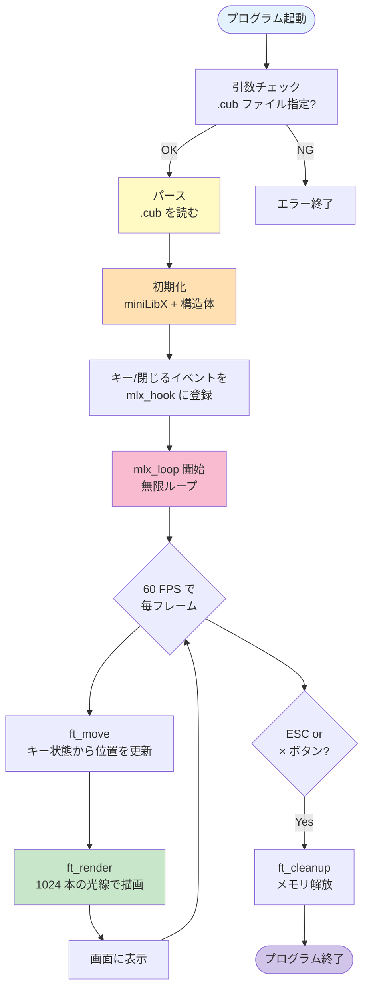
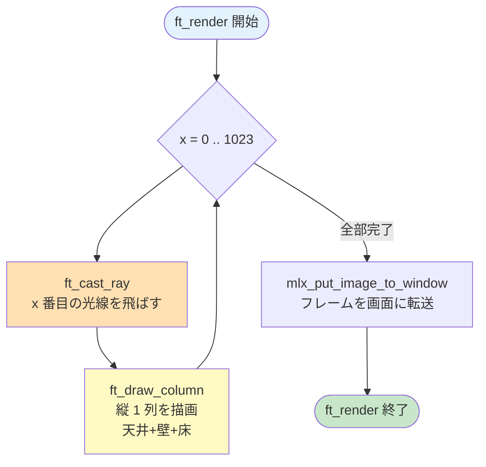
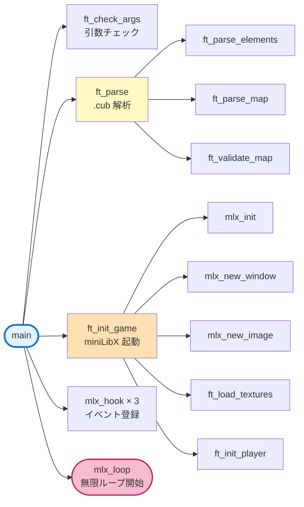

# 00. プログラム全体の流れ — `main.c`

!!! tip "ページナビ"
    **[🏠 ホーム](index.md)** ・ **次 ▶️ [01. 概要とビルド](01-overview.md)**
    ・ **[📚 用語集](glossary.md)**

---

## このページは何？

**cub3D プログラムが起動してから終わるまでの「流れ」を追うページ** です。

各ページで詳しく解説する処理が、**どこから呼ばれて、どう繋がっているか** を
最初に把握しておくと、他のページの理解が深まります。

---

## 1. プログラム全体を俯瞰

!!! tip "💡 図の使い方"
    **各ボックスをクリックすると** 詳しい解説ページに飛びます！



---

## 2. main 関数（main.c）

プログラムの **入口** です。

```c title="srcs/main.c" linenums="1"
int main(int argc, char **argv)
{
    t_game  game;

    // ── ① 初期化 ──
    // game 構造体をゼロクリア
    // (ゴミ値を防ぐため超重要)
    ft_bzero(&game, sizeof(t_game));

    // ── ② 引数チェック ──
    // 引数が 2 個（プログラム名+ファイル）
    // 拡張子が .cub か
    ft_check_args(argc, argv);

    // ── ③ .cub ファイルをパース ──
    // テキストファイル → game.config 構造体
    ft_parse(argv[1], &game.config);

    // ── ④ ゲーム初期化 ──
    // miniLibX を起動
    // ウィンドウを作る
    // テクスチャを読み込む
    // プレイヤー位置を設定
    ft_init_game(&game);

    // ── ⑤ イベントハンドラを登録 ──
    // 2  = キー押下
    // 3  = キー離す
    // 17 = ウィンドウ × ボタン
    mlx_hook(game.win, 2,  1L << 0, ft_key_press,    &game);
    mlx_hook(game.win, 3,  1L << 1, ft_key_release,  &game);
    mlx_hook(game.win, 17, 0,       ft_close_window, &game);

    // ── ⑥ メインループ登録 ──
    // 毎フレーム ft_game_loop を呼ぶ
    mlx_loop_hook(game.mlx, ft_game_loop, &game);

    // ── ⑦ 無限ループ開始 ──
    // ここで mlx_loop に処理を渡す
    // ESC か × で終了するまで戻らない
    mlx_loop(game.mlx);
    return (0);
}
```

### 処理の流れ

| ステップ | 処理 | 詳しくは |
|:-:|:---|:---|
| ① 初期化 | `ft_bzero` で構造体を 0 にする | 下記 |
| ② 引数チェック | 拡張子と引数の数を確認 | 下記 |
| ③ パース | .cub ファイルを読んで構造体に | [02 パーサー](02-parser.md) |
| ④ 初期化 | miniLibX とゲーム状態の準備 | 下記 |
| ⑤ イベント登録 | キー入力等のコールバック登録 | [07 入力処理](07-input.md) |
| ⑥ ループ登録 | 毎フレーム呼ぶ関数を登録 | 下記 |
| ⑦ ループ開始 | mlx_loop を呼んで無限ループへ | — |

### 引数チェック（ft_check_args）

```c title="srcs/main.c (ft_check_args)" linenums="1"
static void ft_check_args(int argc, char **argv)
{
    int len;

    // 引数は 2 個必須 (プログラム名 + .cub)
    if (argc != 2)
        ft_error("Usage: ./cub3D <map.cub>");

    // ファイル名の長さ
    len = ft_strlen(argv[1]);

    // 拡張子が .cub か確認
    // - ファイル名が 5 文字未満なら NG
    //   (".cub" + 最低 1 文字)
    // - 末尾 4 文字が ".cub" でないと NG
    if (len < 5
        || ft_strncmp(argv[1] + len - 4,
                      ".cub", 4) != 0)
        ft_error("Invalid file extension, expected .cub");
}
```

### ウィンドウを閉じる（ft_close_window）

```c title="srcs/main.c (ft_close_window)" linenums="1"
static int ft_close_window(t_game *game)
{
    // × ボタンが押されたときに呼ばれる
    ft_cleanup(game);  // メモリを全解放
    exit(0);           // プログラムを終了
    return (0);        // （届かないが warning 抑止）
}
```

!!! info "ft_close_window はなぜ必要？"
    ウィンドウの × ボタンで閉じたとき、
    この関数を呼ばないと **プログラムが即終了して cleanup が走らず
    メモリリーク** になります。
    `mlx_hook` のイベント 17（DestroyNotify）で登録します。

---

## 3. ゲームループ（ft_game_loop）

**1 フレームごとに呼ばれる関数**。60 FPS なら 1 秒に 60 回呼ばれます。

```c title="srcs/main.c (ft_game_loop)" linenums="1"
int ft_game_loop(t_game *game)
{
    // ① プレイヤーの移動 (キー状態を元に)
    ft_move(game);

    // ② 画面を描画 (レイキャスティング)
    ft_render(game);
    return (0);
}
```

この 2 行だけの短い関数が **ゲームの心臓部** です。


---

## 4. 初期化（init.c）

**miniLibX を起動し、ゲーム状態を準備する処理** です。

```c title="srcs/init.c (ft_init_game)" linenums="1"
void ft_init_game(t_game *game)
{
    // ── ① miniLibX 起動 ──
    // X11 や OpenGL との接続を確立
    game->mlx = mlx_init();
    if (!game->mlx)
        ft_error("Failed to initialize miniLibX");

    // ── ② ウィンドウ作成 ──
    // 1024 x 768 のウィンドウを開く
    // タイトルバーは "cub3D"
    game->win = mlx_new_window(game->mlx,
                               WIN_W, WIN_H, "cub3D");
    if (!game->win)
        ft_error("Failed to create window");

    // ── ③ フレームバッファ作成 ──
    // 画面に出す前の「下書きキャンバス」
    // 1 ピクセルずつ書き込んで、
    // 完成したら一度にウィンドウに転送
    game->frame.ptr =
        mlx_new_image(game->mlx, WIN_W, WIN_H);
    if (!game->frame.ptr)
        ft_error("Failed to create frame buffer");

    // フレームのピクセルデータへのアドレスを取得
    game->frame.addr = mlx_get_data_addr(
        game->frame.ptr,
        &game->frame.bpp,
        &game->frame.line_len,
        &game->frame.endian);
    game->frame.width = WIN_W;
    game->frame.height = WIN_H;

    // ── ④ テクスチャ 4 枚を読み込む ──
    // .xpm ファイルを mlx 画像として読む
    ft_load_textures(game);

    // ── ⑤ プレイヤーの位置と向きを初期化 ──
    ft_init_player(game);

    // ── ⑥ キー状態をゼロクリア ──
    // 起動直後は全キー未押下
    ft_bzero(&game->keys, sizeof(t_keys));
}
```

### プレイヤーの初期化

`.cub` ファイルで `N S E W` のどれが書かれていたかを元に、
**プレイヤーの位置と向き** を設定します。

```c title="srcs/init.c (ft_init_player)" linenums="1"
static void ft_init_player(t_game *game)
{
    // 位置: .cub パース時に +0.5 されてる
    // マスの中央にプレイヤーを置く
    game->player.pos.x = game->config.player_x;
    game->player.pos.y = game->config.player_y;

    // 向き別の dir/plane を設定
    if (game->config.player_dir == 'N'
        || game->config.player_dir == 'S')
        ft_init_dir_ns(game);  // 南北用
    else
        ft_init_dir_ew(game);  // 東西用
}
```

### 向きごとの dir / plane

| 初期の向き | dir (正面) | plane (視野横) | 視野角 |
|:-:|:-:|:-:|:-:|
| **N (北)** | `(0, -1)` | `(0.66, 0)` | 約 66 度 |
| **S (南)** | `(0, +1)` | `(-0.66, 0)` | 約 66 度 |
| **E (東)** | `(+1, 0)` | `(0, 0.66)` | 約 66 度 |
| **W (西)** | `(-1, 0)` | `(0, -0.66)` | 約 66 度 |

!!! info "0.66 の意味"
    `plane` の長さ ÷ `dir` の長さ = `0.66` → **視野角 ≈ 66 度**。
    1.0 にすれば 90 度 FOV。0.66 は **人の目に近い自然な視野** です。

---

## 5. 描画ループ（render.c）

**毎フレーム、画面幅分の光線を飛ばして描画** します。

```c title="srcs/render/render.c" linenums="1"
void ft_render(t_game *game)
{
    int     x;
    t_ray   ray;

    x = 0;
    // 画面の横幅分（1024 回）光線を飛ばす
    while (x < WIN_W)
    {
        // ① 光線 1 本を飛ばして壁を探す
        //    (DDA で計算、距離と壁の向きを取得)
        ft_cast_ray(game, x, &ray);

        // ② そのピクセル列（縦 1 ライン）を描画
        //    (天井 + 壁 + 床)
        ft_draw_column(game, x, &ray);
        x++;
    }
    // ③ 完成したフレームをウィンドウに転送
    // 1 ピクセルずつ直接描くより高速
    mlx_put_image_to_window(game->mlx,
                             game->win,
                             game->frame.ptr,
                             0, 0);
}
```

### レンダリングの流れ



---

## 6. 全体のコール関係図

**どの関数がどこから呼ばれるか** を整理します。

!!! tip "💡 クリックで解説ページへジャンプ"
    図の **ノード（関数名）をクリック** すると、その関数の詳しい解説ページに飛びます。
    関係図が大きいので **3 つに分割** しました。

### ① 起動時の流れ（main → パース → 初期化）



### ② メインループ（毎フレーム）


### ③ イベント処理（キー入力・終了）


---

## 7. ファイル別の担当

| ファイル | 役割 | 詳しくは |
|:---|:---|:---|
| `main.c` | 入口、イベント登録、ループ開始 | **本ページ** |
| `init.c` | miniLibX 起動、プレイヤー初期化 | **本ページ** |
| `parser/*.c` | `.cub` ファイルの読み取り | [02](02-parser.md) |
| `render/raycaster.c` | 光線 1 本の計算 | [04](04-dda.md)・[05](05-camera.md) |
| `render/draw_column.c` | 縦 1 列の描画 | [06](06-rendering.md) |
| `render/texture.c` | テクスチャ読み込み・取得 | [06](06-rendering.md) |
| `render/render.c` | 1 フレームの描画ループ | **本ページ** |
| `input/input.c` | キーイベントハンドラ | [07](07-input.md) |
| `input/move.c` | プレイヤー移動と回転 | [07](07-input.md) |
| `utils/cleanup.c` | メモリ解放 | [08](08-memory.md) |
| `utils/error.c` | エラー時の処理 | [08](08-memory.md) |

---

## 8. ディフェンスで聞かれること

| 質問 | 答え方 |
|:---|:---|
| main の最初に `ft_bzero` を呼ぶ理由は？ | 構造体のメンバをゼロクリアしてゴミ値を防ぎ、NULL チェックを確実にするため |
| `mlx_loop_hook` と `mlx_hook` の違いは？ | `mlx_hook` はイベント発生時に呼ばれる。`mlx_loop_hook` は **毎フレーム** 呼ばれる |
| `mlx_loop` を呼ぶとどうなる？ | 無限ループに入り、登録したコールバックを呼び続ける。`exit` するまで戻らない |
| `ft_game_loop` は何をする？ | 毎フレーム、移動と描画の 2 つを呼ぶだけ |
| 0.66 という plane の長さの意味は？ | FOV（視野角）を 66 度にするため。1.0 にすれば 90 度になる |

---

## 9. よくあるミス

!!! warning "ft_bzero 忘れ"
    構造体のメンバを 0 にしないと **ゴミ値** が入り、後の NULL チェックが効かなくなる。

!!! warning "× ボタンの hook 忘れ"
    `mlx_hook(win, 17, ...)` を忘れると × で閉じたときに cleanup が走らずリーク。

!!! warning "mlx_loop_hook を間違えて mlx_loop に"
    `mlx_loop_hook(mlx, func, param)` と `mlx_loop(mlx)` は別の関数。混同注意。

---

## 📚 分からない用語は？

**→ [📚 用語集](glossary.md)**

---

## 10. 次のページへ

プログラムの全体像が掴めたところで、個別の仕組みを学んでいきます。
次は [📦 01. 概要とビルド](01-overview.md) で環境と操作方法を確認しましょう。
