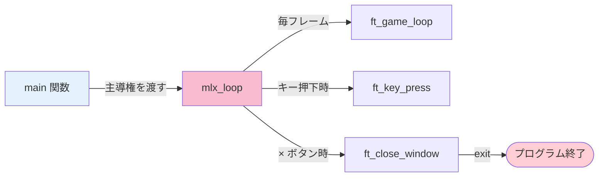
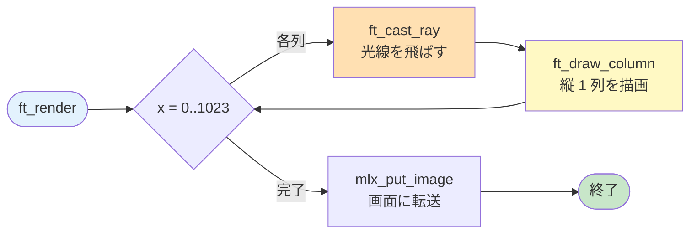
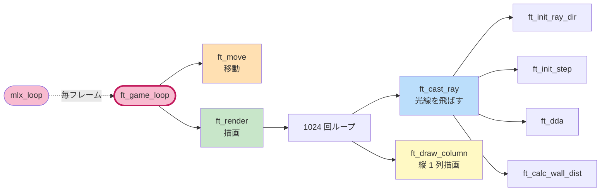
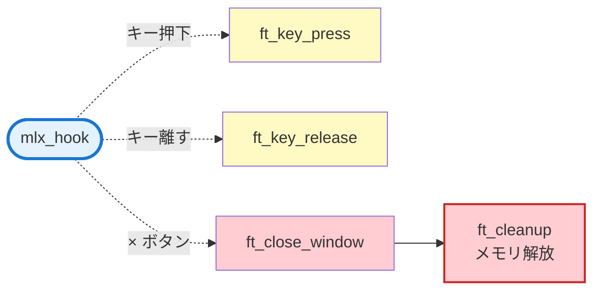

# 00. プログラム全体の流れ — `main.c`

---

## このページは何？

**cub3D プログラムが起動してから終わるまでの「流れ」を追うページ** です。

各ページで詳しく解説する処理が、**どこから呼ばれて、どう繋がっているか** を
最初に把握しておくと、他のページの理解が深まります。

---

## 🎯 なぜこの全体像を最初に？（学習意図）

cub3D は「レイキャスティング」のアルゴリズム自体が華やかなので、つい個別の数式から
学びたくなります。ですが、**ゲームプログラムは「イベント駆動 + フレームループ」という骨格**
を最初に掴まないと、後で迷子になります。

| 学ばせたいこと | このページで出会う形 |
|---|---|
| **イベント駆動モデル** | `mlx_hook` でキー押下/ × ボタンをコールバック登録 |
| **フレームループの考え方** | `mlx_loop_hook` が毎フレーム関数を呼ぶ仕組み |
| **責務分離** | `parse` / `init` / `render` / `cleanup` が独立した関数になる理由 |
| **リソースのライフサイクル** | mlx 確保 → ループ → × 押下 → 解放 のタイミング |
| **構造体ベース設計**（C で OOP もどき） | `t_game` 1 つを全関数で持ち回る理由 |

つまり「**個別の数式の前に、誰がどの順番で動いて、いつ解放するかを掴む**」のがこのページの狙いです。
ここを通っておくと、後続ページの細部が「全体のどこにあたるか」を常に位置づけられます。

---

## このページで学ぶこと

- **`mlx_init` / `mlx_new_window` / `mlx_new_image`** — miniLibX 起動とウィンドウ確保の順序
- **`mlx_hook`** — キー入力やウィンドウクローズを「コールバック」で登録する考え方
- **`mlx_loop_hook` と `mlx_loop`** の違い — 毎フレーム呼ぶ関数 vs 無限ループ本体
- **構造体 `t_game`** に全状態を集約する設計の意図
- **`ft_bzero`** で構造体をゼロクリアする理由（未初期化と NULL チェック）

---

## 1. プログラム全体を俯瞰

!!! tip "💡 図の使い方"
    **各ボックスをクリックすると** 詳しい解説ページに飛びます！


### 6 つのフェーズに分けて考える

| フェーズ | やること | このページで扱う？ |
|:-:|:---|:-:|
| ① 引数チェック | 拡張子と引数の数を確認 | ✅ |
| ② パース | `.cub` ファイルから構造体へ | → [02 パーサー](02-parser.md) |
| ③ 初期化 | miniLibX を起動 / 画像確保 / プレイヤー設定 | ✅ |
| ④ イベント登録 | キー押下/離す/× ボタンに関数を紐付け | ✅（詳細は [07 入力処理](07-input.md)） |
| ⑤ メインループ | 毎フレーム 移動＋描画 | ✅ |
| ⑥ 後片付け | メモリ解放と終了 | → [08 メモリ管理](08-memory.md) |

---

## 2. main 関数（main.c）

プログラムの **入口** です。

```c title="srcs/main.c"
int main(int argc, char **argv)
{
    t_game  game;

    ft_bzero(&game, sizeof(t_game));
    ft_check_args(argc, argv);
    ft_parse(argv[1], &game.config);
    ft_init_game(&game);
    mlx_hook(game.win, 2,  1L << 0, ft_key_press,    &game);
    mlx_hook(game.win, 3,  1L << 1, ft_key_release,  &game);
    mlx_hook(game.win, 17, 0,       ft_close_window, &game);
    mlx_loop_hook(game.mlx, ft_game_loop, &game);
    mlx_loop(game.mlx);
    return (0);
}
```

各行の意味は、続く「新しい概念をひとつずつ解説」で扱います。

### 新しい概念をひとつずつ解説

#### `ft_bzero` で構造体をゼロクリアする理由

C のスタック変数は **初期化しないとゴミ値** が入ります。`t_game` には `mlx` や
`win` などのポインタが入っているので、未初期化のままだと:

```c
// ❌ bzero しない場合
t_game game;
if (game.mlx)            // ゴミ値が非 NULL ならここを通る
    mlx_destroy_display(game.mlx);   // SEGV
```

`ft_bzero` で `0` 埋めしておけば、**全ポインタが NULL**、**全フラグが 0** になり、
後の `if (!ptr) error()` のような NULL チェックが安全に効きます。

#### `mlx_hook` と `mlx_loop_hook` は別物

| 関数 | いつ呼ばれる？ | 使い道 |
|:---|:---|:---|
| `mlx_hook(win, ev, mask, fn, p)` | **イベント発生時** （キー押下など） | 入力処理、ウィンドウクローズ |
| `mlx_loop_hook(mlx, fn, p)` | **毎フレーム** （アイドル時） | ゲームループ本体（移動＋描画） |

混同しがちですが、**「いつ呼ばれるか」が決定的に違う** ことを押さえてください。

!!! info "イベント番号 2/3/17 はどこから？"
    X11 のイベントコードです。`2 = KeyPress`、`3 = KeyRelease`、`17 = DestroyNotify`。
    macOS の `mlx_mms` でも互換のために同じ番号を使います。
    `1L << 0` は `KeyPressMask`、`1L << 1` は `KeyReleaseMask` のマスクで、
    「このイベントだけ拾うよ」という X11 への宣言です。

#### `mlx_loop(mlx)` が戻ってこない意味

`mlx_loop` は内部で `while (1)` の無限ループに入り、登録された関数を呼び続けます。
**`exit()` を呼ばないと帰ってきません**。

これは「**プログラムの主導権を miniLibX に渡す**」という発想で、GUI フレームワークでは
よくあるパターンです（Qt の `QApplication::exec()`、GTK の `gtk_main()` も同じ）。



### 引数チェック（ft_check_args）

```c title="srcs/main.c (ft_check_args)"
static void ft_check_args(int argc, char **argv)
{
    int len;

    if (argc != 2)
        ft_error("Usage: ./cub3D <map.cub>");
    len = ft_strlen(argv[1]);
    if (len < 5
        || ft_strncmp(argv[1] + len - 4, ".cub", 4) != 0)
        ft_error("Invalid file extension, expected .cub");
}
```

!!! warning "拡張子チェックを忘れない"
    評価では **「`.txt` を渡したらどうなる？」「引数 0 個ならどうなる？」** が必ず確認されます。
    `argc != 2` と末尾 `.cub` の 2 つで弾くのが最小要件です。

### ウィンドウを閉じる（ft_close_window）

```c title="srcs/main.c (ft_close_window)"
static int ft_close_window(t_game *game)
{
    ft_cleanup(game);
    exit(0);
    return (0);
}
```

!!! info "× ボタンを `mlx_hook(win, 17, ...)` で拾わないと"
    miniLibX は × ボタンを **自動では処理しない** ので、ウィンドウが消えてもプロセスは生き続けます。
    そのままだと **メモリリーク** で評価終了。`17 = DestroyNotify` を必ず登録します。

---

## 3. ゲームループ（ft_game_loop）

**1 フレームごとに呼ばれる関数**。60 FPS なら 1 秒に 60 回呼ばれます。

```c title="srcs/main.c (ft_game_loop)"
int ft_game_loop(t_game *game)
{
    ft_move(game);     // キー状態から位置を更新
    ft_render(game);   // 1024 本の光線で 1 枚描画
    return (0);
}
```

この 2 行だけの短い関数が **ゲームの心臓部** です。


!!! tip "なぜ「更新 → 描画」の順？"
    逆だと **1 フレーム古い位置** が画面に出るためです。
    キーを押した瞬間の反応速度に影響します（体感でわかるレベル）。

---

## 4. 初期化（init.c）

**miniLibX を起動し、ゲーム状態を準備する処理** です。

```c title="srcs/init.c (ft_init_game)"
void ft_init_game(t_game *game)
{
    game->mlx = mlx_init();
    if (!game->mlx)
        ft_error("Failed to initialize miniLibX");
    game->win = mlx_new_window(game->mlx, WIN_W, WIN_H, "cub3D");
    if (!game->win)
        ft_error("Failed to create window");
    game->frame.ptr = mlx_new_image(game->mlx, WIN_W, WIN_H);
    if (!game->frame.ptr)
        ft_error("Failed to create frame buffer");
    game->frame.addr = mlx_get_data_addr(game->frame.ptr,
        &game->frame.bpp, &game->frame.line_len, &game->frame.endian);
    game->frame.width = WIN_W;
    game->frame.height = WIN_H;
    ft_load_textures(game);
    ft_init_player(game);
    ft_bzero(&game->keys, sizeof(t_keys));
}
```

`mlx_init` → `mlx_new_window` → `mlx_new_image` → テクスチャ →
プレイヤー → キーフラグの順で、**作る順序が重要** です（前の戻り値が次の引数になる）。

### 新しい概念をひとつずつ解説

#### フレームバッファとは？

**「画面に出す前の下書きキャンバス」** です。

| 描画方法 | 速度 | 推奨度 |
|:---|:-:|:-:|
| `mlx_pixel_put` で 1 px ずつ画面に書く | **遅い**（X サーバーへの round-trip が px ごとに発生） | ❌ |
| `mlx_new_image` でメモリ上のバッファに書き、最後に `mlx_put_image_to_window` で転送 | **速い**（転送は 1 回） | ✅ |

cub3D は 1 フレームで `WIN_W × WIN_H ≒ 78 万 px` を描くので、後者でないと
スムーズに動きません。**評価項目「smooth な表示か？」に直結** します。

#### プレイヤーの初期化（向きごとの dir/plane）

`.cub` ファイルで `N S E W` のどれが書かれていたかを元に、
**プレイヤーの位置と向き** を設定します。

```c title="srcs/init.c (ft_init_player)"
static void ft_init_player(t_game *game)
{
    game->player.pos.x = game->config.player_x;
    game->player.pos.y = game->config.player_y;
    if (game->config.player_dir == 'N'
        || game->config.player_dir == 'S')
        ft_init_dir_ns(game);
    else
        ft_init_dir_ew(game);
}
```

| 初期の向き | dir (正面) | plane (視野横) | 視野角 |
|:-:|:-:|:-:|:-:|
| **N (北)** | `(0, -1)` | `(0.66, 0)` | 約 66 度 |
| **S (南)** | `(0, +1)` | `(-0.66, 0)` | 約 66 度 |
| **E (東)** | `(+1, 0)` | `(0, 0.66)` | 約 66 度 |
| **W (西)** | `(-1, 0)` | `(0, -0.66)` | 約 66 度 |

!!! info "0.66 の意味"
    `plane` の長さ ÷ `dir` の長さ = `0.66` → **視野角 ≈ 66 度**。
    詳しい計算は [05 カメラ](05-camera.md) で扱います。ここでは「向きごとに 4 通り設定する」だけ覚えれば OK。

---

## 5. 描画ループ（render.c）

**毎フレーム、画面幅分の光線を飛ばして描画** します。

```c title="srcs/render/render.c"
void ft_render(t_game *game)
{
    int     x;
    t_ray   ray;

    x = 0;
    while (x < WIN_W)
    {
        ft_cast_ray(game, x, &ray);
        ft_draw_column(game, x, &ray);
        x++;
    }
    mlx_put_image_to_window(game->mlx, game->win, game->frame.ptr, 0, 0);
}
```

### レンダリングの流れ



!!! tip "なぜ列ごと？"
    レイキャスティングは **「画面の縦 1 列 = 光線 1 本」** という対応で考えるアルゴリズムです。
    画面の x 座標が「光線の角度」に直接対応するので、列単位で処理するのが自然。
    詳細は [03 レイキャスティング](03-raycasting.md) へ。

---

## 6. 全体のコール関係図

**どの関数がどこから呼ばれるか** を整理します。

!!! tip "💡 クリックで解説ページへジャンプ"
    図の **ノード（関数名）をクリック** すると、その関数の詳しい解説ページに飛びます。
    関係図が大きいので **3 つに分割** しました。

### ① 起動時の流れ（main → パース → 初期化）


### ② メインループ（毎フレーム）



### ③ イベント処理（キー入力・終了）



---

## 7. ファイル別の担当

| ファイル | 役割 | 詳しくは |
|:---|:---|:---|
| `main.c` | 入口、イベント登録、ループ開始 | **本ページ** |
| `init.c` | miniLibX 起動、プレイヤー初期化 | **本ページ** |
| `parser/*.c` | `.cub` ファイルの読み取り | [02](02-parser.md) |
| `render/raycaster.c` | 光線 1 本の計算 | [04](04-dda.md)・[05](05-camera.md) |
| `render/draw_column.c` | 縦 1 列の描画 | [06](06-rendering.md) |
| `render/texture.c` | テクスチャ読み込み・取得 | [06](06-rendering.md) |
| `render/render.c` | 1 フレームの描画ループ | **本ページ** |
| `input/input.c` | キーイベントハンドラ | [07](07-input.md) |
| `input/move.c` | プレイヤー移動と回転 | [07](07-input.md) |
| `utils/cleanup.c` | メモリ解放 | [08](08-memory.md) |
| `utils/error.c` | エラー時の処理 | [08](08-memory.md) |

---

## 8. このページに関連する評価項目

評価シートの **以下 4 セクション** が本ページ（メインフロー）の守備範囲です。
詳細（**英語原文 + 日本語訳 + 評価者が見るコード + 想定質問 + よくある罠**）は
専用ページにまとめてあります。

| 評価セクション | 担当する内容 | 詳細ページ |
|:---|:---|:---|
| **Executable name** | `cub3D` という実行ファイル名・再リンク無し | [eval-execution](eval-execution.md)（準備中） |
| **Technical elements of the display** | ウィンドウ表示・隠す/最小化対応 | [eval-display](eval-display.md)（準備中） |
| **User basic events** | × ボタン・ESC・4 つの移動キー | **[eval-events](eval-events.md)** ✅ |
| **Error management**（部分） | 引数チェック・拡張子・乱打耐性 | [eval-errors](eval-errors.md)（準備中） |

→ 全項目を一覧したい場合は **[評価対策トップ](eval.md)** へ。

---

## 9. ディフェンスで聞かれること（学習トピック）

評価シート項目別の詳細（× ボタン・ESC・移動キーなど）は **[eval-events](eval-events.md)** にあります。
ここでは **本ページの学習トピック（メインフロー設計）に関する技術質問** だけを扱います。


| 質問 | 答え方 | 実装で言うと |
|---|---|---|
| `mlx_hook` と `mlx_loop_hook` の違いは？ | `mlx_hook` は**イベント発生時**（キー押下など）に呼ばれる。`mlx_loop_hook` は**毎フレーム**（アイドル時）呼ばれる。前者は入力、後者はゲームループ | `main.c` で 3 つの `mlx_hook`（key press / release / destroy）と 1 つの `mlx_loop_hook` を登録 |
| なぜ main 冒頭で `ft_bzero` する？ | スタック変数はゴミ値が入る。ポインタを後で NULL チェックするので、ゼロクリアして NULL を保証している | `t_game` の `mlx` / `win` / `frame.ptr` などのポインタが安全に NULL チェックできる |
| `mlx_loop` を呼ぶとどうなる？ | 無限ループに入り、登録したコールバックを呼び続ける。`exit` するまで戻らない | `return (0);` の行は実際には実行されない（コンパイラ警告抑止用） |
| × ボタンを `mlx_hook(win, 17, ...)` で拾わないとどうなる？ | × でウィンドウは消えるがプロセスが生き続け、cleanup されずに **メモリリーク**。評価フラグ `Leaks` に該当 | `ft_close_window` 内で `ft_cleanup(game); exit(0);` の順で解放してから終了 |
| 引数の拡張子チェックはどこで？ | `ft_check_args` 内で文字列長を確認後、末尾 4 文字を `.cub` と比較 | `ft_strncmp(argv[1] + len - 4, ".cub", 4)` |
| 滑らかな表示の仕組みは？ | フレームバッファ（`mlx_new_image`）に毎フレーム描き直し、最後に 1 回だけ `mlx_put_image_to_window` で転送。`mlx_pixel_put` を直接使うより圧倒的に速い | `ft_render` の最後で 1 回だけ `mlx_put_image_to_window` |
| ウィンドウを隠して戻しても内容が崩れない理由は？ | `mlx_loop_hook` が毎フレーム再描画しているので、X11 の `Expose` イベントを待たずに常に最新フレームが表示される | `ft_game_loop` → `ft_render` が 60 FPS で走り続ける |

---

## 10. よくあるミス

!!! warning "ft_bzero 忘れ"
    構造体のメンバを 0 にしないと **ゴミ値** が入り、後の NULL チェックが効かなくなる。
    `mlx_init` の手前で `mlx` が「たまたま非 NULL」だと条件分岐をすり抜けて SEGV。

!!! warning "× ボタンの hook 忘れ"
    `mlx_hook(win, 17, ...)` を忘れると × で閉じたときに cleanup が走らずリーク。
    評価で `top` / `leaks` を見られると **Leaks フラグで終了**。

!!! warning "mlx_loop_hook を mlx_loop と書き間違える"
    `mlx_loop_hook(mlx, func, param)` と `mlx_loop(mlx)` は別関数。
    コンパイルは通るが「ループ関数が登録されない」 → 画面が静止 → 評価不能。

!!! warning "実行ファイル名が `cub3d`（小文字）"
    subject 指定は **`cub3D`**（大文字 D）。Makefile の `NAME` を確認。
    `chmod +x cub3D` の出し直しではなく **Makefile の修正** で直すこと。

---

## 💡 ここまでの学びのまとめ

このページで身についたこと:

- **イベント駆動 + フレームループ** の 2 本立てで GUI プログラムが回る
- **`mlx_hook` は割り込み、`mlx_loop_hook` はポーリング** という対比
- **構造体 1 つを全関数で持ち回る** ことで、グローバル変数を避けつつ状態を共有できる
- **`ft_bzero` でゼロクリア → ポインタ NULL チェック** という C の定番イディオム
- **フレームバッファ方式**（`mlx_new_image` + `mlx_put_image_to_window`）でないと評価が通らない

!!! tip "ここで詰まったら"
    - 「× で閉じても止まらない！」→ `mlx_hook(win, 17, ...)` の登録忘れ
    - 「キーが反応しない！」→ イベントマスク（`1L << 0` / `1L << 1`）の誤り
    - 「画面が真っ黒！」→ `mlx_put_image_to_window` を呼んでいない、または `ft_render` が登録されていない

次の [📦 01. 概要とビルド](01-overview.md) で **環境構築と操作方法** を確認します。
そこで身につけた「make / 起動 / 操作」の感覚を持って [02 パーサー](02-parser.md) 以降に進むと、
個別の処理が **本ページの全体図のどこにあたるか** が常に位置づけられます。

---

## 📚 分からない用語は？

**→ [📚 用語集](glossary.md)**

---

## 11. 次のページへ

プログラムの全体像が掴めたところで、個別の仕組みを学んでいきます。
次は [📦 01. 概要とビルド](01-overview.md) で環境と操作方法を確認しましょう。
