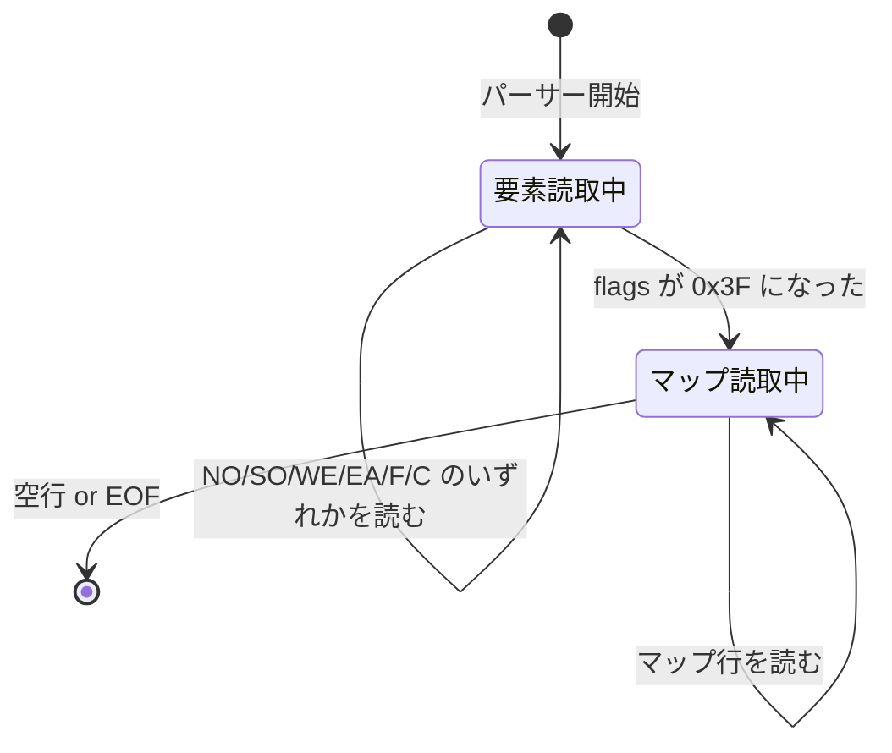
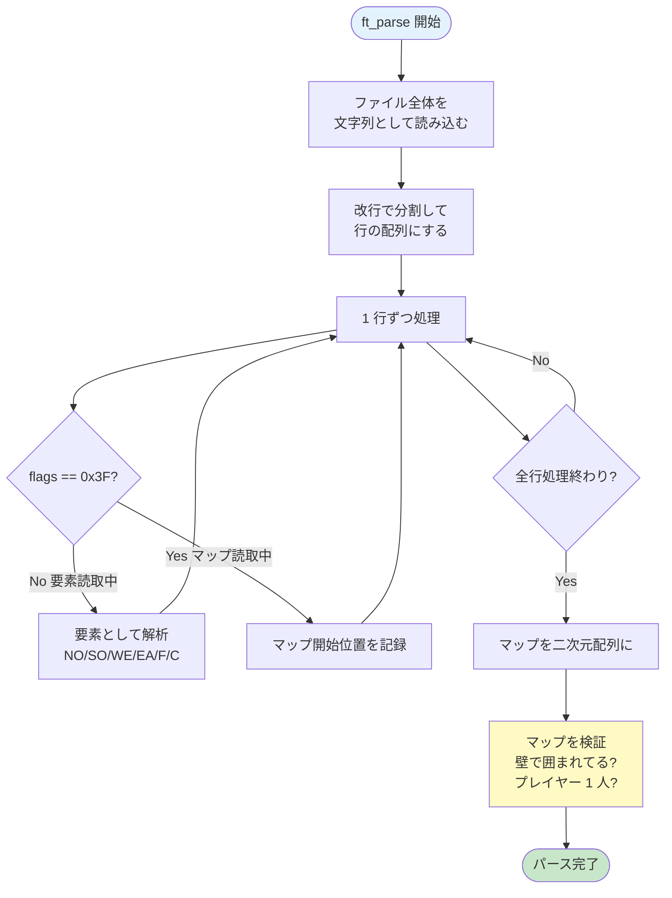

# 02. パーサー — `.cub` ファイルの読み込み

---

## このページは何？

**`.cub` ファイル（マップ設計図）をプログラムが使える形に変換する処理** を解説します。

- **入力**: テキストファイル（人間が書きやすい）
- **出力**: 構造体（プログラムが扱いやすい）

この変換をする人（プログラム）が **パーサー (parser)** です。

---

## 🎯 なぜパーサーを学ぶ？（学習意図）

レイキャスティングの華やかさの裏で、cub3D の評価で **最も減点が積もりやすい** のがパーサーです。
「文字列から意味を取り出す」「異常入力を弾く」「途中エラーでもメモリリークしない」という、
**実装の地味な総合力** が問われます。

| 学ばせたいこと | このページで出会う形 |
|---|---|
| **状態機械（state machine）の考え方** | 「要素読取中」⇄「マップ読取中」の 2 状態切り替え |
| **ビットフラグで集合を管理** | 6 要素の読み取り済みを `int 1` 個（`flags`）で追う |
| **2 段階処理**（パース → 検証） | まず形を作り、後で「壁で囲まれてるか」など意味を検証 |
| **エッジケースの網羅** | プレイヤー 0 人 / 複数 / 不正文字 / 壁開口 / 巨大マップ |
| **失敗時のリソース解放** | パース途中で `ft_error` が呼ばれてもリークしない設計 |

つまり「**入力を信用せず、構造化して、検証する**」という、評価で最も狙われる工程を丁寧に組む練習です。
ここで身につけた「異常入力への耐性」は、レイキャスティング側のクラッシュ防止にも直結します。

---

## このページで学ぶこと

- **`.cub` ファイル仕様** — 6 つの必須要素（NO/SO/WE/EA/F/C）とマップ記号の対応
- **`config.flags`** — 読み取り済み要素をビットで追う仕組みと `0x3F` の意味
- **状態機械** — 要素読取とマップ読取を切り替える 2 状態モデル
- **マップ検証** — 壁で囲まれているか / プレイヤーが 1 人か / 不正文字がないか の 3 大チェック
- **エラー時の解放** — `errctx` でグローバル登録 →`ft_error` 経由で cleanup する流れ

---

## 1. まず知っておきたいこと

### `.cub` ファイルって何？

**cub3D 専用のマップ設計図ファイル** です。

テキストファイル（`.txt` と中身の形式は同じ）ですが、
**決まった書き方のルール** に従って書く必要があります。

=== "📄 `.cub` ファイルの中身の例"

    ```
    NO ./textures/north.xpm    ← 北向きの壁に貼る画像
    SO ./textures/south.xpm    ← 南向きの壁
    WE ./textures/west.xpm     ← 西向きの壁
    EA ./textures/east.xpm     ← 東向きの壁
    F 220,100,0                ← 床の色（RGB）
    C 100,100,255              ← 天井の色（RGB）

    1 1 1 1 1 1                ← ここからマップ
    1 0 0 0 0 1                ← 1 = 壁、0 = 通路
    1 0 N 0 0 1                ← N = 北向きプレイヤー開始位置
    1 0 0 0 0 1
    1 1 1 1 1 1
    ```

=== "🎮 この .cub を読むと…"

    ゲームが起動して、**壁に 4 方向のテクスチャが貼られた 3D 迷路** が
    プレイヤー視点で表示されます。

!!! info "「cub」の由来"
    **cub** は **cube**（立方体）の略。3D 迷路を立方体ブロックで構成している
    イメージから来ています。

### 構造体 (struct) って何？

**「関連する値をまとめて 1 つの箱にする仕組み」** です。

例えば「`.cub` ファイルの情報」は:

- 4 つのテクスチャのパス
- 床の色
- 天井の色
- マップ

…など **複数の情報の集合体**。これを **バラバラの変数** で持つと管理が大変。
**構造体** に入れれば「`config`」という 1 つの箱で全部扱えます。

```c
// cub3D の config 構造体（簡略版）
typedef struct s_config {
    char    *tex_path[4];     // テクスチャパス × 4
    t_color  floor;            // 床の色
    t_color  ceiling;          // 天井の色
    char   **map;              // マップ（二次元配列）
    int      map_w;            // マップの幅
    int      map_h;            // マップの高さ
    int      flags;            // どの要素を読んだかの印
} t_config;
```

!!! info "引き出し付き整理箱のイメージ"
    構造体 = 複数の引き出しが付いた整理箱。
    各引き出し（メンバ）に違う情報を入れて、まとめて持ち運べます。

---

## 2. パーサーって何？

**テキストを読んで、構造化されたデータ（構造体）に変換する処理** です。


**身近な例**: Excel が CSV を開いてセルに値を入れる処理もパーサーです。

---

## 3. `.cub` ファイルのルール

| ルール | 内容 |
|:---|:---|
| ① 要素 6 個が必須 | NO, SO, WE, EA, F, C（順番は自由） |
| ② マップは最後 | 6 要素を全部読んだ後に書く |
| ③ 壁は `1`、通路は `0` | それ以外の文字は不正 |
| ④ プレイヤーは `N` `S` `E` `W` のいずれか 1 つだけ | 0 人・複数人は不正 |
| ⑤ マップは壁で完全に囲む | 隙間や空白で囲い忘れは不正 |

### 6 つの必須要素

| 記号 | 英語 | 日本語 | 値の例 |
|:-:|:---|:---|:---|
| **NO** | North texture | 北側の壁画像 | `NO ./textures/north.xpm` |
| **SO** | South texture | 南側の壁画像 | `SO ./textures/south.xpm` |
| **WE** | West texture | 西側の壁画像 | `WE ./textures/west.xpm` |
| **EA** | East texture | 東側の壁画像 | `EA ./textures/east.xpm` |
| **F** | Floor color | 床の色 (RGB) | `F 220,100,0` |
| **C** | Ceiling color | 天井の色 (RGB) | `C 100,100,255` |

### マップの記号

| 記号 | 意味 | 英語名 |
|:-:|:---|:---|
| `1` | 壁（通れない） | Wall |
| `0` | 通路（通れる） | Floor / Path |
| `N` | プレイヤー開始位置・北向き | North |
| `S` | プレイヤー開始位置・南向き | South |
| `E` | プレイヤー開始位置・東向き | East |
| `W` | プレイヤー開始位置・西向き | West |
| 空白 | マップの外 | Outside |

---

## 4. config flags（設定フラグ）って何？

**「.cub の要素 6 個のうち、どれをもう読んだか」を覚えておく変数** です。

6 個の要素それぞれに **ビット** を割り当て、読み込んだらそのビットを 1 に立てます。

### ビットの対応

| ビット | 2進数 | 16進数 | 意味 |
|:-:|:-:|:-:|:---|
| ビット 0 | `000001` | `0x01` | NO 読んだ |
| ビット 1 | `000010` | `0x02` | SO 読んだ |
| ビット 2 | `000100` | `0x04` | WE 読んだ |
| ビット 3 | `001000` | `0x08` | EA 読んだ |
| ビット 4 | `010000` | `0x10` | F 読んだ |
| ビット 5 | `100000` | `0x20` | C 読んだ |

全部読むと合計 `111111` → **`0x3F`**（10 進数で 63）になります。


!!! info "なぜビットで管理？"
    `int` 1 個で 6 個のフラグを同時に管理できて効率的だから。
    `bool tex_no_read; bool tex_so_read; ...` と 6 個作るより簡潔。

---

## 5. 状態機械 (state machine) って何？

**「今どの状態か」を覚えながら処理を進める仕組み**。

cub3D のパーサーは **2 つの状態** を行き来します:



「機械 (machine)」という漢字は **合っています**（state **machine** の直訳）。
**「状態の切り替えをする装置」** というイメージ。

---

## 6. パーサーの動き（ステップごと）



---

## 7. マップ検証（validation）の詳細

**パースした後、マップが正しいかチェック** します。
ここが評価で最も試される部分です。

### エラーパターン一覧

=== "🟢 OK なマップ"

    ```
    1 1 1 1 1
    1 0 0 0 1
    1 0 N 0 1
    1 1 1 1 1
    ```

    壁で完全に囲まれている。

=== "🔴 NG: 開いた壁"

    ```
    1 1 1 1 1
    1 0 0 0 1
    1 0 N 0 1
    1 1 0 1 1   ← 下が '0' で開いている
    ```

    通路マスから外が見える → エラー "Map is not surrounded by walls"

=== "🔴 NG: プレイヤーなし"

    ```
    1 1 1 1 1
    1 0 0 0 1
    1 0 0 0 1
    1 1 1 1 1
    ```

    N/S/E/W が 1 つもない → エラー "No player start position found"

=== "🔴 NG: プレイヤー複数"

    ```
    1 1 1 1 1
    1 N 0 S 1   ← N と S の 2 人
    1 1 1 1 1
    ```

    プレイヤーが 2 人以上 → エラー "Multiple player start positions"

=== "🔴 NG: 不正文字"

    ```
    1 1 1 1 1
    1 0 X 0 1   ← X は未定義文字
    1 1 1 1 1
    ```

    `X` は不正 → エラー "Invalid character in map"

=== "🔴 NG: 巨大マップ"

    ```
    1 1 1 ... (501 マス以上)
    ```

    500 x 500 を超える → エラー "Map too large"

---

## 8. コード解説（簡潔版）

### エントリポイント

```c title="parse.c (ft_parse)"
void ft_parse(char *path, t_config *config)
{
    char  *content;
    char **lines;

    ft_bzero(config, sizeof(t_config));
    content = ft_read_file(path);
    lines = ft_split_lines(content);
    free(content);
    if (!lines)
        ft_error("Memory allocation failed");
    ft_set_errctx(config, lines);
    ft_process_lines(lines, config);
    ft_validate_map(config);
    ft_set_errctx(NULL, NULL);
    ft_free_lines(lines);
}
```

---

## 9. このページに関連する評価項目

本ページの内容は、評価シートの **以下のセクション** に対応します。詳細（英語原文 + 日本語訳 + 評価者が見るコード + Q&A）は各専用ページに。

| 評価セクション | 担当する内容 | 詳細 |
|:---|:---|:---|
| **Configuration file** | 6 要素の有無・順序自由・色 RGB・拡張子 `.cub`・不正設定エラー | [eval-config](eval-config.md) |
| **Walls**（部分） | NO/SO/WE/EA テクスチャパスの読み取りと検証 | [eval-walls](eval-walls.md) |

→ 全項目を一覧したい場合は **[評価対策トップ](eval.md)** へ。

---

## 10. ディフェンスで聞かれること（学習トピック）

評価シート項目別の詳細（要素欠落・色範囲・拡張子・テクスチャパスなど）は **[eval-config](eval-config.md)** / **[eval-walls](eval-walls.md)** にあります。
ここでは **本ページの学習トピック（パーサー設計）に関する技術質問** だけを扱います。

| 質問 | 答え方 | 実装で言うと |
|:---|:---|:---|
| パーサーとは？ | テキストから意味を取り出して構造体に変換する処理。`.cub` のテキストを `t_config` に詰める | `ft_parse(path, &game.config)` で 1 ファイルを 1 構造体に変換 |
| なぜ flags をビットで管理？ | 6 個の要素が全部揃ったか `int` 1 個で効率的に追跡するため。各要素 1 ビット、`0x3F` でコンプリート判定 | `config->flags & (1 << 5)` のようにビット演算で確認 |
| 状態機械を使う理由は？ | `.cub` は「要素 6 個 → マップ」という 2 段構成。**今どこを読んでいるか** を持たないと「マップの 1 行」と「F 0,0,0」が区別できない | `flags == 0x3F` を境に処理を分岐 |
| マップ検証で何を見る？ | 壁で囲まれてるか / プレイヤーが 1 人だけか / 不正文字なし の 3 大チェック。順序自由なのでパース後に一括検証 | `ft_validate_map` で flood fill 風に走査 |
| 空白の扱いは？ | 「壁の外」扱い。通路マス `0` の隣に空白があれば壁で囲い切れていない | `' '` を「マップ外」として扱う検証ロジック |
| エラー時のリーク対策は？ | `errctx` でグローバル登録、`ft_error` から cleanup を呼ぶ。途中で `malloc` した行配列も解放 | `ft_set_errctx` / `ft_error` 内で `ft_free_lines` を呼ぶ |

---

## 11. よくあるミス

!!! warning "マップ検証を怠る"
    正常マップだけテストして異常系を見逃すと **Crash フラグ** の危険。

!!! warning "空白の扱い"
    マップ中の `' '` (空白) は **「壁の外」**。通路マスの隣にあったら壁不足。

!!! warning "プレイヤー文字の後処理"
    `N S E W` は位置情報を取り出した後、`0` に置き換える必要あり。
    そのままだとレイキャスティングで通行判定に影響。

---

## 📚 分からない用語は？

**→ [📚 用語集](glossary.md)** で全用語を平易に解説しています。

---

## 💡 ここまでの学びのまとめ

このページで身についたこと:

- **状態機械** ... 「要素読取」⇄「マップ読取」を切り替えることで、1 つの `.cub` ファイル内に異なる構文が共存できる
- **ビットフラグ** ... 6 要素の読み取り済みを `int 1` 個（`flags`）で追える C の定番イディオム
- **2 段階処理**（パース → 検証）... まず形を作り、後で「壁で囲まれてるか」など意味を一括検証する設計
- **検証 3 大項目** ... 壁包囲 / プレイヤー 1 人 / 不正文字なし、をパース後に走査して確認
- **エラー時の解放** ... `errctx` 登録 →`ft_error` 経由で行配列・構造体を解放する流れ

!!! tip "ここで詰まったら"
    - 「正常マップだけ動いて異常系で落ちる！」→ `ft_validate_map` が未実装か、`ft_error` 前の `free` が漏れている
    - 「`flags` が `0x3F` にならない！」→ 要素読取後にビットを立てる `|=` が抜けている可能性
    - 「マップ末尾でクラッシュ！」→ 空白マスを「壁の外」と扱えていない（`' '` を `'0'` 扱いするバグ）

---

## 12. 次のページへ

次は [🔦 03. レイキャスティングとは](03-raycasting.md) で、
パースしたマップを **どう 3D に描画するか** を学びます。
