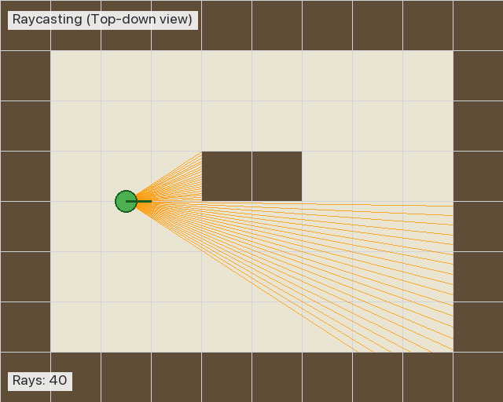
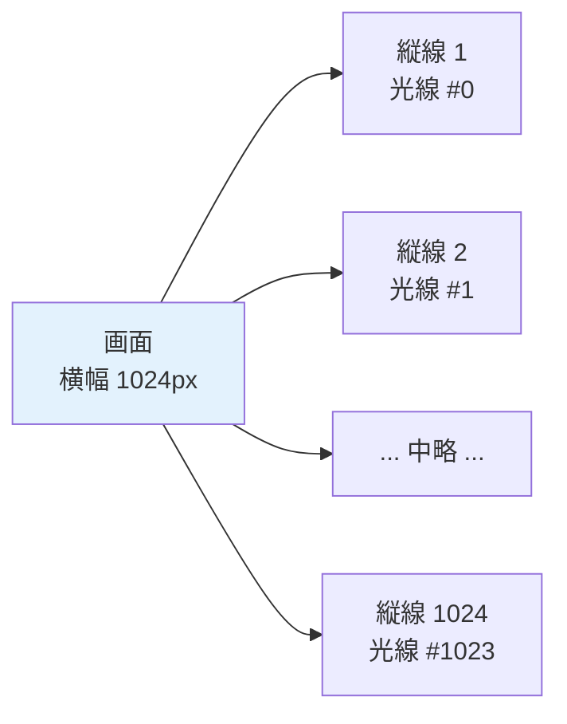
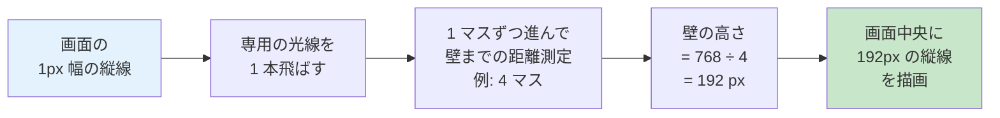
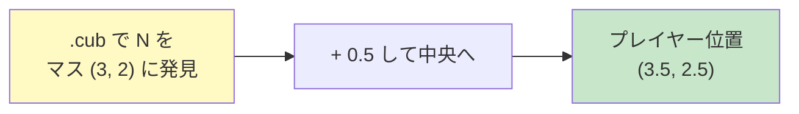
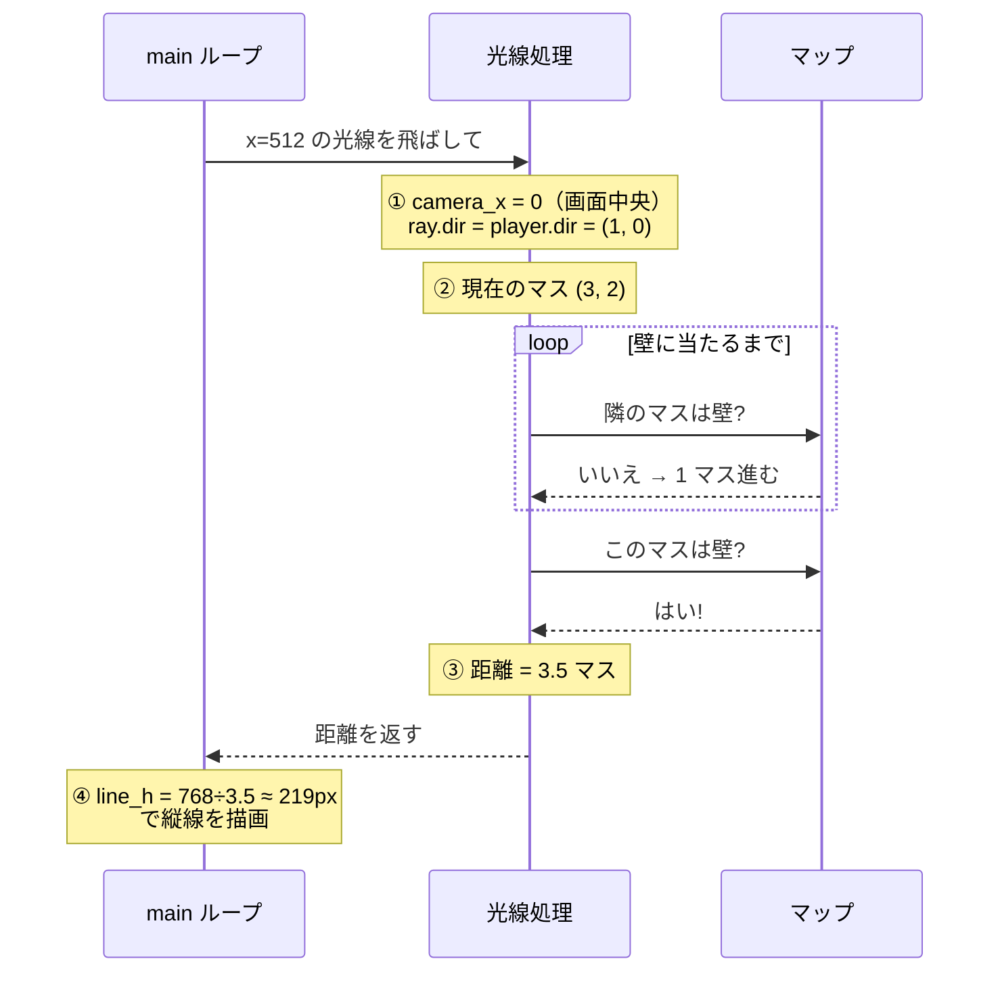

# 03. レイキャスティングとは — 概念編

---

## このページは何？

**cub3D の「3D っぽく見せる魔法」の正体を、まず感覚でつかむページ** です。

!!! info "言葉の解説"
    - **レイキャスティング (raycasting)** = **光線投射法**
    - **レイ (ray)** = **光線**。プレイヤーから伸ばす仮想の直線

実は cub3D の 3D は **本物の 3D ではありません**。
2D の地図に **たくさんの光線** を飛ばして、「壁までどれくらい遠いか」を測っているだけ。

### 🎮 実際の cub3D 画面


4 方向の壁が **別々の色/テクスチャ** で描かれています:

| 色 | 方向 | テクスチャ |
|:-:|:---|:---|
| 🔴 赤 (上) | 天井 | C 225,30,0 |
| 🟠 オレンジ (下) | 床 | F 220,100,0 |
| 🟢 緑 | 東の壁 | EA テクスチャ |
| 🟡 黄 | 西の壁 | WE テクスチャ |
| 🔵 青 | 北の壁 | NO テクスチャ |

### 🎬 レイキャスティングの動き（概念図）



プレイヤー（緑の丸）から **扇形に広がる光線** がそれぞれ壁まで飛んで、
**壁までの距離を測っている** のが見えます。視点が回転すると光線の束も一緒に回ります。

---

!!! info "💡 ここでつまずく人へ — 「3D ゲーム」とどう違う？"
    本物の 3D ゲーム（`Unreal` や `Unity` など）は **本当に 3 次元空間** を計算します。
    レイキャスティングは **2D の地図** に光線を飛ばし、
    壁までの距離から「あたかも 3D に見える絵」を描く **見せかけの 3D** です。

    だからマップは `.cub` ファイルに **2 次元の文字列** として書かれていて、
    天井や床の高さは固定です（プレイヤーは飛べないし、しゃがめない）。

---

## 🎯 なぜレイキャスティングを学ぶ？（学習意図）

cub3D の評価で最も「動いて見える成果物」を作る工程です。
ただ、いきなり数式から入ると挫折しがちなので、**まずは「光線を 1 本飛ばして壁までの距離を測る」という
ローテクな発想から入る** のがこのページの狙いです。

| 学ばせたいこと | このページで出会う形 |
|---|---|
| **2D で 3D を作る発想** | 上から見た地図に光線を飛ばし、距離から壁の高さを逆算 |
| **画面 1 列 = 光線 1 本** | 横 1024px の画面に対して 1024 本のレイを飛ばすという対応関係 |
| **距離と画面上の高さの逆比** | `line_h = WIN_H / 距離`（近いほど大きく見える） |
| **マスとの整数 / 小数の使い分け** | マップ格子は `int`、プレイヤー位置は `double`（マスの中央 `+0.5`） |
| **方向ベクトルの考え方** | プレイヤーの向きを `dir.x / dir.y` の 2 成分で表す |

つまり「**3D の絵を 2D の計算で組み立てる発想**」を掴むのが本ページの真の狙いです。
ここで「光線を飛ばす絵」が頭に入ると、04（DDA）の格子歩きと 05（カメラ）の視野計算が
「全体のどこにあたるか」を常に位置づけられるようになります。

---

## このページで学ぶこと

- **2D 上の光線** — プレイヤーから伸ばす仮想の直線。3D の幻影を 2D の計算で作る発想
- **画面 1 列 = 光線 1 本** — 横解像度 1024 px に対して光線 1024 本を飛ばす対応関係
- **距離 → 壁の高さ変換** — `line_h = WIN_H / 距離` で「近いほど大きく見える」を作る
- **マスの中央配置（`+0.5`）** — プレイヤー位置を小数にする理由
- **`dir` ベクトル** — プレイヤーの向きを `(dir.x, dir.y)` の 2 成分で持つ意味

---

## 1. 懐中電灯のたとえ

真っ暗な迷路で **懐中電灯** を照らすと、光は壁に当たるところまで届きます。

- 光がすぐ壁に当たる → **壁は近い**
- 光が遠くまで伸びる → **壁は遠い**

これだけで「距離」が測れます。


!!! info "ポイント"
    cub3D は **画面の幅の本数だけ** 懐中電灯を並べ、
    それぞれの光の長さを測って **壁の高さ** を計算しています。

---

## 2. なぜ 1024 本？

**画面の横幅が 1024 ピクセルだから** です。

!!! info "ピクセルとは"
    画面の最小単位の「点」。画面はこの点を縦横に並べて絵を描きます。

cub3D では画面サイズが `includes/cub3d.h` に定義されています:

```c
#define WIN_W 1024   // 画面の幅（Width）= 1024 ピクセル
#define WIN_H 768    // 画面の高さ（Height）= 768 ピクセル
```

**画面の各縦 1 列（1 ピクセル幅）ごとに 1 本の光線** を飛ばすので、
幅が 1024 なら 1024 本必要です。



---

## 3. 全体の流れ


このサイクルが **1 秒間に 60 回** 回ります（60 FPS）。

---

## 4. 1 本の光線で何をするか



### 具体例（距離別）

| 壁までの距離 | 計算 | 画面上の壁の高さ |
|:-:|:---|:-:|
| 1 マス（壁すぐそば） | 768 ÷ 1 | **768px（画面いっぱい）** |
| 2 マス | 768 ÷ 2 | 384px（画面半分） |
| 4 マス | 768 ÷ 4 | 192px（画面の 1/4） |
| 8 マス（遠い壁） | 768 ÷ 8 | 96px（小さい） |

**距離が近いほど大きく、遠いほど小さく** 見えるので 3D っぽく感じます。

---

## 5. 上から見た地図 vs 画面

=== "🗺️ 上から見た地図（プログラム内部）"

    | 列 (x) →<br>行 (y) ↓ | 0 | 1 | 2 | 3 | 4 | 5 | 6 | 7 |
    |:-:|:-:|:-:|:-:|:-:|:-:|:-:|:-:|:-:|
    | **0** | 🧱 | 🧱 | 🧱 | 🧱 | 🧱 | 🧱 | 🧱 | 🧱 |
    | **1** | 🧱 |  |  |  |  |  |  | 🧱 |
    | **2** | 🧱 |  |  |  |  |  |  | 🧱 |
    | **3** | 🧱 |  |  | 👤→ | → | → | → | 🧱 |
    | **4** | 🧱 |  |  |  |  |  |  | 🧱 |
    | **5** | 🧱 |  |  |  |  |  |  | 🧱 |
    | **6** | 🧱 | 🧱 | 🧱 | 🧱 | 🧱 | 🧱 | 🧱 | 🧱 |

    - 🧱 = 壁（`1`）／ 空欄 = 通路（`0`）／ 👤 = プレイヤー
    - **x = 列番号（横）、y = 行番号（縦）** の順
    - C では `map[y][x]` の順でアクセスする慣習

=== "🖥️ 画面に映る絵（プレイヤー視点）"

    | 画面の上下位置 | 表示 |
    |:-:|:-:|
    | 上部 | ☁️ 天井色（単色） |
    | 中央 | 🧱 **壁**（距離が遠いほど小さく） |
    | 下部 | 🟫 床色（単色） |

上から見た 2D 地図を元に、プレイヤーから見える絵を作るのがレイキャスティングの仕事。

---

## 6. プレイヤー位置が小数な理由

### マスの中央に置くため

プレイヤーを **マスの中央** に配置します。
`.cub` ファイルで `N` を見つけたマスが `(3, 2)` なら、
実際のプレイヤー位置は `(3.5, 2.5)` にします。



| 値 | 意味 |
|:-:|:---|
| **整数** (3, 2) | 「マスの座標」（格子の左上角） |
| **小数** (3.5, 2.5) | 「マスの中央」（プレイヤーの実際の位置） |

### 向き (dir) ベクトル

`dir` は **direction**（方向）の略。プレイヤーが向いている向きを 2 成分で表します。

| プレイヤーの向き | dir.x | dir.y |
|:-:|:-:|:-:|
| 北（上） | 0 | -1 |
| 南（下） | 0 | +1 |
| 東（右） | +1 | 0 |
| 西（左） | -1 | 0 |

!!! info "プログラム上の y 軸"
    画面プログラムでは **y が下向きに増える** のが慣習。
    「北」は「y が減る方向」、「南」は「y が増える方向」。

---

## 7. 1 本の光線を追ってみる

画面中央のピクセル（x = 512）に対応する光線の動きを見ましょう。

### 初期状態

プレイヤー位置 `(3.5, 2.5)`、東向き（dir = `(1, 0)`）の場合:



### ステップの意味

| # | 処理 |
|:-:|:---|
| ① | 画面位置から光線の向きを決める（camera_x は次ページで解説） |
| ② | 今いるマスの整数座標を取得 |
| ③ | DDA で 1 マスずつ進み、壁まで距離を測る（[04 ページ](04-dda.md)で詳しく） |
| ④ | 距離から壁の高さを計算して描画 |

---

## 8. 大事な用語まとめ

| 用語 | 意味 | 詳しくはこのページへ |
|:---|:---|:---|
| **光線 (ray)** | プレイヤーから伸ばす仮想の線 | 本ページ |
| **dir ベクトル** | プレイヤーの向き | 本ページ |
| **DDA** | 格子を効率よく渡る方法 | [04](04-dda.md) |
| **カメラプレーン (plane)** | 視野を決めるベクトル | [05](05-camera.md) |
| **camera_x** | 画面位置を -1 〜 +1 にした値 | [05](05-camera.md) |
| **魚眼補正** | 画面端の歪みを直す計算 | [05](05-camera.md) |
| **垂直距離** | 正面方向への投影距離 | [05](05-camera.md) |

---

## 9. このページに関連する評価項目

本ページの内容は、評価シートの **以下のセクション** に対応します。詳細（英語原文 + 日本語訳 + 評価者が見るコード + Q&A）は各専用ページに。

| 評価セクション | 担当する内容 | 詳細 |
|:---|:---|:---|
| **Technical elements of the display** | 迷路の描画・天井床の色分け・ウィンドウ表示 | [eval-display](eval-display.md) |
| **Walls** | 4 方向（NO/SO/WE/EA）テクスチャの使い分け・壁面の向き判定 | [eval-walls](eval-walls.md) |

→ 全項目を一覧したい場合は **[評価対策トップ](eval.md)** へ。

---

## 10. ディフェンスで聞かれること（学習トピック）

評価シート項目別の詳細（4 方向テクスチャ・天井床の色・スムーズな表示など）は **[eval-display](eval-display.md)** / **[eval-walls](eval-walls.md)** にあります。
ここでは **本ページの学習トピック（レイキャスティングの概念）に関する技術質問** だけを扱います。

| 質問 | 答え方 | 実装で言うと |
|:---|:---|:---|
| なぜ「2D で 3D を作れる」？ | 2D 地図に光線を飛ばし、壁までの距離から **画面上の壁の高さ** を逆算しているから。本物の 3D ではなく「3D に見える絵」 | `.cub` ファイルが 2 次元の文字列、プレイヤーは飛べない・しゃがめない |
| なぜ画面の幅と同じ本数の光線？ | 画面の **縦 1 列に光線 1 本** を対応させているから。x 座標が光線の角度に対応 | 横解像度 `WIN_W = 1024` なら 1024 本ループ |
| 「近いほど大きく見える」を作る式は？ | `line_h = WIN_H / 距離`。距離が半分になれば高さは 2 倍になる逆比 | `ft_calc_wall_dist` で求めた `perp_dist` を分母に |
| なぜプレイヤー位置が小数？ | マスの中央に置きたいから。`.cub` で見つけた格子座標 `(3, 2)` に `+0.5` して `(3.5, 2.5)` で扱う | `ft_init_player` 内で `+ 0.5` を加算 |
| `dir.y` が **下向きに正** なのはなぜ？ | 画面プログラムの慣習で y 軸が下向き。北 = y 減少、南 = y 増加で考える | 北向きプレイヤーの `dir = (0, -1)` |
| `map[y][x]` の順なのはなぜ？ | C 配列は **行優先（row-major）** で、外側が y（行）、内側が x（列）。逆にすると CPU キャッシュ効率も落ちる | `config->map[y][x]` でアクセス |

---

## 11. よくあるミス

!!! warning "x と y を逆にする"
    `map[x][y]` と書くと **斜めに変な壁** が現れる。C 配列は **行優先** なので `map[y][x]` が正解。
    型ヒント代わりに `t_vec2i` でラップしておくと混乱を減らせる。

!!! warning "プレイヤー位置を整数のまま使う"
    `.cub` で見つけた `(3, 2)` をそのまま使うと、プレイヤーがマスの **左上角** に立つ。
    壁の真上に重なる場合があり、レイキャスティングで距離 0 になって描画が壊れる。`+ 0.5` を忘れずに。

!!! warning "光線本数を画面幅と切り離す"
    `WIN_W` を変えたのに光線本数を `1024` ベタ書きしていると、画面右端が描画されない。
    必ず `for (x = 0; x < WIN_W; x++)` のように **画面幅変数** をループ終端に使う。

---

## 💡 ここまでの学びのまとめ

このページで身についたこと:

- **2D で 3D を作る発想** ... 上から見た地図に光線を飛ばし、距離から壁の高さを逆算する
- **画面 1 列 = 光線 1 本** ... 横解像度 `WIN_W` 本のループが描画の基本構造
- **距離 → 高さの逆比** ... `line_h = WIN_H / 距離` で「近いほど大きく」を作る
- **マスの中央配置** ... プレイヤー位置に `+ 0.5` して小数で持つ理由
- **`dir` ベクトル** ... プレイヤーの向きを 2 成分で持つことで、後の光線計算が単純な足し算で済む

!!! tip "ここで詰まったら"
    - 「壁が斜めに歪む！」→ `map[y][x]` と `map[x][y]` を取り違えている可能性
    - 「画面に壁が出ない / 真っ黒！」→ ループ終端を `WIN_W` ではなく定数で書いていないか確認
    - 「プレイヤーが壁に埋まっている！」→ `+ 0.5` のマス中央配置を忘れていないか確認

---

## 12. 次のページへ

▶️ **[04. DDA — 格子を効率よく渡る](04-dda.md)**

!!! tip "進め方"
    このページで「レイキャスティングって何？」のイメージはつかめました。
    次の 2 ページで「どう計算するの？」を具体的に学びます。

    - **04**: 壁を**見つける**アルゴリズム（DDA）
    - **05**: 光線の**向き**と**補正**（カメラと魚眼）
