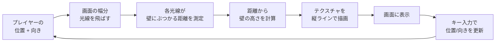
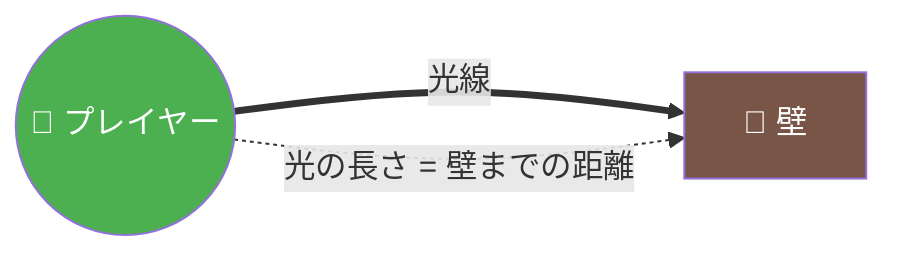
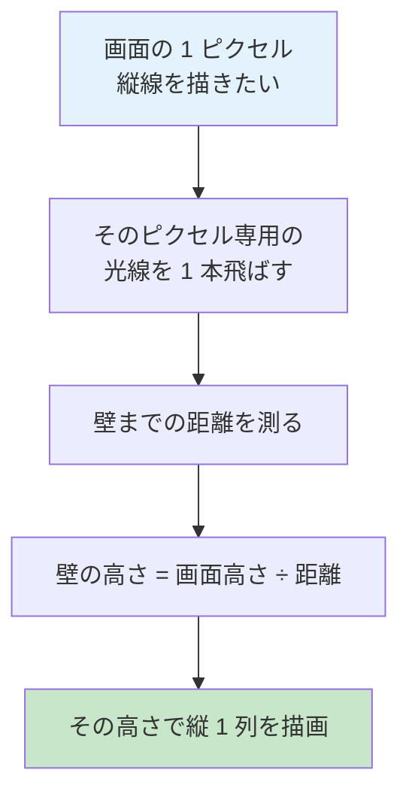
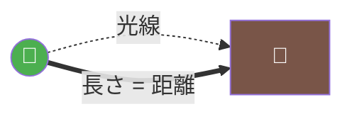
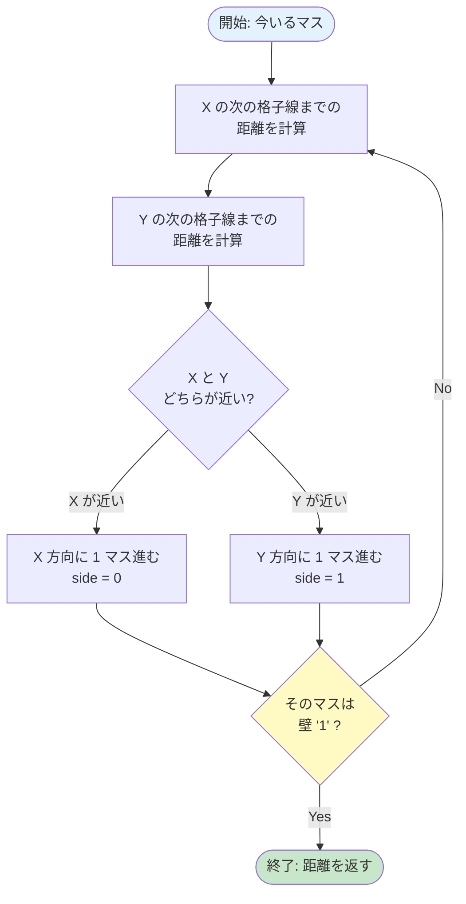
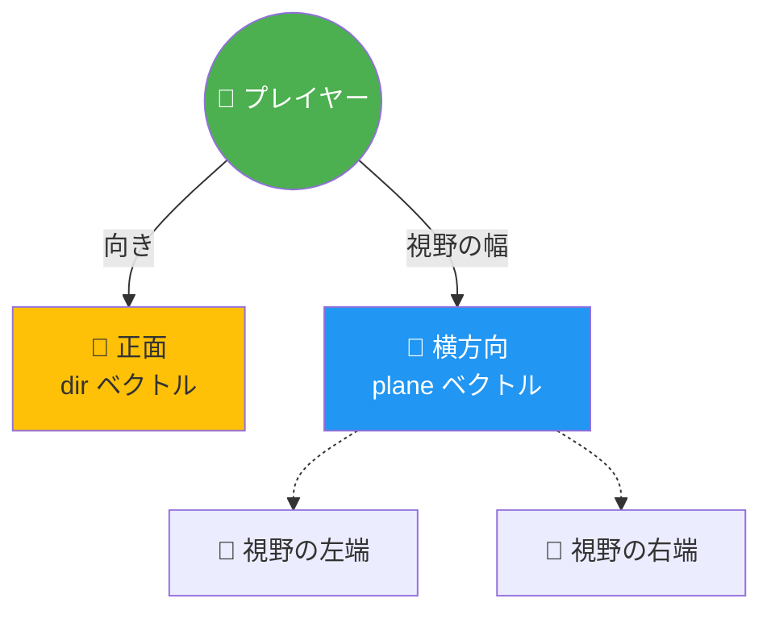
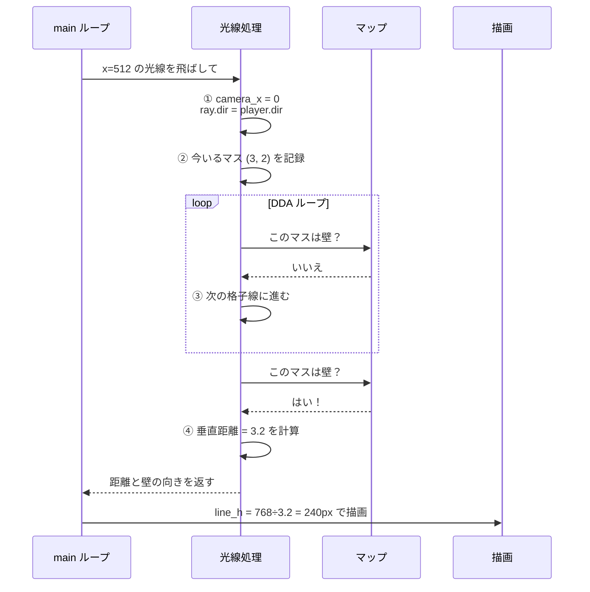
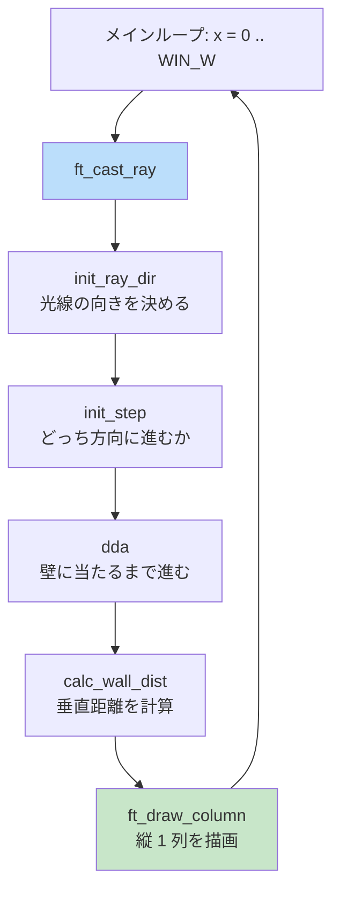

# 03. レイキャスティング（最重要）

!!! tip "ページナビ"
    ◀️ 前 **[02. パーサー](02-parser.md)** ・ **次 ▶️ [04. レンダリング](04-rendering.md)**

---

## このページは何？

**cub3D の「3D っぽく見せる魔法」の正体を解説するページ** です。

実は cub3D の 3D は **本物の 3D ではありません**。
2D の地図に **懐中電灯の光** みたいな光線をたくさん飛ばして、
「壁までどれくらい遠いか」を測っているだけです。

### 全体の流れ



---

## 1. イメージでつかもう

### 身近なたとえ：暗闇で懐中電灯

真っ暗な迷路で懐中電灯を照らすと、光が壁に当たるところまで届きます。
**光がすぐ壁に当たれば「壁は近い」、遠くまで伸びれば「壁は遠い」** がわかります。



!!! info "ポイント"
    cub3D は **画面の幅 (例: 1024 ピクセル) の本数だけ** 懐中電灯を並べ、
    それぞれの光の長さを測って **壁の高さ** を計算しています。

### 1 本の光線で何をするか



画面幅が 1024 なら **1024 回繰り返す** → 3D っぽい絵が完成します。

---

## 2. 上から見た地図 vs 画面

=== "🗺️ 上から見た地図（プログラムの中身）"

    | 列→<br>行↓ | 0 | 1 | 2 | 3 | 4 | 5 | 6 | 7 |
    |:-:|:-:|:-:|:-:|:-:|:-:|:-:|:-:|:-:|
    | **0** | 🧱 | 🧱 | 🧱 | 🧱 | 🧱 | 🧱 | 🧱 | 🧱 |
    | **1** | 🧱 |  |  |  |  |  |  | 🧱 |
    | **2** | 🧱 |  |  |  |  |  |  | 🧱 |
    | **3** | 🧱 |  |  | 👤→ | → | → | → | 🧱 |
    | **4** | 🧱 |  |  |  |  |  |  | 🧱 |
    | **5** | 🧱 |  |  |  |  |  |  | 🧱 |
    | **6** | 🧱 | 🧱 | 🧱 | 🧱 | 🧱 | 🧱 | 🧱 | 🧱 |

    🧱 = 壁（`1`）／ 空欄 = 通路（`0`）／ 👤 = プレイヤー

=== "🖥️ 画面に映る絵（プレイヤー視点）"

    | 画面エリア | 内容 |
    |:-:|:-:|
    | 上部 | ☁️ 天井色 |
    | 中央 | 🧱 **壁** (距離が遠いほど小さい) |
    | 下部 | 🟫 床色 |

    「上から見た地図」を元に「プレイヤーから見える絵」を作るのが、
    レイキャスティングの仕事です。

---

## 3. このページで学ぶこと

| 用語 | 意味 |
|:---|:---|
| **光線 (ray)** | プレイヤーから伸ばす仮想の線 |
| **DDA アルゴリズム** | 地図の格子をパッパッと渡る賢い方法 |
| **カメラプレーン** | 視野（画面に映る範囲）を決めるもの |
| **魚眼補正** | 画面の端が歪まないための工夫 |
| **壁の高さ計算** | 距離が近いほど高く見える仕組み |

---

## 4. 新しい概念の解説

### 光線（ray）って何？

**プレイヤーから出る仮想の直線** です。

実際に光を飛ばすわけじゃなく、数学的に
**「この方向に何マス進むと壁に当たるか」** を計算します。



### DDA（Digital Differential Analyzer）って何？

**地図の格子を効率よく渡る方法** です。

やってることは簡単：
**「次の格子線まで進む」を壁に当たるまで繰り返す**



!!! tip "なぜ速い？"
    1 ピクセルずつチェックする必要がなく、**格子の境界だけ見れば OK** なので爆速です。

### カメラプレーンって何？

**視野（FOV = Field of View）を決めるもの** です。

目玉が見える範囲を決める「眼鏡のフレーム」だと思ってください。



**構造体では 2 つのベクトルで表現**:

| ベクトル | 意味 |
|:---|:---|
| `player.dir` | プレイヤーの向き（正面） |
| `player.plane` | カメラの横方向（視野の幅） |

この 2 つで作る三角形が **視野範囲** になります。

### camera_x って何？

**画面のどこのピクセルかを表す数字** です。

画面の 1024 ピクセルを **-1 〜 +1** の数字に変換します:

| 画面の x 座標 | camera_x | 位置 |
|:-:|:-:|:---|
| 0 | **-1.0** | 左端 |
| 256 | -0.5 | 左寄り |
| 512 | **0.0** | 中央 |
| 768 | +0.5 | 右寄り |
| 1024 | **+1.0** | 右端 |

この数字で **各光線の向き** を決めます：

$$
\text{ray.dir} = \text{dir} + \text{plane} \times \text{camera\_x}
$$

| camera_x | 結果 | 意味 |
|:-:|:---|:---|
| -1 | `dir - plane` | 左端の光線 |
| 0 | `dir` | 正面の光線 |
| +1 | `dir + plane` | 右端の光線 |

### 魚眼効果（fisheye）って何？

**普通の距離を使うと画面端が歪む現象** です。

=== "❌ 補正なし（魚眼）"

    | 画面位置 | 見え方 |
    |:-:|:---|
    | 中央 | 🧱 正常 |
    | 端 | 🎈 **膨らんで歪む** |

    斜めの光線のほうが長くなるため、端の壁が遠く見える。

=== "✅ 補正あり（きれい）"

    | 画面位置 | 見え方 |
    |:-:|:---|
    | 中央 | 🧱 正常 |
    | 端 | 🧱 正常（歪みなし） |

    **垂直距離** だけ使うことで、端が正確な距離になる。

#### なぜ歪む？

```mermaid
graph LR
    P((👤)) -.正面.-> W1[🧱 壁]
    P -.斜め.-> W2[🧱 壁]

    P ==光線 = 長さ 5==> W1
    P ==光線 = 長さ 7==> W2

    style P fill:#4CAF50,color:#fff
```

同じ距離の壁でも、**斜めの光線のほうが長い**。
そのまま距離として使うと「端の壁が遠い」と勘違いしてしまう。

#### 対策：垂直距離だけ使う

光線の長さではなく、**プレイヤーの正面方向への距離** だけ使えば、
端の壁も正しい距離になります。

---

## 5. 光線 1 本の一生を追う

画面中央のピクセル（x = 512）で何が起きるかを順番に追いましょう。



### 各ステップの詳細

| ステップ | 内容 |
|:-:|:---|
| **①** | camera_x = 0 なので `ray.dir = player.dir`（正面そのまま） |
| **②** | プレイヤー位置 `(3.5, 2.5)` → 現在のマス `(3, 2)` |
| **③** | X と Y の次の格子線、近い方に 1 マス進む（DDA） |
| **④** | マスが `'1'` になったら終了、垂直距離を計算 |
| **⑤** | `line_h = WIN_H ÷ 垂直距離` で壁の高さを決定 |

これを **画面幅 1024 回** 繰り返す → 3D 画面の完成！

---

## 6. コード解説

### プログラムの全体フロー



### ステップ 1: 光線の向き

```c title="raycaster.c (init_ray_dir)" linenums="1"
static void ft_init_ray_dir(t_game *game,
                            int x, t_ray *ray)
{
    double camera_x;

    // 画面の x 座標を -1〜+1 に変換
    // 左端=-1, 中央=0, 右端=+1
    camera_x = 2.0 * x / (double)WIN_W - 1.0;

    // 光線の向き = 正面向き + 横向き * camera_x
    ray->dir.x = game->player.dir.x
               + game->player.plane.x * camera_x;
    ray->dir.y = game->player.dir.y
               + game->player.plane.y * camera_x;

    // 今いるマスの座標を int で取得
    ray->map_pos.x = (int)game->player.pos.x;
    ray->map_pos.y = (int)game->player.pos.y;

    // 1 マス進むのに必要な光線の長さ
    // (dir が 0 なら無限大に近い値 1e30)
    if (ray->dir.x == 0)
        ray->delta_dist.x = 1e30;
    else
        ray->delta_dist.x = fabs(1.0 / ray->dir.x);
    if (ray->dir.y == 0)
        ray->delta_dist.y = 1e30;
    else
        ray->delta_dist.y = fabs(1.0 / ray->dir.y);
}
```

### ステップ 2: 最初の格子線までの距離

```c title="raycaster.c (init_step)" linenums="1"
static void ft_init_step(t_game *game, t_ray *ray)
{
    // 光線が左向きなら step = -1 (左に進む)
    if (ray->dir.x < 0)
    {
        ray->step.x = -1;
        ray->side_dist.x =
            (game->player.pos.x - ray->map_pos.x)
            * ray->delta_dist.x;
    }
    else
    {
        ray->step.x = 1;  // 右向きは step = +1
        ray->side_dist.x =
            (ray->map_pos.x + 1.0
             - game->player.pos.x)
            * ray->delta_dist.x;
    }
    // Y 方向も同じ処理
    if (ray->dir.y < 0)
    {
        ray->step.y = -1;
        ray->side_dist.y =
            (game->player.pos.y - ray->map_pos.y)
            * ray->delta_dist.y;
    }
    else
    {
        ray->step.y = 1;
        ray->side_dist.y =
            (ray->map_pos.y + 1.0
             - game->player.pos.y)
            * ray->delta_dist.y;
    }
}
```

### ステップ 3: DDA で進む

```c title="raycaster.c (dda)" linenums="1"
static void ft_dda(t_game *game, t_ray *ray)
{
    int hit;

    hit = 0;  // まだ壁に当たってない
    while (!hit)
    {
        // X と Y の次の格子線、近い方に進む
        if (ray->side_dist.x < ray->side_dist.y)
        {
            ray->side_dist.x += ray->delta_dist.x;
            ray->map_pos.x += ray->step.x;
            ray->side = 0;  // X 壁に当たった
        }
        else
        {
            ray->side_dist.y += ray->delta_dist.y;
            ray->map_pos.y += ray->step.y;
            ray->side = 1;  // Y 壁に当たった
        }
        // マップの外に出たら強制終了
        if (ray->map_pos.x < 0
            || ray->map_pos.x >= game->config.map_w
            || ray->map_pos.y < 0
            || ray->map_pos.y >= game->config.map_h)
            break ;
        // 壁 ('1') に当たったら終了
        if (game->config.map
                [ray->map_pos.y]
                [ray->map_pos.x] == '1')
            hit = 1;
    }
}
```

### ステップ 4: 壁までの距離と方向

```c title="raycaster.c (calc_wall_dist)" linenums="1"
static void ft_calc_wall_dist(t_game *game,
                               t_ray *ray)
{
    // 垂直距離 (魚眼補正済み)
    if (ray->side == 0)
    {
        // X 壁に当たった (東 or 西)
        ray->perp_wall_dist =
            ray->side_dist.x - ray->delta_dist.x;
        ray->wall_x = game->player.pos.y
            + ray->perp_wall_dist * ray->dir.y;
    }
    else
    {
        // Y 壁に当たった (北 or 南)
        ray->perp_wall_dist =
            ray->side_dist.y - ray->delta_dist.y;
        ray->wall_x = game->player.pos.x
            + ray->perp_wall_dist * ray->dir.x;
    }
    ray->wall_x -= floor(ray->wall_x);

    // 壁の向きを判定
    if (ray->side == 0 && ray->dir.x > 0)
        ray->tex_id = TEX_EA;      // 東
    else if (ray->side == 0 && ray->dir.x <= 0)
        ray->tex_id = TEX_WE;      // 西
    else if (ray->side == 1 && ray->dir.y > 0)
        ray->tex_id = TEX_SO;      // 南
    else
        ray->tex_id = TEX_NO;      // 北
}
```

---

## 7. 数式まとめ

| 計算 | 式 | 意味 |
|:---|:---|:---|
| **光線の向き** | `ray.dir = dir + plane × camera_x` | camera_x で画面の位置を指定 |
| **垂直距離** | `perp_wall_dist = side_dist - delta_dist` | 魚眼補正された正しい距離 |
| **壁の高さ** | `line_h = WIN_H ÷ perp_wall_dist` | 距離に反比例 |

### 壁の高さの対応表

| 距離 | 壁の高さ（WIN_H=768 の場合） | 見え方 |
|:-:|:-:|:---|
| 1.0 | 768px | 画面いっぱい（最も近い） |
| 2.0 | 384px | 半分 |
| 4.0 | 192px | 1/4 |
| 10.0 | 77px | 遠い（小さく見える） |

---

## 8. 評価シートの確認項目

- [ ] 画面の横幅分の光線を飛ばしている
- [ ] DDA アルゴリズムを使っている
- [ ] 魚眼補正（垂直距離）を使っている
- [ ] 壁の向き（N/S/E/W）を正しく判定している
- [ ] マップ外に出てもクラッシュしない

---

## 9. テストチェックリスト

- [ ] 回転しても画面が膨らまない（魚眼なし）
- [ ] 四方の壁で別のテクスチャが貼られる
- [ ] 壁に近づくと大きく、離れると小さく見える
- [ ] 壁際ギリギリでも不自然にならない

---

## 10. ディフェンスで聞かれること

| 質問 | 答え方 |
|------|--------|
| レイキャスティングとは？ | プレイヤーから画面幅分の光線を飛ばし、壁までの距離から縦 1 ラインずつ描画する手法 |
| DDA とは？ | 格子を 1 マスずつ効率よく渡る方法。X と Y の次の格子線のうち近い方に進む |
| カメラプレーンとは？ | 視野角を決める仮想の平面。`dir` と `plane` の大きさで FOV が決まる |
| 魚眼補正はなぜ必要？ | 斜めの光線は長くなるので、そのまま使うと端が膨らむ。垂直距離に変換して補正 |
| 壁の向きはどう判定？ | `side`（最後に渡った格子線の向き）と光線方向の符号で決定 |
| 無限ループしない理由は？ | DDA は 1 マスずつ前進、マップ外に出たら break |
| 画面 x 座標から光線へ変換は？ | `camera_x = 2x/WIN_W - 1` で -1〜+1 に正規化 |

---

## 11. よくあるミス

!!! warning "魚眼補正を忘れる"
    `perp_wall_dist` ではなく普通の距離を使うと端が膨らむ。

!!! warning "div by zero"
    `dir.x == 0` のとき `1/dir` で落ちる。大きな値（`1e30`）でガード。

!!! warning "side の勘違い"
    `side=0` は **X 壁（EAST/WEST）** です。N/S ではないので注意。

!!! warning "壁判定の順番"
    DDA で `map_pos` を更新 → 壁判定の順でないと 1 マスずれる。

---

## 12. 次のページへ

次は [04. レンダリング](04-rendering.md) で、光線の結果を実際に画面に描く方法を学びます。
