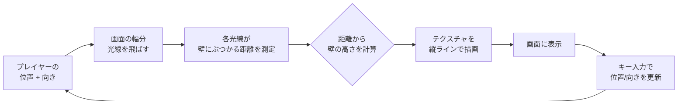
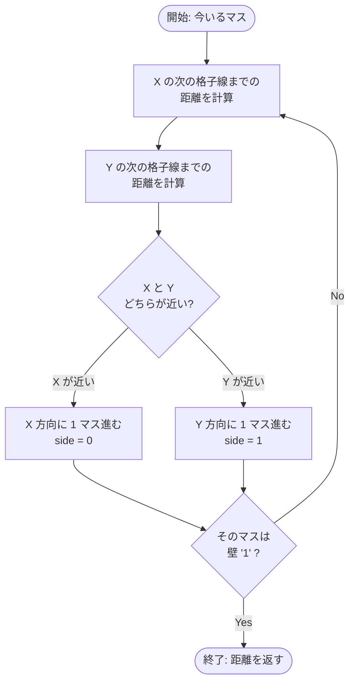
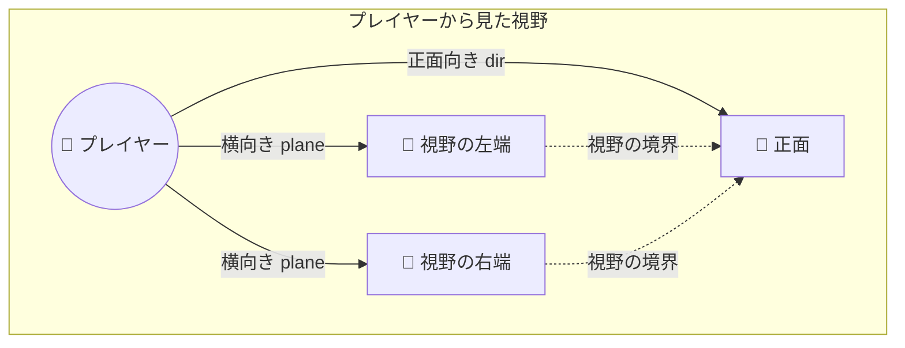

# 03. レイキャスティング（最重要）

!!! tip "ページナビ"
    ◀️ 前 **[02. パーサー](02-parser.md)** ・ **次 ▶️ [04. レンダリング](04-rendering.md)**

    **cub3D 全ページ:** [00 概要](index.md) · [01 ビルド](01-overview.md) · [02 パーサー](02-parser.md) · [**03 レイキャスティング**](03-raycasting.md) · [04 レンダリング](04-rendering.md) · [05 入力](05-input.md) · [06 メモリ](06-memory.md) · [🎓 評価対策](eval.md)

---

## このページは何？

**cub3D の「3D っぽく見せる魔法」の正体を解説するページ** です。

実は cub3D の 3D は **本物の 3D ではありません**。
2D の地図に **懐中電灯の光** みたいな光線をたくさん飛ばして、
「壁までどれくらい遠いか」を測っているだけです。

### 全体の流れ図



---

## 1. イメージでつかもう

### 身近なたとえ：暗闇で懐中電灯

**真っ暗な迷路で懐中電灯を使う場面を想像してください。**

```
    あなた
     *
     |
    [懐中電灯]
     |
     |     光が壁に届く
     |        ↓
     v ━━━━━━ 壁 ━━━━━━
```

光がすぐ壁に当たったら「壁は近い」、
光が遠くまで飛んだら「壁は遠い」がわかります。

**cub3D は画面の横幅の本数だけ懐中電灯を並べて**、
それぞれの光の長さを測ります。

```
画面幅 = 1024 ピクセル
     ↓
1024 本の懐中電灯を並べる
     ↓
それぞれ「壁までの距離」を測る
     ↓
距離 → 壁の高さに変換
     ↓
3D っぽい絵の完成！
```

---

## 2. 全体の流れ（鳥の目で見る）

### 「上から見た地図」と「プレイヤーの画面」の関係

=== "上から見た地図（プログラムの中身）"

    ```
    1 1 1 1 1 1 1 1
    1 0 0 0 0 0 0 1
    1 0 0 0 0 0 0 1
    1 0 0 P → → → 1    ← プレイヤーは →向き
    1 0 0 0 0 0 0 1
    1 0 0 0 0 0 0 1
    1 1 1 1 1 1 1 1

    1 = 壁, 0 = 通路, P = プレイヤー
    ```

=== "画面に映る絵"

    ```
    +----------------------+
    |     天井色          |
    |                      |
    |      ┌────┐          |
    |      │ 壁 │          |
    |      │    │  ← 遠い  |
    |      └────┘            |
    |                      |
    |     床色            |
    +----------------------+
    ```

**上から見た地図を元に、プレイヤーから見える絵を作る**
のがレイキャスティングの仕事。

### 1 本の光線で何をするか

画面の **1 ピクセル幅の縦線 1 本** を描くために、
**1 本の光線** を飛ばします。

```
[プレイヤー]
     |
     | 光線を飛ばす
     v
   ・・・
  (1 マスずつ)
   ・・・
  [壁！]
     |
     | 距離: 4 マス
     v
  画面に高さ計算:
     line_h = 画面高さ / 4
     → 画面の 1/4 の高さで壁を描画
```

画面幅が 1024 なら **1024 本** の光線を飛ばします。

---

## 3. このページで学ぶこと

- **光線（ray）**: プレイヤーから伸ばす仮想の線
- **DDA アルゴリズム**: 地図の格子をパッパッと渡る賢い方法
- **カメラプレーン**: 視野（画面に映る範囲）を決めるもの
- **魚眼補正**: 画面の端が歪まないための工夫
- **壁の高さ計算**: 距離が近いほど高く見える仕組み

---

## 4. 新しい概念の解説

### 光線（ray）って何？

**プレイヤーから出る仮想の直線** です。

実際に光を飛ばすわけじゃなく、
数学的な「この方向に何マス進むと壁に当たるか」を計算します。

```
[プレイヤー]━━━━━→ [壁]
            ↑
      これが 1 本の光線
      長さ = 壁までの距離
```

### DDA（Digital Differential Analyzer）って何？

**地図の格子を効率よく渡る方法** です。

名前は難しいですが、やってることは簡単：

**「次の格子線まで進む」を壁に当たるまで繰り返す**



```
       x の格子線   x の格子線
            ↓           ↓
    +------+------+------+
    |      |      |      |
    | 光線 →→→→→→→→→→→→ |
    |      |      |      |
    +------+------+------+
     ↑                    ↑
     スタート              壁
```

どうやって進むか：

```
今の位置から X の次の格子線まで: 0.4 マス
今の位置から Y の次の格子線まで: 0.7 マス
                ↓
    近い方 (X) にジャンプ！
                ↓
X 側に進んだら、また次の格子線までを測る
                ↓
これを壁に当たるまで繰り返す
```

**なぜ便利？**

1 ピクセルずつチェックする必要がないので **爆速**。
格子の境界だけ見れば OK。

### カメラプレーン（camera plane）って何？

**視野（FOV = Field of View）を決めるもの** です。

目玉が見える範囲を決める「眼鏡のフレーム」だと思ってください。



```
        ┌── 画面 ──┐
        │          │   ← これが実際に見える範囲
        └──┬───┬───┘
          ＼ ┃ ／
           ＼┃／  dir（プレイヤーの向き）
           [P]
```

**構造体では 2 つのベクトルで表現**：

```
player.dir   = プレイヤーの向き（正面）
player.plane = カメラの横方向（視野の幅）

この2つで作る三角形の外側 = 見えない範囲
              内側         = 見える範囲
```

### camera_x って何？

**画面のどこのピクセルかを表す数字** です。

画面の 1024 ピクセルを **-1 〜 +1** の数字に変換します：

```
画面の x 座標    camera_x
     0       →   -1.0    (左端)
     512     →    0.0    (中央)
     1024    →   +1.0    (右端)
```

この数字を使って、**各光線の向き** を決めます：

```
ray.dir = dir + plane * camera_x

x=0 (左端):    dir - plane = 左向きの光線
x=512 (中央): dir          = 正面の光線
x=1024 (右端): dir + plane = 右向きの光線
```

### 魚眼効果（fisheye）って何？

**普通の距離を使うと画面端が歪む現象** です。

=== "補正なし（魚眼）"

    ```
    +----------------------+
    | 壁 ←歪んで膨らむ      |
    |    +----------+      |
    |   /            \     |
    |  /              \    |
    |                      |
    +----------------------+
    ```

=== "補正あり（きれい）"

    ```
    +----------------------+
    |  ┌────────────┐     |
    |  │  まっすぐ   │     |
    |  │   な壁     │     |
    |  │            │     |
    |  └────────────┘     |
    +----------------------+
    ```

**なぜ歪む？**

画面端の光線は **斜め** に飛びます。
斜めの線は正面より **長く** なります。

```
正面の光線:  ━━━━━ (長さ5)
斜めの光線: ╲    ╲     (長さ7)
            ╲   ╲
             ╲ ╲
              ╲╲
               ●

同じ距離の壁なのに、斜めの光線は長い！
→ 壁が遠く見える → 端が膨らむ
```

**対策：垂直距離だけ使う**

光線の長さじゃなくて、
**プレイヤーの正面方向への距離** だけ使います。

```
斜めの光線 (実際):    ╲━━━━━━━
                      ╲
                       ╲
垂直距離 (計算用):    ━━━    ← こっちを使う
                      ↑
              正面方向の距離だけ取り出す
```

---

## 5. 光線 1 本の一生を追う（ストーリー仕立て）

画面の中央のピクセル（x = 512）で起きることを順番に見ましょう。

### ステップ 1: 光線の向きを決める

```
画面中央なので camera_x = 0

ray.dir = player.dir + player.plane * 0
        = player.dir

→ プレイヤーの向きそのまま！
```

### ステップ 2: 今いる格子を記録

```
プレイヤー位置: (3.5, 2.5)
              ↓ int に変換
現在のマス: (3, 2)

+---+---+---+---+
| 1 | 1 | 1 | 1 |
+---+---+---+---+
| 1 | 0 | 0 | 1 |
+---+---+---+---+
| 1 | 0 |P← | 1 |   P = (3, 2)
+---+---+---+---+    dir = →
| 1 | 1 | 1 | 1 |
+---+---+---+---+
```

### ステップ 3: 次の格子線までの距離を計算

```
X の次の格子線まで: 0.5 (右端まで)
Y の次の格子線まで: 5.0 (dir.y ≈ 0 なので超大)
              ↓
小さい方 (X) にジャンプ
              ↓
新しい位置: マス (4, 2)
```

### ステップ 4: そのマスは壁？

```
map[2][4] = '0' → 壁じゃない
              ↓
また次の格子線までを計算
```

### ステップ 5: 繰り返して壁に到達

```
+---+---+---+---+---+
| 1 | 1 | 1 | 1 | 1 |
+---+---+---+---+---+
| 1 | 0 | 0 | 0 | 1 |
+---+---+---+---+---+
| 1 | 0 | P→→→→→ |★|   ★ = 壁！
+---+---+---+---+---+
| 1 | 1 | 1 | 1 | 1 |
+---+---+---+---+---+

map[2][4] = '1' → 壁発見！
              ↓
DDA 終了
```

### ステップ 6: 壁までの距離を計算

```
ぶつかった壁までの距離 (垂直距離) = 3.2
              ↓
line_h = WIN_H / 3.2
       = 768 / 3.2
       = 240 ピクセル
              ↓
画面の中央に 240 ピクセルの壁を描画！
```

これを画面の幅 1024 回 繰り返す → 3D 画面完成！

---

## 6. コード解説

### プログラムの流れ

```
main() のループ内
  |
  for (x = 0; x < WIN_W; x++)   画面幅分回す
  |    |
  |    ↓
  |    ft_cast_ray(game, x, &ray)  光線を飛ばす
  |    ├── init_ray_dir:    光線の向きを決める
  |    ├── init_step:       どっち方向に進むか決める
  |    ├── dda:             壁に当たるまで進む
  |    └── calc_wall_dist:  垂直距離と壁の向きを計算
  |    ↓
  |    ft_draw_column(game, x, &ray)  縦 1 列を描画
```

### ステップ 1: 光線の向き

```c title="raycaster.c (init_ray_dir)" linenums="1"
static void ft_init_ray_dir(t_game *game,
                            int x, t_ray *ray)
{
    double camera_x;

    // 画面の x 座標を -1〜+1 に変換
    // 左端=-1, 中央=0, 右端=+1
    camera_x = 2.0 * x / (double)WIN_W - 1.0;

    // 光線の向き = 正面向き + 横向き * camera_x
    // 中央の光線は正面、端は斜めになる
    ray->dir.x = game->player.dir.x
               + game->player.plane.x * camera_x;
    ray->dir.y = game->player.dir.y
               + game->player.plane.y * camera_x;

    // 今いるマスの座標を int で取得
    ray->map_pos.x = (int)game->player.pos.x;
    ray->map_pos.y = (int)game->player.pos.y;

    // 1 マス進むのに必要な光線の長さ
    // (dir が 0 なら無限大に近い値 1e30 をセット)
    if (ray->dir.x == 0)
        ray->delta_dist.x = 1e30;
    else
        ray->delta_dist.x = fabs(1.0 / ray->dir.x);
    if (ray->dir.y == 0)
        ray->delta_dist.y = 1e30;
    else
        ray->delta_dist.y = fabs(1.0 / ray->dir.y);
}
```

### ステップ 2: 最初の格子線までの距離

```c title="raycaster.c (init_step)" linenums="1"
static void ft_init_step(t_game *game, t_ray *ray)
{
    // 光線が左向きなら step = -1 (左に進む)
    if (ray->dir.x < 0)
    {
        ray->step.x = -1;
        // 左の格子線までの距離
        ray->side_dist.x =
            (game->player.pos.x - ray->map_pos.x)
            * ray->delta_dist.x;
    }
    else
    {
        ray->step.x = 1;  // 右向きは step = +1
        // 右の格子線までの距離
        ray->side_dist.x =
            (ray->map_pos.x + 1.0
             - game->player.pos.x)
            * ray->delta_dist.x;
    }
    // Y 方向も同じ処理
    if (ray->dir.y < 0)
    {
        ray->step.y = -1;
        ray->side_dist.y =
            (game->player.pos.y - ray->map_pos.y)
            * ray->delta_dist.y;
    }
    else
    {
        ray->step.y = 1;
        ray->side_dist.y =
            (ray->map_pos.y + 1.0
             - game->player.pos.y)
            * ray->delta_dist.y;
    }
}
```

### ステップ 3: DDA で進む

```c title="raycaster.c (dda)" linenums="1"
static void ft_dda(t_game *game, t_ray *ray)
{
    int hit;

    hit = 0;  // まだ壁に当たってない
    while (!hit)
    {
        // X と Y の次の格子線、近い方に進む
        if (ray->side_dist.x < ray->side_dist.y)
        {
            // X 側が近い → X 方向に 1 マス進む
            ray->side_dist.x += ray->delta_dist.x;
            ray->map_pos.x += ray->step.x;
            ray->side = 0;  // 最後に渡ったのは X 壁
        }
        else
        {
            // Y 側が近い → Y 方向に 1 マス進む
            ray->side_dist.y += ray->delta_dist.y;
            ray->map_pos.y += ray->step.y;
            ray->side = 1;  // 最後に渡ったのは Y 壁
        }
        // マップの外に出たら強制終了
        if (ray->map_pos.x < 0
            || ray->map_pos.x >= game->config.map_w
            || ray->map_pos.y < 0
            || ray->map_pos.y >= game->config.map_h)
            break ;
        // 壁 ('1') に当たったら終了
        if (game->config.map
                [ray->map_pos.y]
                [ray->map_pos.x] == '1')
            hit = 1;
    }
}
```

### ステップ 4: 壁までの距離と方向

```c title="raycaster.c (calc_wall_dist)" linenums="1"
static void ft_calc_wall_dist(t_game *game,
                               t_ray *ray)
{
    // 垂直距離 (魚眼補正済み)
    // = 進んだ距離 - 1マス分
    // (壁の直前の距離を計算する)
    if (ray->side == 0)
    {
        // X 壁に当たった (東 or 西)
        ray->perp_wall_dist =
            ray->side_dist.x - ray->delta_dist.x;
        // 壁のどの位置に当たったか (0〜1)
        // テクスチャの横位置計算に使う
        ray->wall_x = game->player.pos.y
            + ray->perp_wall_dist * ray->dir.y;
    }
    else
    {
        // Y 壁に当たった (北 or 南)
        ray->perp_wall_dist =
            ray->side_dist.y - ray->delta_dist.y;
        ray->wall_x = game->player.pos.x
            + ray->perp_wall_dist * ray->dir.x;
    }
    // 小数部分だけ取り出す
    // (3.74 → 0.74 のように)
    ray->wall_x -= floor(ray->wall_x);

    // 壁の向きを判定
    // side=0 (X壁) + 右向き → 東側
    // side=0 (X壁) + 左向き → 西側
    // side=1 (Y壁) + 下向き → 南側
    // side=1 (Y壁) + 上向き → 北側
    if (ray->side == 0 && ray->dir.x > 0)
        ray->tex_id = TEX_EA;
    else if (ray->side == 0 && ray->dir.x <= 0)
        ray->tex_id = TEX_WE;
    else if (ray->side == 1 && ray->dir.y > 0)
        ray->tex_id = TEX_SO;
    else
        ray->tex_id = TEX_NO;
}
```

---

## 7. 数式まとめ

### 光線の向き

```
ray.dir = player.dir + player.plane * camera_x
```

- `camera_x` は -1（左端）〜 +1（右端）
- 中央の光線は `player.dir` と同じ

### 垂直距離（魚眼補正）

```
perp_wall_dist = side_dist - delta_dist
```

`side_dist` は「壁のマスに入った瞬間の距離」、
1 マス分戻して「壁の直前の距離」にします。

### 壁の高さ

```
line_h = WIN_H / perp_wall_dist
```

- 距離 = 1 なら高さ = WIN_H（画面いっぱい）
- 距離 = 2 なら高さ = WIN_H/2（半分）
- 距離 = 10 なら高さ = WIN_H/10（1/10）

---

## 8. 評価シートの確認項目

- [ ] 画面の横幅分の光線を飛ばしている
- [ ] DDA アルゴリズムを使っている
- [ ] 魚眼補正（垂直距離）を使っている
- [ ] 壁の向き（N/S/E/W）を正しく判定している
- [ ] マップ外に出てもクラッシュしない

---

## 9. テストチェックリスト

- [ ] 回転しても画面が膨らまない（魚眼なし）
- [ ] 四方の壁で別のテクスチャが貼られる
- [ ] 壁に近づくと大きく、離れると小さく見える
- [ ] 壁際ギリギリでも不自然にならない

---

## 10. ディフェンスで聞かれること

| 質問 | 答え方 |
|------|--------|
| レイキャスティングとは？ | プレイヤーから画面幅分の光線を飛ばし、壁までの距離から縦 1 ラインずつ描画する手法 |
| DDA とは？ | 格子を 1 マスずつ効率よく渡る方法。X と Y の次の格子線のうち近い方に進む |
| カメラプレーンとは？ | 視野角を決める仮想の平面。`dir` と `plane` の大きさで FOV が決まる |
| 魚眼補正はなぜ必要？ | 斜めの光線は長くなるので、そのまま使うと端が膨らむ。垂直距離に変換して補正 |
| 壁の向きはどう判定？ | `side`（最後に渡った格子線の向き）と光線方向の符号で決定 |
| 無限ループしない理由は？ | DDA は 1 マスずつ前進、マップ外に出たら break |
| 画面 x 座標から光線へ変換は？ | `camera_x = 2x/WIN_W - 1` で -1〜+1 に正規化 |

---

## 11. よくあるミス

!!! warning "魚眼補正を忘れる"
    `perp_wall_dist` ではなく普通の距離を使うと端が膨らむ。

!!! warning "div by zero"
    `dir.x == 0` のとき `1/dir` で落ちる。大きな値（`1e30`）でガード。

!!! warning "side の勘違い"
    `side=0` は **X 壁（EAST/WEST）** です。N/S ではないので注意。

!!! warning "壁判定の順番"
    DDA で `map_pos` を更新 → 壁判定の順でないと 1 マスずれる。

---

## 12. 次のページへ

次は [レンダリング](04-rendering.md) で、光線の結果を実際に画面に描く方法を学びます。
