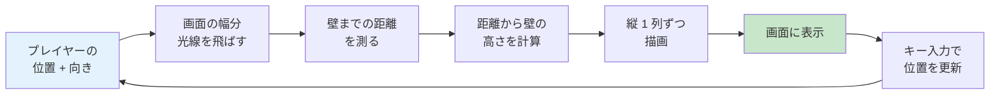
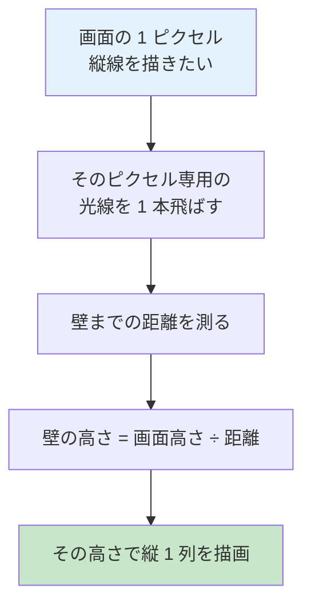
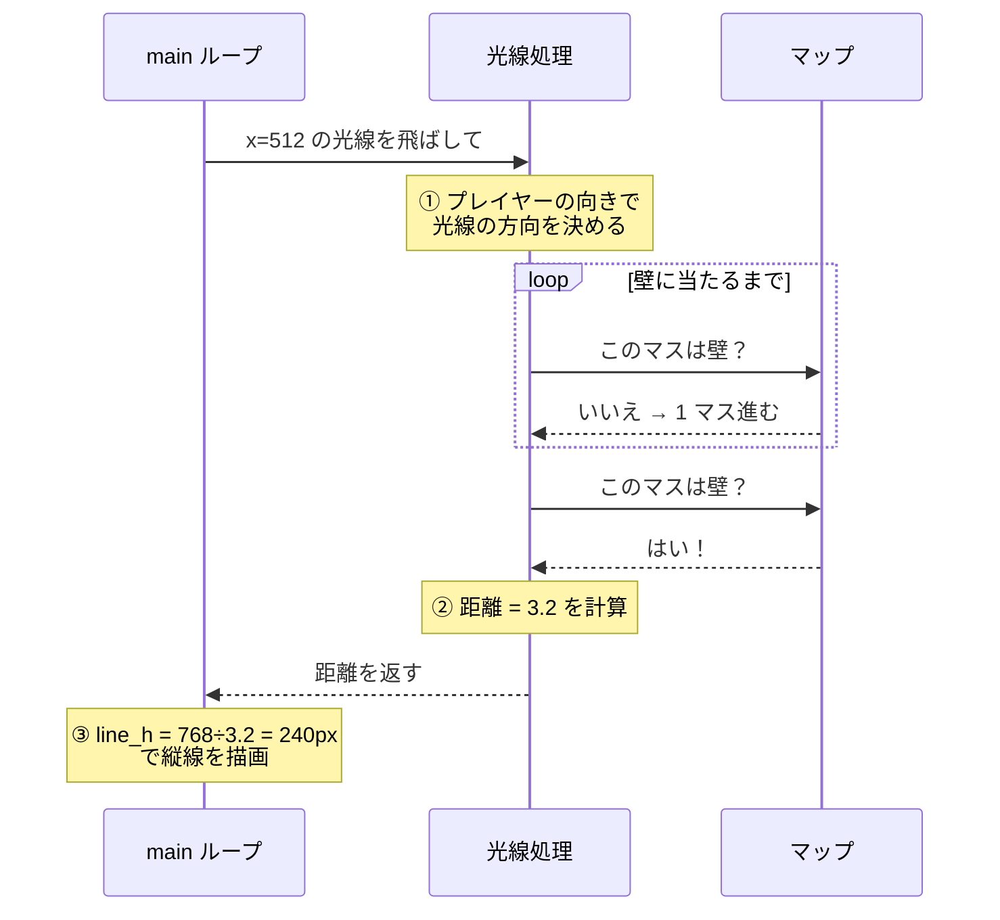

# 03. レイキャスティングとは（概念編）

!!! tip "ページナビ"
    ◀️ 前 **[02. パーサー](02-parser.md)** ・ **次 ▶️ [04. DDA アルゴリズム](04-dda.md)**

---

## このページは何？

**cub3D の「3D っぽく見せる魔法」の正体を、まず感覚でつかむページ** です。

実は cub3D の 3D は **本物の 3D ではありません**。
2D の地図に **たくさんの光線** を飛ばして、
「壁までどれくらい遠いか」を測っているだけ。

具体的な計算方法（DDA など）は次のページで学びます。
このページでは **「何をしているか」** に集中します。

---

## 1. 懐中電灯のたとえ

真っ暗な迷路で **懐中電灯** を照らすと、
光は壁に当たるところまで届きます。

- 光がすぐ壁に当たる → **壁は近い**
- 光が遠くまで伸びる → **壁は遠い**

これだけで「距離」が測れます。

!!! info "ポイント"
    cub3D は **画面の幅（例: 1024 ピクセル）の本数だけ** 懐中電灯を並べ、
    それぞれの光の長さを測って **壁の高さ** を計算しています。

---

## 2. 全体の流れ

このサイクルが **1 秒間に 60 回** 回ります（60 FPS）。

---

## 3. 1 本の光線で何をするか

画面幅が 1024 なら **1024 回繰り返す** → 3D っぽい絵が完成！

---

## 4. 上から見た地図 vs 画面

=== "🗺️ 上から見た地図（プログラム内部）"

    | 列→ 行↓ | 0 | 1 | 2 | 3 | 4 | 5 | 6 | 7 |
    |:-:|:-:|:-:|:-:|:-:|:-:|:-:|:-:|:-:|
    | **0** | 🧱 | 🧱 | 🧱 | 🧱 | 🧱 | 🧱 | 🧱 | 🧱 |
    | **1** | 🧱 |  |  |  |  |  |  | 🧱 |
    | **2** | 🧱 |  |  |  |  |  |  | 🧱 |
    | **3** | 🧱 |  |  | 👤→ | → | → | → | 🧱 |
    | **4** | 🧱 |  |  |  |  |  |  | 🧱 |
    | **5** | 🧱 |  |  |  |  |  |  | 🧱 |
    | **6** | 🧱 | 🧱 | 🧱 | 🧱 | 🧱 | 🧱 | 🧱 | 🧱 |

    🧱 = 壁（`1`）／ 空欄 = 通路（`0`）／ 👤 = プレイヤー

=== "🖥️ 画面に映る絵（プレイヤー視点）"

    | 画面エリア | 内容 |
    |:-:|:-:|
    | 上部 | ☁️ 天井色 |
    | 中央 | 🧱 **壁** (距離が遠いほど小さく描画) |
    | 下部 | 🟫 床色 |

上から見た 2D 地図を元に、プレイヤーから見える絵を作るのが
レイキャスティングの仕事。

---

## 5. 具体例: 1 本の光線を追う

画面中央のピクセル（例: x = 512）に対応する光線が、
どう動くかを見てみましょう。

### ステップ別サマリー

| ステップ | 内容 |
|:-:|:---|
| ① | 画面上のピクセル位置から、光線の向きを決める |
| ② | 光線を壁まで進めて、距離を測る |
| ③ | 距離から壁の高さを計算して描画 |

ここまでで **レイキャスティングの全体像** はつかめました。

---

## 6. 大事な用語まとめ

| 用語 | 意味 |
|:---|:---|
| **光線 (ray)** | プレイヤーから伸ばす仮想の線 |
| **DDA** | 地図の格子を効率よく渡る方法（次ページ） |
| **カメラプレーン** | 視野を決めるもの（05 ページ） |
| **魚眼補正** | 画面端の歪みを直す工夫（05 ページ） |
| **垂直距離** | プレイヤー正面方向への距離（05 ページ） |

---

## 7. 次のページへ

具体的な計算方法に進みます。まずは壁を見つけるためのアルゴリズム:

▶️ **[04. DDA — 格子を効率よく渡る](04-dda.md)**

!!! tip "進め方"
    このページが「レイキャスティングって何？」に答えました。
    次の 2 ページで「どう計算するの？」を学びます。

    - 04: 壁を**見つける**アルゴリズム（DDA）
    - 05: 光線の**向き**と**補正**（カメラと魚眼）
