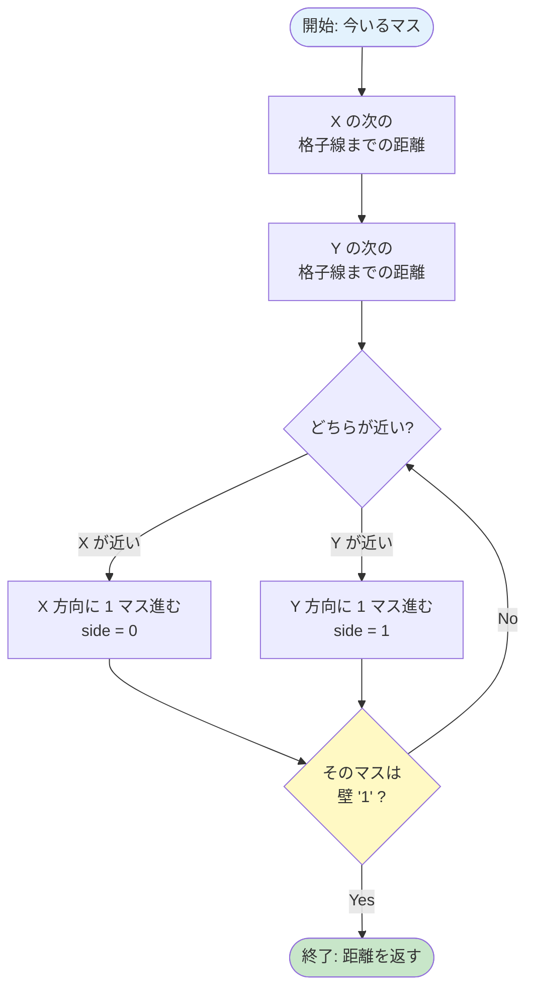

# 04. DDA — 格子を効率よく渡る

!!! tip "ページナビ"
    ◀️ 前 **[03. レイキャスティングとは](03-raycasting.md)** ・ **次 ▶️ [05. カメラと魚眼補正](05-camera.md)**

---

## このページは何？

**光線が壁を見つけるまで、地図をどう進むかを解説するページ** です。

DDA（Digital Differential Analyzer）という賢い方法で、
**ピクセル単位ではなく、格子単位で一気に飛んで** 壁を探します。

---

## 1. なぜ DDA を使う？

### 素朴な方法: 1 ピクセルずつ進む


これは **遅すぎる**。1 画面で **数十万回** のチェックが必要。

### DDA: 格子線だけチェック


**壁の境界だけ見れば OK** なので **爆速**。
マップ 8x8 なら最大 15 回くらいのチェックで終わる。

---

## 2. DDA の仕組み

**「X の次の格子線」と「Y の次の格子線」のうち近い方に進む** を繰り返すだけ。



---

## 3. 具体例: 光線が動く様子

プレイヤーが `(1.5, 1.5)` にいて、右上方向に光線を飛ばす例。

### 初期状態

| 列→<br>行↓ | 0 | 1 | 2 | 3 | 4 |
|:-:|:-:|:-:|:-:|:-:|:-:|
| **0** | 🧱 | 🧱 | 🧱 | 🧱 | 🧱 |
| **1** | 🧱 | 👤 |  |  | 🧱 |
| **2** | 🧱 |  |  |  | 🧱 |
| **3** | 🧱 |  |  |  | 🧱 |
| **4** | 🧱 | 🧱 | 🧱 | 🧱 | 🧱 |

### 進む順序

| 回 | side | 移動後のマス | 壁？ |
|:-:|:-:|:-:|:-:|
| 1 | X (右) | (2, 1) | ❌ |
| 2 | Y (下) | (2, 2) | ❌ |
| 3 | X (右) | (3, 2) | ❌ |
| 4 | X (右) | (4, 2) | ✅ **壁発見** |

**たった 4 回** のチェックで壁に到達！

---

## 4. 重要な変数

| 変数 | 意味 |
|:---|:---|
| `ray.map_pos` | 今いるマスの座標（int） |
| `ray.side_dist` | 次の格子線までの距離（X と Y の両方） |
| `ray.delta_dist` | 1 格子進むのに必要な距離 |
| `ray.step` | 進む方向（+1 または -1） |
| `ray.side` | 最後に渡った格子線（0=X 壁, 1=Y 壁） |

---

## 5. コード解説

### 最初の格子線までの距離を計算

```c title="raycaster.c (init_step)" linenums="1"
static void ft_init_step(t_game *game, t_ray *ray)
{
    // X 方向: 左向き? 右向き?
    if (ray->dir.x < 0)
    {
        ray->step.x = -1;  // 左に進む
        // 左の格子線までの距離
        ray->side_dist.x =
            (game->player.pos.x - ray->map_pos.x)
            * ray->delta_dist.x;
    }
    else
    {
        ray->step.x = 1;   // 右に進む
        // 右の格子線までの距離
        ray->side_dist.x =
            (ray->map_pos.x + 1.0
             - game->player.pos.x)
            * ray->delta_dist.x;
    }
    // Y 方向も同じ処理
    if (ray->dir.y < 0)
    {
        ray->step.y = -1;
        ray->side_dist.y =
            (game->player.pos.y - ray->map_pos.y)
            * ray->delta_dist.y;
    }
    else
    {
        ray->step.y = 1;
        ray->side_dist.y =
            (ray->map_pos.y + 1.0
             - game->player.pos.y)
            * ray->delta_dist.y;
    }
}
```

### DDA 本体

```c title="raycaster.c (dda)" linenums="1"
static void ft_dda(t_game *game, t_ray *ray)
{
    int hit;

    hit = 0;  // まだ壁に当たってない
    while (!hit)
    {
        // X と Y の次の格子線、近い方に進む
        if (ray->side_dist.x < ray->side_dist.y)
        {
            ray->side_dist.x += ray->delta_dist.x;
            ray->map_pos.x += ray->step.x;
            ray->side = 0;  // X 壁に当たった
        }
        else
        {
            ray->side_dist.y += ray->delta_dist.y;
            ray->map_pos.y += ray->step.y;
            ray->side = 1;  // Y 壁に当たった
        }
        // マップの外に出たら強制終了
        if (ray->map_pos.x < 0
            || ray->map_pos.x >= game->config.map_w
            || ray->map_pos.y < 0
            || ray->map_pos.y >= game->config.map_h)
            break ;
        // 壁 ('1') に当たったら終了
        if (game->config.map
                [ray->map_pos.y]
                [ray->map_pos.x] == '1')
            hit = 1;
    }
}
```

---

## 6. ディフェンスで聞かれること

| 質問 | 答え方 |
|------|--------|
| DDA とは？ | 格子を 1 マスずつ効率的に渡るアルゴリズム |
| なぜピクセル単位で進まない？ | 遅いから。格子の境界だけ見れば十分 |
| side が 0 / 1 の違いは？ | 0 = X 壁（東西）、1 = Y 壁（南北） |
| 無限ループ対策は？ | マップ外に出たら `break`、必ず 1 マスずつ前進 |
| X と Y どちらに進む判断は？ | `side_dist.x` と `side_dist.y` のうち小さい方 |

---

## 7. よくあるミス

!!! warning "div by zero"
    `dir.x == 0` のとき `1/dir` で落ちる。
    `delta_dist` 計算時に `1e30` でガード必須。

!!! warning "壁判定の順番"
    DDA ループでは **「進む → 壁判定」** の順。
    逆にすると 1 マスずれる。

!!! warning "side の混同"
    `side = 0` は X 格子線を渡った = **東西の壁**（EA/WE）。
    北南 (NO/SO) ではないので注意。

---

## 8. 次のページへ

DDA で壁は見つけられました。次は **光線の向き** を決める仕組みを学びます。

▶️ **[05. カメラと魚眼補正](05-camera.md)**
