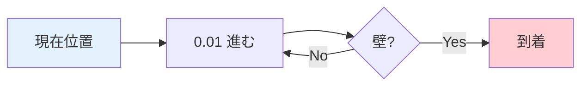
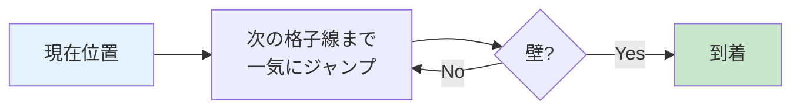
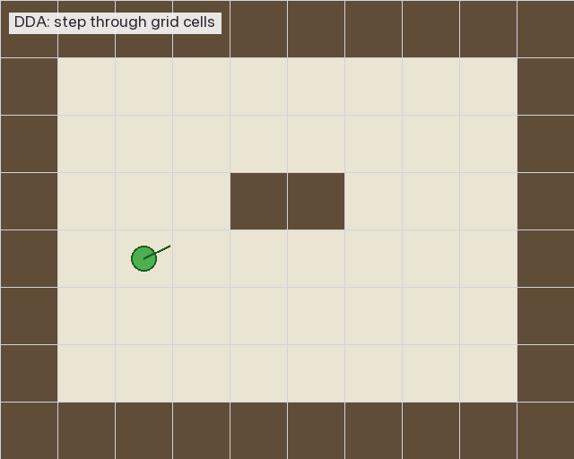
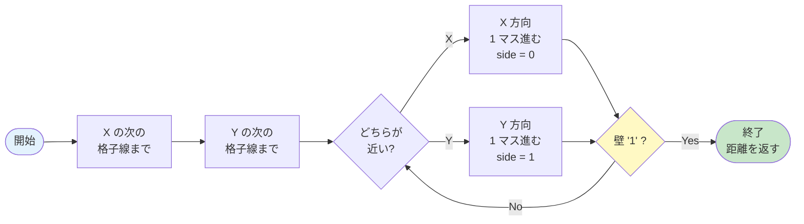
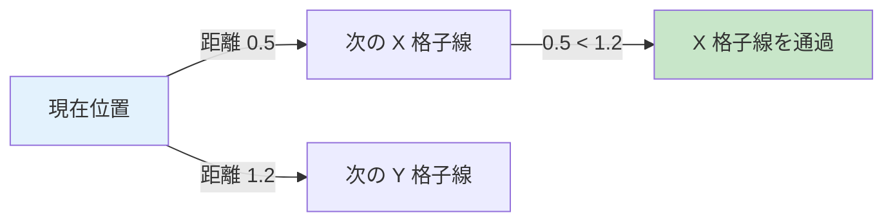

# 04. DDA — 格子を効率よく渡る

---

## このページは何？

**光線が壁を見つけるまで、地図をどう進むかを解説するページ** です。

!!! info "言葉の解説"
    - **DDA** = **Digital Differential Analyzer**（デジタル微分解析機）
    - **格子 (grid)** = マップの **マスの縦横の線**。1 マスごとに引かれる
    - **格子線 (grid line)** = マスとマスの **境界線**

DDA は **「格子線の場所だけチェックして進む」** 賢い方法。
ピクセル単位で進むより **爆速**です。

---

## 🎯 なぜ DDA を学ぶ？（学習意図）

レイキャスティングは「壁までの距離」を測れて初めて意味を持ちます。
ここで素朴に「0.01 ずつ進んで壁か確認」を選ぶと、1024 本 × 数百ステップ = 30 万回の判定が毎フレーム走り、
すぐに **60 FPS が崩壊** します。DDA は「ピクセル空間ではなく **格子線** という離散的な構造を使って計算量を激減させる」
という、3D ゲーム黎明期の知恵そのものです。

| 学ばせたいこと | このページで出会う形 |
|---|---|
| **離散化による高速化** | ピクセル単位ループ vs 格子線ジャンプの 100 倍以上の速度差 |
| **増分計算 (incremental computation)** | `side_dist` を毎回計算し直さず、`delta_dist` を加算するだけで進める |
| **2 軸の競合解決** | X 方向と Y 方向のどちらが先に格子線に届くか、`side_dist.x < side_dist.y` で決める |
| **境界条件と無限ループ防止** | マップ外脱出チェック、ゼロ除算ガード、必ず 1 マスずつ前進する保証 |
| **`side` で壁面の向きまで決まる** | DDA の出力（0/1）が後段のテクスチャ選択と垂直距離計算に直結する |

つまり「**ナイーブなループを賢いアルゴリズムに置き換える訓練**」が真の狙いです。
DDA を理解すると、コンピュータグラフィックスの定番技法「**離散化 + 増分計算**」のパターンが体に入ります。

---

## このページで学ぶこと

- **格子線 (grid line)** — マスの境界線。DDA がチェックする「節目」
- **`delta_dist`** — X / Y 方向に 1 マス進むのに必要な光線の長さ
- **`side_dist`** — 現在地から次の格子線までの距離（毎ステップ更新）
- **`step.x / step.y`** — 進む向き（+1 または -1）
- **`side`** — 最後に渡った格子線（0 = X 壁、1 = Y 壁）
- **ゼロ除算ガード** — `dir.x == 0` のとき `1e30` で逃がす定番イディオム

---

!!! info "💡 ここでつまずく人へ — 「格子線」って何？"
    マップは **1 マス単位** で書かれた地図です（チェック柄の床をイメージ）。
    マス同士の境目に走っている **縦と横の線** が「**格子線**」。

    DDA は「光線が 1 マス 1 マス進むのではなく、**次の格子線にぶつかった瞬間** だけを
    チェックする」方法。0.01 単位で進むより圧倒的に速いです。

---

## 1. なぜ DDA を使う？

### 素朴な方法（遅い）: 1 ピクセルずつ進む



これだと **1 本の光線で数百回のチェック** が必要。
1024 本 × 数百回 = **数十万回** のチェックが 1 フレームで発生 → 重すぎる。

### DDA の方法（速い）: 格子線ごとにジャンプ



**壁の境界だけ見れば十分** なので、
マップ 8x8 なら **最大 15 回くらい** のチェックで終わります。

---

## 2. DDA の 1 回の動き

### 🎬 DDA の動きを可視化



プレイヤー（緑の丸）から光線が飛び、**1 マスずつオレンジ色でハイライト** しながら進みます。
壁のマス（濃い茶色）に当たった瞬間、**赤色でハイライトして終了** します。

### 仕組み

**「X の次の格子線」と「Y の次の格子線」のうち近い方に進む** を繰り返すだけ。



---

## 3. 具体例: プレイヤーが (1.5, 1.5) から右方向に光線を飛ばす

!!! info "座標の見方"
    - **x 座標** = **横方向**（左→右で増える）
    - **y 座標** = **縦方向**（上→下で増える）
    - 例: `(1.5, 1.5)` = 列 1, 行 1 のマスの中央

### 初期のマップ

| 列 (x) →<br>行 (y) ↓ | 0 | 1 | 2 | 3 | 4 |
|:-:|:-:|:-:|:-:|:-:|:-:|
| **0** | 🧱 | 🧱 | 🧱 | 🧱 | 🧱 |
| **1** | 🧱 | 👤 | ⬜ | ⬜ | 🧱 |
| **2** | 🧱 | ⬜ | ⬜ | ⬜ | 🧱 |
| **3** | 🧱 | ⬜ | ⬜ | ⬜ | 🧱 |
| **4** | 🧱 | 🧱 | 🧱 | 🧱 | 🧱 |

👤 = プレイヤー（右上向き: dir ≈ (1, 0.3)）／ 🧱 = 壁／ ⬜ = 通路

### DDA の動き（1 ステップずつ）

| 回数 | side | 進む方向 | 移動後のマス | 壁？ |
|:-:|:-:|:---|:-:|:-:|
| 1 回目 | `0` (X 壁) | 右へ 1 マス | (2, 1) | ❌ 通路 |
| 2 回目 | `1` (Y 壁) | 下へ 1 マス | (2, 2) | ❌ 通路 |
| 3 回目 | `0` (X 壁) | 右へ 1 マス | (3, 2) | ❌ 通路 |
| 4 回目 | `0` (X 壁) | 右へ 1 マス | **(4, 2)** | ✅ **壁発見!** |

**たった 4 回** のチェックで壁に到達！

### 到達時のマップ

| 列 (x) →<br>行 (y) ↓ | 0 | 1 | 2 | 3 | 4 |
|:-:|:-:|:-:|:-:|:-:|:-:|
| **0** | 🧱 | 🧱 | 🧱 | 🧱 | 🧱 |
| **1** | 🧱 | 👤→ | → | ⬜ | 🧱 |
| **2** | 🧱 | ⬜ | ↘ | → | 🟥 |
| **3** | 🧱 | ⬜ | ⬜ | ⬜ | 🧱 |
| **4** | 🧱 | 🧱 | 🧱 | 🧱 | 🧱 |

🟥 = 光線が最後に当たった壁（マス `(4, 2)`）

---

## 4. 使う変数まとめ

| 変数 | 意味 | 型 |
|:---|:---|:-:|
| `ray.map_pos.x` | 今いるマスの **x 座標**（列） | int |
| `ray.map_pos.y` | 今いるマスの **y 座標**（行） | int |
| `ray.delta_dist.x` | X 方向に 1 マス進むのに必要な光線の長さ | double |
| `ray.delta_dist.y` | Y 方向に 1 マス進むのに必要な光線の長さ | double |
| `ray.side_dist.x` | 次の X 格子線までの距離 | double |
| `ray.side_dist.y` | 次の Y 格子線までの距離 | double |
| `ray.step.x` | X 方向に進む向き（+1 or -1） | int |
| `ray.step.y` | Y 方向に進む向き（+1 or -1） | int |
| `ray.side` | 最後に渡った格子線（0 = X 壁, 1 = Y 壁） | int |

---

## 5. なぜ「どちらが近いか」で判定？

次の **X 格子線** と **Y 格子線** のうち、**光線が先に届く方** が次の通過地点です。



光線は **直線** なので、先に出会う格子線を 1 本ずつ越えていくイメージ。

---

## 6. コード解説

### 最初の格子線までの距離を計算

```c title="raycaster.c (init_step)"
static void ft_init_step(t_game *game, t_ray *ray)
{
    if (ray->dir.x < 0)
    {
        ray->step.x = -1;           // 左に進む
        ray->side_dist.x = (game->player.pos.x - ray->map_pos.x)
            * ray->delta_dist.x;
    }
    else
    {
        ray->step.x = 1;            // 右に進む
        ray->side_dist.x = (ray->map_pos.x + 1.0 - game->player.pos.x)
            * ray->delta_dist.x;
    }
    if (ray->dir.y < 0)
    {
        ray->step.y = -1;           // 上に進む
        ray->side_dist.y = (game->player.pos.y - ray->map_pos.y)
            * ray->delta_dist.y;
    }
    else
    {
        ray->step.y = 1;            // 下に進む
        ray->side_dist.y = (ray->map_pos.y + 1.0 - game->player.pos.y)
            * ray->delta_dist.y;
    }
}
```

### DDA 本体

```c title="raycaster.c (dda)"
static void ft_dda(t_game *game, t_ray *ray)
{
    int hit;

    hit = 0;
    while (!hit)
    {
        if (ray->side_dist.x < ray->side_dist.y)
        {
            ray->side_dist.x += ray->delta_dist.x;
            ray->map_pos.x += ray->step.x;
            ray->side = 0;  // X 壁に当たった
        }
        else
        {
            ray->side_dist.y += ray->delta_dist.y;
            ray->map_pos.y += ray->step.y;
            ray->side = 1;  // Y 壁に当たった
        }
        if (ray->map_pos.x < 0 || ray->map_pos.x >= game->config.map_w
            || ray->map_pos.y < 0 || ray->map_pos.y >= game->config.map_h)
            break ;
        if (game->config.map[ray->map_pos.y][ray->map_pos.x] == '1')
            hit = 1;
    }
}
```

---

## 7. このページに関連する評価項目

本ページの内容は、評価シートの **以下のセクション** に対応します。詳細（英語原文 + 日本語訳 + 評価者が見るコード + Q&A）は各専用ページに。

| 評価セクション | 担当する内容 | 詳細 |
|:---|:---|:---|
| **Technical elements of the display** | DDA で測った距離をフレームバッファに反映 → smooth な描画の基盤 | [eval-display](eval-display.md) |
| **Walls** | DDA が壁を確実に検出し、`side` を正しく出力する → 4 方向テクスチャの前提 | [eval-walls](eval-walls.md) |

→ 全項目を一覧したい場合は **[評価対策トップ](eval.md)** へ。

---

## 8. ディフェンスで聞かれること（学習トピック）

評価シート項目別の詳細（壁の判定・smooth な表示など）は **[eval-walls](eval-walls.md)** / **[eval-display](eval-display.md)** にあります。
ここでは **本ページの学習トピック（DDA アルゴリズム）に関する技術質問** だけを扱います。

| 質問 | 答え方 | 実装で言うと |
|:---|:---|:---|
| DDA とは？ | 格子を 1 マスずつ効率的に渡るアルゴリズム。「ピクセル空間」ではなく「格子線」を単位に進む | `ft_dda` 内のメインループ。`side_dist` を更新しながら 1 マスずつ前進 |
| なぜピクセル単位で進まない？ | 遅いから。0.01 ずつ進むと 1 本の光線で数百回判定 → 60 FPS が崩壊する | `ft_dda` は最大でも `map_w + map_h` 回程度のループで終わる |
| `side` が 0 / 1 の違いは？ | 0 = X 格子線を渡った = 東西の壁（EA/WE）。1 = Y 格子線を渡った = 南北の壁（NO/SO） | `ray->side` は後段 `ft_calc_wall_dist` でテクスチャ選択に使われる |
| 無限ループ対策は？ | マップ外に出たら `break`、毎ループで必ず 1 マスずつ前進する保証 | `ft_dda` の `if (... || ray->map_pos.x >= game->config.map_w ...) break;` |
| X と Y どちらに進む判断は？ | `side_dist.x` と `side_dist.y` のうち **小さい方** = 先に届く格子線 | `if (ray->side_dist.x < ray->side_dist.y)` の分岐 |
| ゼロ除算対策は？ | `dir.x == 0` のとき `delta_dist.x = 1e30` の巨大値を入れて「決して X 格子線には届かない」状態にする | `ft_init_ray_dir` で `if (ray->dir.x == 0) ray->delta_dist.x = 1e30;` |
| `delta_dist` と `side_dist` の違いは？ | `delta_dist` は「1 マス分の光線長」の **定数**。`side_dist` は「現在地から次の格子線までの距離」の **可変**。毎ループで `side_dist += delta_dist` | `delta_dist` は光線開始時に 1 度計算、`side_dist` は DDA ループで都度加算 |

---

## 9. よくあるミス

!!! warning "div by zero（0 で割るバグ）"
    `dir.x == 0` のとき `1/dir.x` で落ちる。
    `delta_dist` 計算時に `1e30` の大きな値でガード必須。

!!! warning "壁判定の順番"
    DDA ループは **「進む → 壁判定」** の順。
    逆にすると 1 マスずれる。

!!! warning "side の混同"
    `side = 0` は **X 格子線を渡った = 東西の壁**（EA/WE）。
    南北 (NO/SO) ではないので注意。

---

## 📚 分からない用語は？

**→ [📚 用語集](glossary.md)**

---

## 💡 ここまでの学びのまとめ

このページで身についたこと:

- **格子線ジャンプ** で計算量を激減させる発想（ピクセル単位ループとの 100 倍以上の速度差）
- **増分計算**: `side_dist` を毎回計算し直さず、`delta_dist` を加算するだけで進める
- **`side_dist.x < side_dist.y` で 2 軸の競合を解決** — 先に届く格子線を 1 本ずつ越えていく
- **`side` で壁面の向きまで決まる** — 0 = X 壁 (EA/WE)、1 = Y 壁 (NO/SO)。後段のテクスチャ選択へ直結
- **境界条件の 3 点セット** — マップ外脱出 break、ゼロ除算ガード、毎ループ必ず 1 マスずつ前進

!!! tip "ここで詰まったら"
    - 「光線が止まらない/SEGV する！」→ マップ外脱出の `break` が抜けている、または ` map_pos.x < 0` チェック忘れ
    - 「`dir.x = 0` で nan/inf が出る！」→ `ft_init_ray_dir` でゼロ除算ガード（`1e30` 代入）が抜けている
    - 「壁の向きが東西と南北で逆！」→ `side = 0` は **X 格子線 = 東西**。`side = 1` は **Y 格子線 = 南北**。混同しがち
    - 「テクスチャが 1 マス分ずれる！」→ DDA は「進む → 壁判定」の順。`map_pos` を更新する前に判定すると 1 マスずれる

---

## 10. 次のページへ

DDA で壁は見つけられました。次は **光線の向き** を決める仕組みを学びます。

▶️ **[05. カメラと魚眼補正](05-camera.md)**
