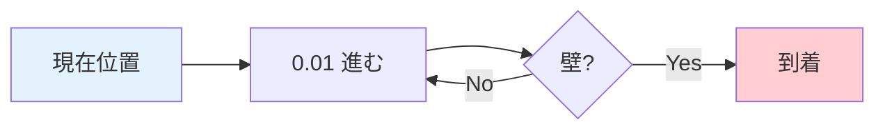
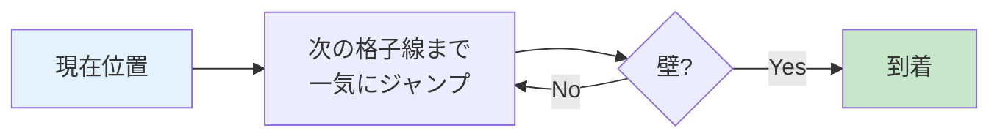
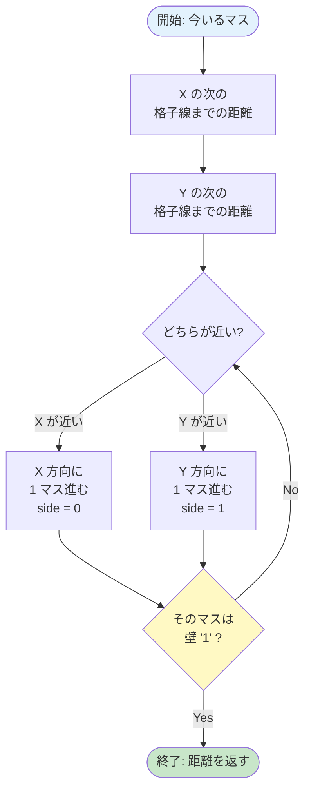
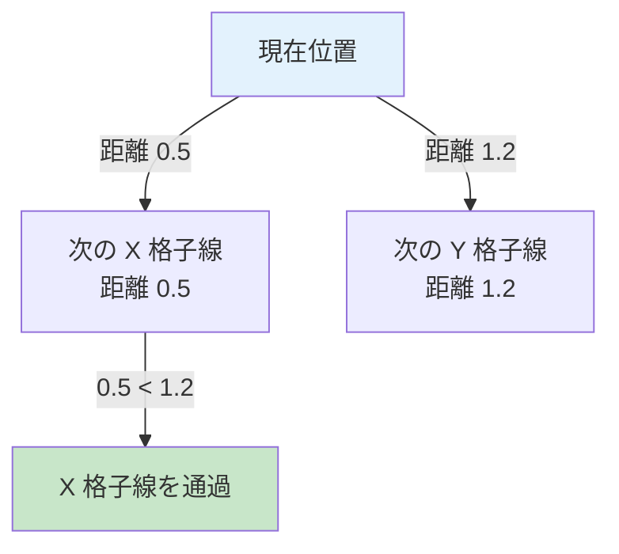

# 04. DDA — 格子を効率よく渡る

!!! tip "ページナビ"
    ◀️ 前 **[03. レイキャスティングとは](03-raycasting.md)** ・ **次 ▶️ [05. カメラと魚眼補正](05-camera.md)**
    ・ **[📚 用語集](glossary.md)**

---

## このページは何？

**光線が壁を見つけるまで、地図をどう進むかを解説するページ** です。

!!! info "言葉の解説"
    - **DDA** = **Digital Differential Analyzer**（デジタル微分解析機）
    - **格子 (grid)** = マップの **マスの縦横の線**。1 マスごとに引かれる
    - **格子線 (grid line)** = マスとマスの **境界線**

DDA は **「格子線の場所だけチェックして進む」** 賢い方法。
ピクセル単位で進むより **爆速**です。

---

## 1. なぜ DDA を使う？

### 素朴な方法（遅い）: 1 ピクセルずつ進む



これだと **1 本の光線で数百回のチェック** が必要。
1024 本 × 数百回 = **数十万回** のチェックが 1 フレームで発生 → 重すぎる。

### DDA の方法（速い）: 格子線ごとにジャンプ



**壁の境界だけ見れば十分** なので、
マップ 8x8 なら **最大 15 回くらい** のチェックで終わります。

---

## 2. DDA の 1 回の動き

**「X の次の格子線」と「Y の次の格子線」のうち近い方に進む** を繰り返すだけ。



---

## 3. 具体例: プレイヤーが (1.5, 1.5) から右方向に光線を飛ばす

!!! info "座標の見方"
    - **x 座標** = **横方向**（左→右で増える）
    - **y 座標** = **縦方向**（上→下で増える）
    - 例: `(1.5, 1.5)` = 列 1, 行 1 のマスの中央

### 初期のマップ

| 列 (x) →<br>行 (y) ↓ | 0 | 1 | 2 | 3 | 4 |
|:-:|:-:|:-:|:-:|:-:|:-:|
| **0** | 🧱 | 🧱 | 🧱 | 🧱 | 🧱 |
| **1** | 🧱 | 👤 | ⬜ | ⬜ | 🧱 |
| **2** | 🧱 | ⬜ | ⬜ | ⬜ | 🧱 |
| **3** | 🧱 | ⬜ | ⬜ | ⬜ | 🧱 |
| **4** | 🧱 | 🧱 | 🧱 | 🧱 | 🧱 |

👤 = プレイヤー（右上向き: dir ≈ (1, 0.3)）／ 🧱 = 壁／ ⬜ = 通路

### DDA の動き（1 ステップずつ）

| 回数 | side | 進む方向 | 移動後のマス | 壁？ |
|:-:|:-:|:---|:-:|:-:|
| 1 回目 | `0` (X 壁) | 右へ 1 マス | (2, 1) | ❌ 通路 |
| 2 回目 | `1` (Y 壁) | 下へ 1 マス | (2, 2) | ❌ 通路 |
| 3 回目 | `0` (X 壁) | 右へ 1 マス | (3, 2) | ❌ 通路 |
| 4 回目 | `0` (X 壁) | 右へ 1 マス | **(4, 2)** | ✅ **壁発見!** |

**たった 4 回** のチェックで壁に到達！

### 到達時のマップ

| 列 (x) →<br>行 (y) ↓ | 0 | 1 | 2 | 3 | 4 |
|:-:|:-:|:-:|:-:|:-:|:-:|
| **0** | 🧱 | 🧱 | 🧱 | 🧱 | 🧱 |
| **1** | 🧱 | 👤→ | → | ⬜ | 🧱 |
| **2** | 🧱 | ⬜ | ↘ | → | 🟥 |
| **3** | 🧱 | ⬜ | ⬜ | ⬜ | 🧱 |
| **4** | 🧱 | 🧱 | 🧱 | 🧱 | 🧱 |

🟥 = 光線が最後に当たった壁（マス `(4, 2)`）

---

## 4. 使う変数まとめ

| 変数 | 意味 | 型 |
|:---|:---|:-:|
| `ray.map_pos.x` | 今いるマスの **x 座標**（列） | int |
| `ray.map_pos.y` | 今いるマスの **y 座標**（行） | int |
| `ray.delta_dist.x` | X 方向に 1 マス進むのに必要な光線の長さ | double |
| `ray.delta_dist.y` | Y 方向に 1 マス進むのに必要な光線の長さ | double |
| `ray.side_dist.x` | 次の X 格子線までの距離 | double |
| `ray.side_dist.y` | 次の Y 格子線までの距離 | double |
| `ray.step.x` | X 方向に進む向き（+1 or -1） | int |
| `ray.step.y` | Y 方向に進む向き（+1 or -1） | int |
| `ray.side` | 最後に渡った格子線（0 = X 壁, 1 = Y 壁） | int |

---

## 5. なぜ「どちらが近いか」で判定？

次の **X 格子線** と **Y 格子線** のうち、**光線が先に届く方** が次の通過地点です。



光線は **直線** なので、先に出会う格子線を 1 本ずつ越えていくイメージ。

---

## 6. コード解説

### 最初の格子線までの距離を計算

```c title="raycaster.c (init_step)" linenums="1"
static void ft_init_step(t_game *game, t_ray *ray)
{
    // ── X 方向 ──
    // 光線が左向きか右向きか判定
    if (ray->dir.x < 0)
    {
        ray->step.x = -1;           // 左に進む
        // 左の格子線までの距離
        ray->side_dist.x =
            (game->player.pos.x - ray->map_pos.x)
            * ray->delta_dist.x;
    }
    else
    {
        ray->step.x = 1;            // 右に進む
        // 右の格子線までの距離
        ray->side_dist.x =
            (ray->map_pos.x + 1.0
             - game->player.pos.x)
            * ray->delta_dist.x;
    }
    // ── Y 方向も同じ処理 ──
    if (ray->dir.y < 0)
    {
        ray->step.y = -1;           // 上に進む
        ray->side_dist.y =
            (game->player.pos.y - ray->map_pos.y)
            * ray->delta_dist.y;
    }
    else
    {
        ray->step.y = 1;            // 下に進む
        ray->side_dist.y =
            (ray->map_pos.y + 1.0
             - game->player.pos.y)
            * ray->delta_dist.y;
    }
}
```

### DDA 本体

```c title="raycaster.c (dda)" linenums="1"
static void ft_dda(t_game *game, t_ray *ray)
{
    int hit;

    hit = 0;  // まだ壁に当たってない
    while (!hit)
    {
        // X と Y の次の格子線、近い方に進む
        if (ray->side_dist.x < ray->side_dist.y)
        {
            ray->side_dist.x += ray->delta_dist.x;
            ray->map_pos.x += ray->step.x;
            ray->side = 0;  // X 壁に当たった
        }
        else
        {
            ray->side_dist.y += ray->delta_dist.y;
            ray->map_pos.y += ray->step.y;
            ray->side = 1;  // Y 壁に当たった
        }
        // マップ外に出たら強制終了（安全策）
        if (ray->map_pos.x < 0
            || ray->map_pos.x >= game->config.map_w
            || ray->map_pos.y < 0
            || ray->map_pos.y >= game->config.map_h)
            break ;
        // そのマスが壁 '1' なら終了
        if (game->config.map
                [ray->map_pos.y]
                [ray->map_pos.x] == '1')
            hit = 1;
    }
}
```

---

## 7. ディフェンスで聞かれること

| 質問 | 答え方 |
|:---|:---|
| DDA とは？ | 格子を 1 マスずつ効率的に渡るアルゴリズム |
| なぜピクセル単位で進まない？ | 遅いから。格子の境界だけ見れば十分 |
| side が 0 / 1 の違いは？ | 0 = X 壁（東西）、1 = Y 壁（南北） |
| 無限ループ対策は？ | マップ外に出たら `break`、必ず 1 マスずつ前進 |
| X と Y どちらに進む判断は？ | `side_dist.x` と `side_dist.y` のうち小さい方 |

---

## 8. よくあるミス

!!! warning "div by zero（0 で割るバグ）"
    `dir.x == 0` のとき `1/dir.x` で落ちる。
    `delta_dist` 計算時に `1e30` の大きな値でガード必須。

!!! warning "壁判定の順番"
    DDA ループは **「進む → 壁判定」** の順。
    逆にすると 1 マスずれる。

!!! warning "side の混同"
    `side = 0` は **X 格子線を渡った = 東西の壁**（EA/WE）。
    南北 (NO/SO) ではないので注意。

---

## 📚 分からない用語は？

**→ [📚 用語集](glossary.md)**

---

## 9. 次のページへ

DDA で壁は見つけられました。次は **光線の向き** を決める仕組みを学びます。

▶️ **[05. カメラと魚眼補正](05-camera.md)**
