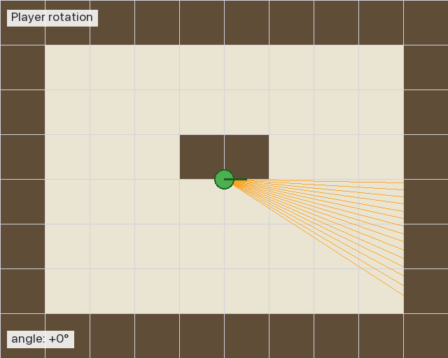
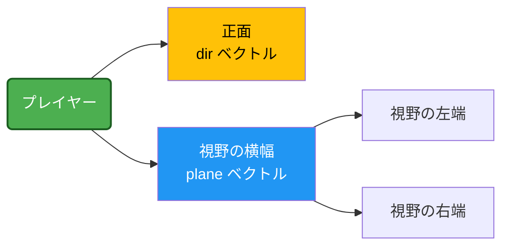
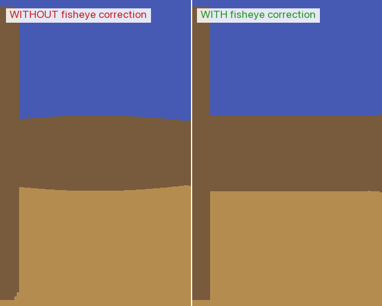
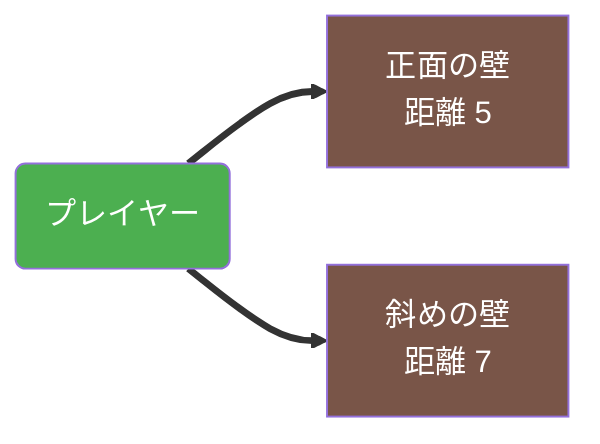
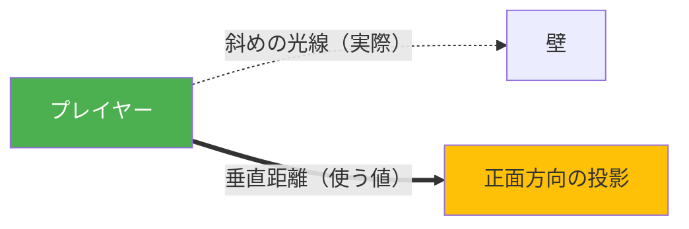
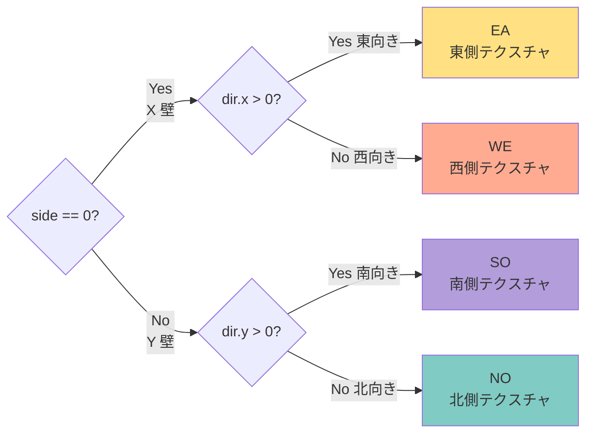

# 05. カメラと魚眼補正

---

## このページは何？

**光線の「向き」をどう決めるか、そして「画面端の歪み」をどう直すかを解説するページ** です。

DDA で壁は見つけられるようになりました。
あと必要なのは:

1. 画面の各ピクセルに対応する **光線の向き**
2. 斜めの光線で起きる **魚眼歪み** の補正
3. 壁の **向き（N/S/E/W）** の判定

---

## 🎯 なぜカメラと魚眼補正を学ぶ？（学習意図）

DDA で「壁までの距離」は測れますが、そのまま画面に出すと **画面端の壁が膨らんで歪む（魚眼）**。
さらに、画面の各列に対応する光線をどう向けるかを決めないと、そもそも 1024 本の光線が成り立ちません。
このページは「**光線の出発点 (camera) と、結果の整形 (fisheye fix)**」という、レイキャスティングの
**前処理と後処理の両端** を担います。

| 学ばせたいこと | このページで出会う形 |
|---|---|
| **線形補間と画面マッピング** | `camera_x = 2x / WIN_W - 1` で画面ピクセル → -1〜+1 のカメラ座標へ |
| **2 本のベクトルで視野を表現** | `dir`（正面）と `plane`（横）の 2 ベクトルで FOV を決める発想 |
| **射影 (projection) の概念** | 光線の長さではなく「正面方向への投影距離」を使う = 魚眼補正 |
| **`side` と `dir` の符号で 4 方向判定** | DDA の出力を使って NO/SO/EA/WE のテクスチャを選ぶ |
| **`wall_x`** — テクスチャ U 座標の計算 | DDA の結果から壁に当たった位置の小数部を取り出す（次ページ「レンダリング」の前提）|

つまり「**画面ピクセル ↔ 3D 空間** の対応を、シンプルなベクトル演算だけで実装する訓練」が真の狙いです。
ここを通っておくと、テクスチャマッピング・FOV 変更・自由なカメラ操作がすべて同じ枠組みで理解できます。

---

## このページで学ぶこと

- **`camera_x`** — 画面 x 座標を -1〜+1 に正規化したカメラ座標
- **`plane` ベクトル** — `dir` に垂直な「視野の横幅」を表すベクトル（長さで FOV が決まる）
- **`perp_wall_dist`** — 「光線の長さ」ではなく「プレイヤー正面方向への投影距離」
- **魚眼補正の式** — `perp_wall_dist = side_dist - delta_dist`（なぜ引き算 1 つで済むのか）
- **`tex_id` の決め方** — `side` (0/1) と `dir` の符号の組み合わせで NO/SO/EA/WE を分岐
- **`wall_x`** — 壁に当たった位置の小数部。次ページのテクスチャ U 座標になる

---

!!! info "💡 ここでつまずく人へ — 「光線」と「カメラ」の関係"
    レイキャスティングの世界では、画面 1 列ごとに 1 本の **光線 (ray)** を飛ばし、
    その光線が壁に当たった距離を計算します。
    「カメラ」は **どの方向に光線を飛ばすか** を決める役割で、
    `dir`（正面）と `plane`（横幅）の **2 本のベクトル** で表されます。

    👉 ここから先を読むときは「**光線が画面の各列を担当している**」というイメージを持つと
    一気に分かりやすくなります。

---

## 1. カメラプレーンって何？

### 🎬 プレイヤーが回転したときの視野



プレイヤー（緑の丸）が左右に回転すると、**視野の扇形** も一緒に回ります。
この扇形の **幅** を決めるのがカメラプレーン (`plane`) です。

### 定義

**視野（FOV = Field of View）を決めるベクトル** です。

プレイヤーの目には、正面の方向に **画面** があるイメージ。
その画面の幅を決めるのが **plane** ベクトルです。



### 2 つのベクトルの役割

| ベクトル | 役割 |
|:---|:---|
| `player.dir` | プレイヤーが向いている方向（正面） |
| `player.plane` | その正面に垂直な「カメラの横方向」 |

**視野角（FOV）は 2 つの長さの比** で決まります。
普通は `|dir| = |plane|` で **90 度 FOV**。

---

## 2. camera_x って何？

**画面のどのピクセルかを、-1 〜 +1 の数字で表したもの** です。

### 画面座標と camera_x の対応表

| 画面の x 座標 | camera_x | 位置 |
|:-:|:-:|:---|
| 0 | **-1.0** | 左端 |
| 256 | -0.5 | 左寄り |
| 512 | **0.0** | 中央 |
| 768 | +0.5 | 右寄り |
| 1024 | **+1.0** | 右端 |

### 計算式

$$
\text{camera\_x} = \frac{2x}{\text{WIN\_W}} - 1
$$

### 光線の向きを決める

$$
\text{ray.dir} = \text{dir} + \text{plane} \times \text{camera\_x}
$$

| camera_x | 結果 | どの光線？ |
|:-:|:---|:---|
| -1 | `dir - plane` | 左端の光線 |
| 0 | `dir` | 正面の光線（まっすぐ） |
| +1 | `dir + plane` | 右端の光線 |

---

## 3. 魚眼効果（fisheye）って何？

### 🎬 魚眼補正の Before / After 比較



- **左**: 補正なし → 画面端の壁が膨らんで見える（魚眼効果）
- **右**: 補正あり → 壁がまっすぐに見える（正常）

同じ視線の動きでも、補正の有無で見え方が全然違います。

### 定義

**普通の距離を使うと画面端が歪んで見える現象** です。

### なぜ歪む？



同じ距離にある壁でも、**斜めの光線のほうが長い**。
そのまま距離として使うと「端の壁は遠い」と勘違い → 画面端が膨らむ。

!!! info "💡 ここでつまずく人へ — `perp_wall_dist` ってなぜ必要？"
    光線の長さをそのまま使うと、画面の端の壁ほど距離が長くなり、
    **遠い = 小さく描画** されるため壁が外側に向かって縮みます（魚眼）。

    そこで「**光線の長さ**」ではなく、
    「**プレイヤーが向いている方向に投影した長さ (perpendicular distance)**」を使います。
    これで真っ直ぐな壁が画面上でも真っ直ぐ見えるようになります。

### 補正前 vs 補正後

=== "❌ 補正なし（魚眼）"

    | 画面位置 | 見え方 |
    |:-:|:---|
    | 中央 | 🧱 正常 |
    | 端 | 🎈 **膨らんで見える** |

=== "✅ 補正あり（きれい）"

    | 画面位置 | 見え方 |
    |:-:|:---|
    | 中央 | 🧱 正常 |
    | 端 | 🧱 正常（歪みなし） |

### 対策: 垂直距離を使う

光線の長さではなく、**プレイヤー正面方向への距離** だけを使います。



$$
\text{perp\_wall\_dist} = \text{side\_dist} - \text{delta\_dist}
$$

---

## 4. 壁の向き（N/S/E/W）をどう判定？

DDA で **最後にどちらの格子線を渡ったか** と **光線の向きの符号** で決まります。



---

## 5. コード解説

### 光線の向き計算

```c title="raycaster.c (init_ray_dir)"
static void ft_init_ray_dir(t_game *game, int x, t_ray *ray)
{
    double camera_x;

    camera_x = 2.0 * x / (double)WIN_W - 1.0;
    ray->dir.x = game->player.dir.x + game->player.plane.x * camera_x;
    ray->dir.y = game->player.dir.y + game->player.plane.y * camera_x;
    ray->map_pos.x = (int)game->player.pos.x;
    ray->map_pos.y = (int)game->player.pos.y;
    if (ray->dir.x == 0)
        ray->delta_dist.x = 1e30;  // div by 0 対策
    else
        ray->delta_dist.x = fabs(1.0 / ray->dir.x);
    if (ray->dir.y == 0)
        ray->delta_dist.y = 1e30;
    else
        ray->delta_dist.y = fabs(1.0 / ray->dir.y);
}
```

### 垂直距離と壁の向き

```c title="raycaster.c (calc_wall_dist)"
static void ft_calc_wall_dist(t_game *game, t_ray *ray)
{
    if (ray->side == 0)
    {
        ray->perp_wall_dist = ray->side_dist.x - ray->delta_dist.x;
        ray->wall_x = game->player.pos.y
            + ray->perp_wall_dist * ray->dir.y;
    }
    else
    {
        ray->perp_wall_dist = ray->side_dist.y - ray->delta_dist.y;
        ray->wall_x = game->player.pos.x
            + ray->perp_wall_dist * ray->dir.x;
    }
    ray->wall_x -= floor(ray->wall_x);
    if (ray->side == 0 && ray->dir.x > 0)
        ray->tex_id = TEX_EA;
    else if (ray->side == 0 && ray->dir.x <= 0)
        ray->tex_id = TEX_WE;
    else if (ray->side == 1 && ray->dir.y > 0)
        ray->tex_id = TEX_SO;
    else
        ray->tex_id = TEX_NO;
}
```

---

## 6. 壁の高さの対応表

垂直距離から壁の高さを計算:

$$
\text{line\_h} = \frac{\text{WIN\_H}}{\text{perp\_wall\_dist}}
$$

| 距離 | 高さ（WIN_H=768） | 見え方 |
|:-:|:-:|:---|
| 1.0 | 768px | 画面いっぱい（最接近） |
| 2.0 | 384px | 半分 |
| 4.0 | 192px | 1/4 |
| 10.0 | 77px | 遠い（小さく見える） |

---

## 7. このページに関連する評価項目

本ページの内容は、評価シートの **以下のセクション** に対応します。詳細（英語原文 + 日本語訳 + 評価者が見るコード + Q&A）は各専用ページに。

| 評価セクション | 担当する内容 | 詳細 |
|:---|:---|:---|
| **Movements** | 視野・回転に直結する `dir` / `plane` の設計、回転で FOV が崩れない | [eval-movement](eval-movement.md) |
| **Technical elements of the display** | 魚眼補正により壁がまっすぐ見える = smooth な表示 | [eval-display](eval-display.md) |

→ 全項目を一覧したい場合は **[評価対策トップ](eval.md)** へ。

---

## 8. ディフェンスで聞かれること（学習トピック）

評価シート項目別の詳細（移動・視点・smooth 描画）は **[eval-movement](eval-movement.md)** / **[eval-display](eval-display.md)** にあります。
ここでは **本ページの学習トピック（カメラ設計と魚眼補正）に関する技術質問** だけを扱います。

| 質問 | 答え方 | 実装で言うと |
|:---|:---|:---|
| カメラプレーンとは？ | 視野を決める仮想の平面ベクトル。`dir` と `plane` の **比** で FOV が決まる（同じ長さなら 90 度 FOV） | `player.plane` を `player.dir` に垂直なベクトルとして保持。`(0.66, 0)` などで約 66 度 FOV |
| `camera_x` の役割は？ | 画面のピクセル位置 0〜WIN_W を -1〜+1 に変換。光線の向きを `dir + plane * camera_x` で決めるのに使う | `ft_init_ray_dir` 内の `camera_x = 2.0 * x / WIN_W - 1.0;` |
| 魚眼補正はなぜ必要？ | 斜めの光線ほど距離が長くなるので、そのまま使うと **画面端の壁が遠い扱い → 小さく描画 → 膨らんで見える** | 補正なしだと `side_dist` の値が画面端で大きくなる |
| どう補正する？ | 光線の長さではなく、**正面方向への投影距離**（垂直距離 = perpendicular distance）を使う。式は `side_dist - delta_dist` | `ft_calc_wall_dist` で `ray->perp_wall_dist = ray->side_dist.x - ray->delta_dist.x;` |
| なぜ `side_dist - delta_dist` で投影距離になる？ | DDA ループの最後で `side_dist` は「**1 マス進みすぎた状態**」になっている。直前の `delta_dist` 分を引き戻すと、壁にちょうど当たった瞬間の距離になる | `ft_dda` ループの末尾で `side_dist += delta_dist` した直後の値が `ft_calc_wall_dist` に渡る |
| 壁の向き判定の仕組みは？ | `side` (0 = X 壁 / 1 = Y 壁) と **光線方向の符号** の組み合わせで 4 通りに分岐 | `if (side == 0 && dir.x > 0) tex_id = TEX_EA;` のような 4 分岐 |
| `wall_x` は何のため？ | 壁に当たった「マスの中の位置」を 0〜1 で表す。次ページでテクスチャの **横方向 U 座標** に使う | `wall_x = pos.y + perp_wall_dist * dir.y` のあと `wall_x -= floor(wall_x);` で小数部だけ取り出す |
| FOV を広げるには？ | `plane` ベクトルを **長く** する。`dir = (0, -1)` のとき `plane = (1.0, 0)` で 90 度、`(0.66, 0)` で約 66 度 | `ft_init_dir_ns` / `ft_init_dir_ew` で初期値を決定。回転時は `dir` と `plane` を同じ角度回す |

---

## 9. よくあるミス

!!! warning "魚眼補正を忘れる"
    `side_dist` をそのまま使うと画面端が膨らむ。
    必ず `perp_wall_dist = side_dist - delta_dist` を使う。

!!! warning "camera_x の符号"
    左端が `-1`、右端が `+1`。逆にすると左右が反転する。

!!! warning "壁の向き判定の反転"
    `side=0` は **東西**（EA/WE）。南北と逆にしない。

---

## 💡 ここまでの学びのまとめ

このページで身についたこと:

- **`camera_x` は画面ピクセル ↔ 光線方向の線形マッピング** — 0/WIN_W が -1/+1 に対応
- **`dir` + `plane` の 2 ベクトルで視野を表現** — 比で FOV が決まる発想
- **`perp_wall_dist = side_dist - delta_dist`** で魚眼補正 — 「光線長」ではなく「正面投影距離」
- **`side` × `dir` の符号で 4 方向テクスチャを選ぶ** — DDA の `side` を後段で活用する設計
- **`wall_x`** はテクスチャ U 座標の元データ — 小数部だけ取り出して次ページで使う

!!! tip "ここで詰まったら"
    - 「画面端で壁が膨らむ！」→ 魚眼補正忘れ。`side_dist` をそのまま `perp_wall_dist` に使っていないか確認
    - 「視野が狭い/広すぎる！」→ `plane` の長さを調整。`dir` と同じ長さなら 90 度、`0.66` 倍なら約 66 度
    - 「左右が反転！」→ `camera_x = 2x / WIN_W - 1` の符号確認。左端が -1、右端が +1
    - 「壁の 4 方向が NO ⇄ SO や EA ⇄ WE で入れ替わる！」→ `side == 1 && dir.y > 0` で SO の対応を見直し
    - 「回転すると視野が歪む！」→ `dir` と `plane` は **同じ回転行列** をかける。片方だけ回すと垂直関係が壊れる

---

## 10. 次のページへ

これでレイキャスティングの 3 つの柱（DDA・カメラ・補正）が揃いました。
次は、測った距離から **実際に壁を描く方法** を学びます。

▶️ **[06. レンダリング](06-rendering.md)**
