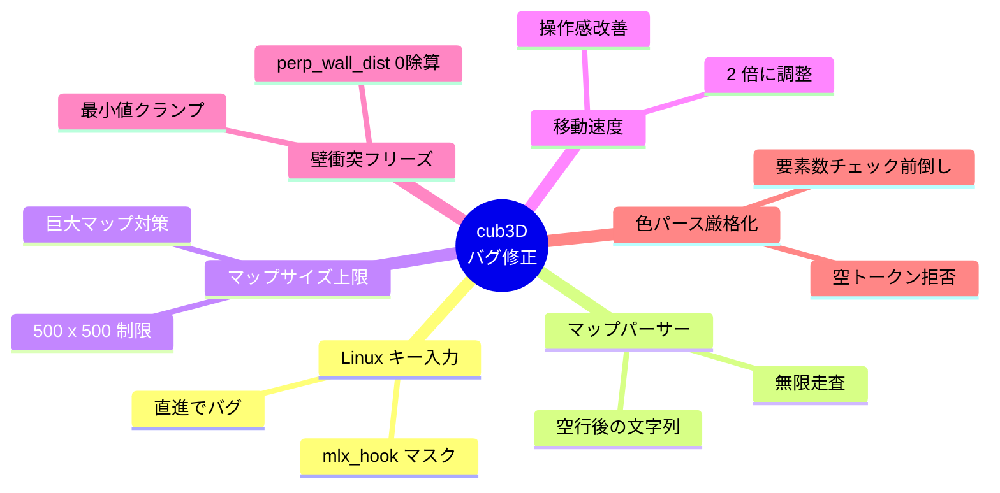
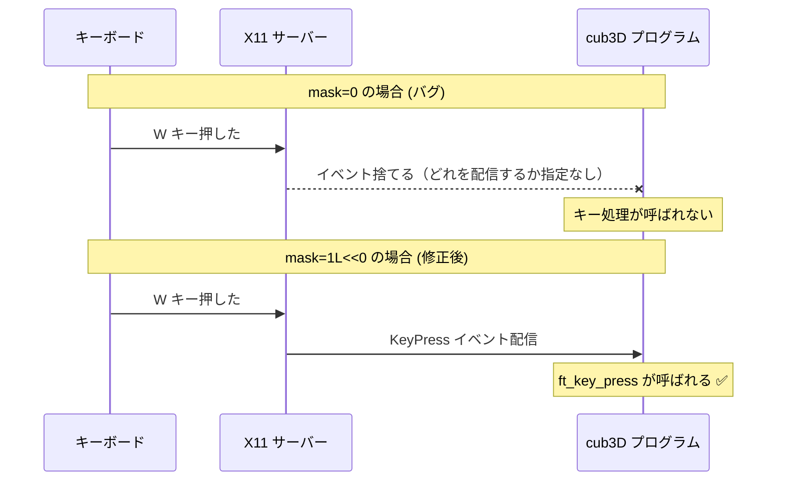
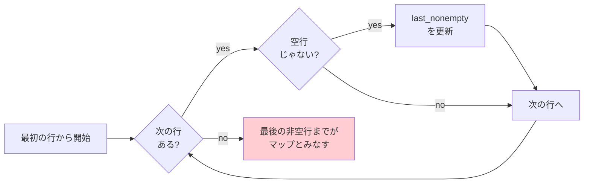
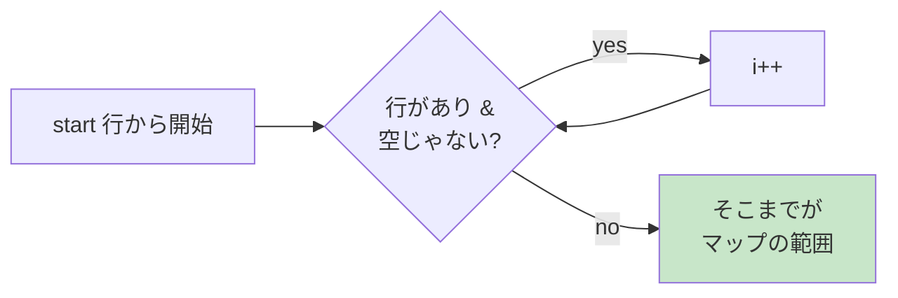
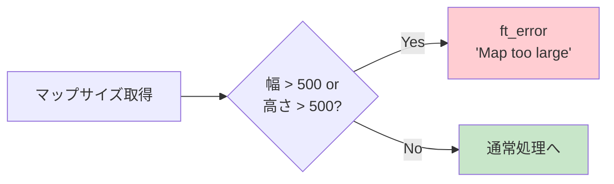

# 09. 実際に遭遇したバグと修正

---

## このページは何？

**実際に cub3D を作って遭遇した 6 つのバグと、その直し方を記録したページ** です。

教科書的な解説だけでなく、**実際のハマりポイント** を知っておくと、
あなたが同じバグに遭遇したとき即座に対処できます。

!!! info "元コミット"
    - `53cdd1f` — Fix Linux key input, add map size limit, and improve map parser (2026-04-12)
    - `c9917a3` — final（**壁衝突フリーズ修正** + 色パース厳格化） (2026-04-19)

### 修正サマリー



---

## 🐛 バグ #1: Linux で直進できない

### 症状

macOS では正常に動くのに、**Linux で `W` キーを押しても動かない**。

| 環境 | W で直進 | A/D ストレイフ | ← → 回転 |
|:-:|:-:|:-:|:-:|
| macOS | ✅ 動く | ✅ 動く | ✅ 動く |
| Linux | ❌ **動かない** | ❌ 動かない | ❌ 動かない |

### 原因

`mlx_hook` の **イベントマスク** が `0` になっていて、
Linux の X11 はどんなイベントを受けたいか分からず
**キーイベントを配信してくれない** 状態でした。



### 修正コード

```c title="srcs/main.c"
// ❌ 修正前 (mask = 0)
mlx_hook(game.win, 2, 0, ft_key_press, &game);
mlx_hook(game.win, 3, 0, ft_key_release, &game);

// ✅ 修正後 (KeyPressMask / KeyReleaseMask)
mlx_hook(game.win, 2, 1L << 0, ft_key_press, &game);
mlx_hook(game.win, 3, 1L << 1, ft_key_release, &game);
```

### マスクの意味

| ビット | X11 の名前 | 意味 |
|:-:|:---|:---|
| `1L << 0` | `KeyPressMask` | キー押下を受け取る |
| `1L << 1` | `KeyReleaseMask` | キー離すを受け取る |
| `1L << 17` | `StructureNotifyMask` | ウィンドウ破棄を受け取る |

### 学び

!!! warning "macOS と Linux で必要な設定が違う"
    macOS の miniLibX はマスクを無視しますが、
    Linux の miniLibX (X11) は **マスクが必須**。
    両方でテストしないと Linux だけ動かない事故が起きます。

!!! tip "テスト環境の話"
    42 の Moulinette は Linux で走ります。
    **提出前に必ず Linux でも動作確認** しましょう。
    Docker や VM を用意しておくと安心です。

---

## 🐛 バグ #2: マップ解析が延々と続く

### 症状

マップの **後ろに余分な行** があると、
それもマップとして扱われたり、**無限ループに近い処理** になっていました。

```
マップファイル例:
1 1 1 1 1
1 0 P 0 1
1 1 1 1 1
         ← 空行

ゴミデータ    ← これも解析されてしまう
誤った内容
```

### 原因

`ft_map_line_count` がマップの終わりを判定するとき、
**ファイル全体を走査して「最後の非空行」を探していた**。



これだと下記のような問題が発生：

- マップ後のコメント的データも走査してしまう
- MAP_MAX を超える長さをマップ行として扱う

### 修正コード

```c title="srcs/parser/parse_map.c"
// ❌ 修正前
static int ft_map_line_count(char **lines, int start)
{
    int count;
    int last_nonempty;
    int i;

    count = 0;
    last_nonempty = start;
    i = start;
    while (lines[i])  // ← ファイル最後まで走査
    {
        if (lines[i][0] != '\0')
            last_nonempty = i;
        i++;
    }
    count = last_nonempty - start + 1;
    return (count);
}

// ✅ 修正後
static int ft_map_line_count(char **lines, int start)
{
    int i;

    i = start;
    // 最初の空行まで進んだら終了
    while (lines[i] && lines[i][0] != '\0')
        i++;
    return (i - start);
}
```

### 修正後のフロー



**「最初の空行でマップ終了」** というシンプルで正しい動作になりました。

### 学び

!!! info "入力の終端を正しく決める"
    ファイル全体を走査するより、**「ここまでがマップ」という明確なルール**
    （= 空行で終了）を決めたほうが：

    - ロジックが単純
    - バグが起きにくい
    - 処理も速い

---

## 🐛 バグ #3: 巨大マップでクラッシュ

### 症状

1000 x 1000 マスみたいな巨大な `.cub` ファイルを読ませると、
**メモリ確保失敗でクラッシュ** したり、**計算で無限時間** かかったりする。

### 原因

**マップサイズの上限チェックがなかった**。
`ft_calloc(count + 1, sizeof(char *))` で何 MB でも確保しようとしてしまう。

### 修正コード

```c title="includes/cub3d.h"
# define WIN_W 1024
# define WIN_H 768
+# define MAP_MAX 500      // ← 追加
```

```c title="srcs/parser/parse_map.c"
void ft_parse_map(char **lines, int start,
                  t_config *config)
{
    int count;

    count = ft_map_line_count(lines, start);
    ft_find_max_width(lines, start, count,
                      &config->map_w);
    config->map_h = count;
    // ✅ サイズチェックを追加
    if (config->map_w > MAP_MAX
        || config->map_h > MAP_MAX)
        ft_error("Map too large");
    // ...
}
```

### 判定フロー



### 学び

!!! warning "入力は常に疑う"
    42 の評価者は **わざと異常な入力** を試してきます。

    ```
    チェックされる異常入力:
    - 巨大マップ (10000 x 10000)
    - 空のファイル
    - 不正文字
    - プレイヤーなし/複数
    - 壁で囲まれていないマップ
    ```

    **「想定外の入力でも安全に終了する」** のが評価のポイント。

---

## 🐛 バグ #4: 操作が遅すぎる

### 症状

キャラクターが **カメの動き** で操作感が悪い。

### 原因

移動・回転速度の定数が小さすぎた。

### 修正コード

```c title="includes/cub3d.h"
// ❌ 修正前 (遅い)
# define MOVE_SPEED 0.05
# define ROT_SPEED 0.03

// ✅ 修正後 (2 倍に)
# define MOVE_SPEED 0.1
# define ROT_SPEED 0.06
```

### 比較表

| 定数 | 修正前 | 修正後 | 意味 |
|:---|:-:|:-:|:---|
| `MOVE_SPEED` | 0.05 | **0.1** | 1 フレームあたりの移動量（マス単位） |
| `ROT_SPEED` | 0.03 | **0.06** | 1 フレームあたりの回転角度（ラジアン） |

### 学び

!!! tip "魔法の数字は調整する"
    アルゴリズムは正しくても、**定数の調整** で体験が大きく変わります。

    - 移動が速すぎる → 壁をすり抜けやすくなる
    - 移動が遅すぎる → プレイヤーがイライラする
    - **自分で遊んで気持ち良い値を探す** のが大事

---

## 🔧 ついでに追加した改善

### クロスプラットフォーム Makefile

macOS / Linux の両方で `make` だけでビルドできるようにしました。

```makefile title="Makefile"
UNAME_S := $(shell uname -s)

ifeq ($(UNAME_S),Darwin)
    MLX_DIR = libs/minilibx_opengl_20191021
else
    MLX_DIR = libs/minilibx-linux
endif

ifeq ($(UNAME_S),Darwin)
    LIBS = -L $(MLX_DIR) -lmlx -lm \
           -framework OpenGL -framework AppKit
else
    LIBS = -L $(MLX_DIR) -lmlx -lm -lX11 -lXext
endif
```

### テストスイート追加

評価対策として、異常系マップのテストスイートを追加：

```bash
make test   # bin/test.sh を実行
```

**テスト内容:**

| カテゴリ | 内容 |
|:---|:---|
| `maps/valid/` | 正常マップ（ウィンドウが開くか） |
| `maps/invalid/` | 不正マップ（エラーで終了するか + valgrind） |
| `maps/nyan_map/Success/` | 他人作の正常マップ（互換性確認） |
| `maps/nyan_map/Failed/` | 他人作の不正マップ |

**実行結果の記録:**

```
[OK] Window opened (killed after 2s)
[OK] Rejected (exit 1)
[KO] Memory leak detected  ← リークがあればここで捕捉
```

---

## まとめ: 4 つのバグから学んだこと

| バグ | 学び |
|:---|:---|
| 🐧 Linux キー入力 | **環境依存のバグは両方でテスト** |
| 📝 マップパーサー | **終端条件は明確に** |
| 📏 マップサイズ | **入力は常に疑う・上限を設ける** |
| 🐢 操作速度 | **定数の調整は重要** |

!!! tip "ディフェンスでの応用"
    このページの内容は **ディフェンスで「どう実装しましたか？」「難しかった点は？」**
    と聞かれたときに **最強のネタ** になります。

    「Linux と macOS で差異があり、Linux だけ動かないバグに出会いました。
    原因は mlx_hook のマスクで、**X11 ではイベントマスクで配信を制御する仕組み**
    になっていました…」と説明できれば、評価者は「本当に自分で書いた」と
    納得してくれます。

---

## 次のページへ

次は [🎓 評価対策](eval.md) で、ディフェンス対策の総仕上げに行きましょう。
