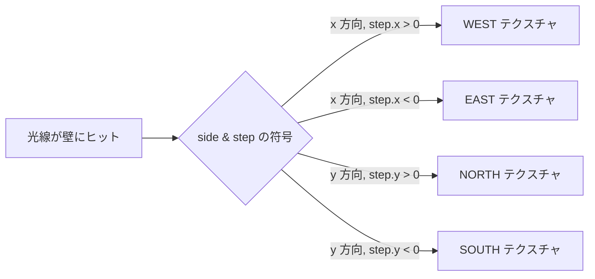
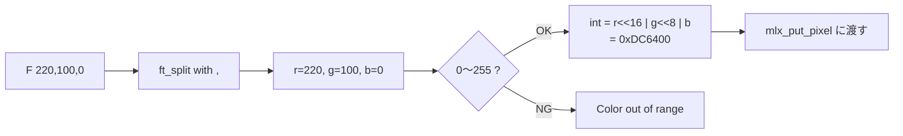
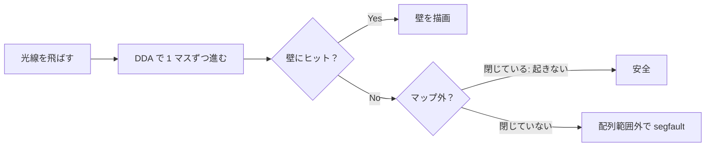
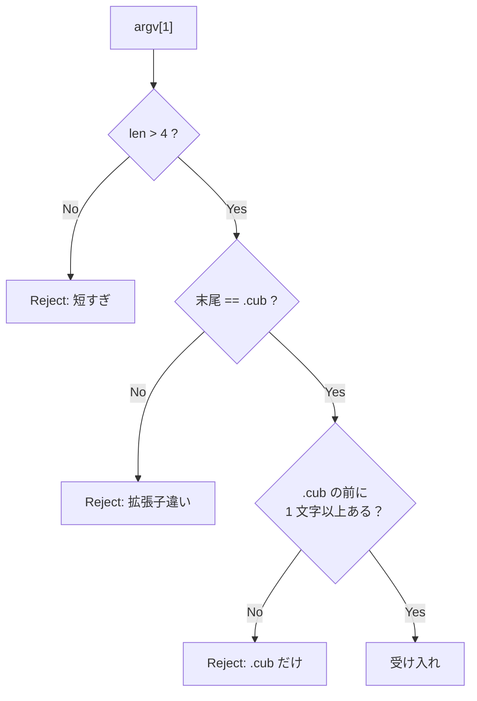

# Configuration file — 評価詳細

cub3D 評価シートの **「Configuration file」セクション** を「評価原文 + 日本語訳 + コード + 原理原則 + 模範回答」で 1 項目ずつ解説します。

→ 概要は **[評価対策トップ](eval.md)** を参照。
→ 本文の流れは **[02 パーサー](02-parser.md)** を参照。

---

## 🌱 3 秒でわかる

| 観点 | 一言で |
|---|---|
| **🎯 評価形式** | 5 テスト中 **1 つでも失敗** したら **`Incomplete work` フラグ** で defense 終了 |
| **📦 関連コード** | `srcs/parser/parse_elements.c` / `srcs/parser/parse_map.c` / `srcs/parser/validate_map.c` / `srcs/main.c` の `ft_check_args` |
| **⚠️ ハマりどころ** | 同じキー（例: `NO`）が **2 回現れた時** にエラーにしていない、空白を含む不正マップで `segfault` |
| **🔗 本文ページ** | [02 パーサー](02-parser.md) |

---

## 📋 セクション全体の原文

!!! note "原文（評価シート Configuration file）"
    > In the configuration file, check that the following elements can be set: North texture path - NO, South texture path - SO, East texture path - EA, West texture path - WE, Floor color - F, Ceiling color - C, the map (see subject for the map configuration details). Also, check that the program returns an error and exits properly when the configuration file is misconfigured (for example an unknown key, double keys, an invalid path..) or if the filename doesn't end with the .cub extension. If not, the defense is over and use the appropriate flag incomplete work, crash....

!!! info "日本語訳"
    設定ファイル内で以下の要素を設定できることを確認する: 北のテクスチャパス `NO`、南のテクスチャパス `SO`、東のテクスチャパス `EA`、西のテクスチャパス `WE`、床の色 `F`、天井の色 `C`、マップ（マップの詳細は subject 参照）。
    また、設定ファイルに **不備があった場合**（未知のキー、キーの重複、無効なパスなど）や **ファイル名が `.cub` で終わらない場合** に、プログラムが **エラーを返してクリーンに終了** することを確認する。そうでない場合は defense はここで終了し、`Incomplete work` / `Crash` などの適切なフラグを使う。

---

## Test 1: NO/SO/EA/WE の 4 つのテクスチャパスが読める

### ① 評価シート原文

> Check that the following elements can be set: North texture path - NO, South texture path - SO, East texture path - EA, West texture path - WE.

### ② 日本語訳

> 設定ファイル内で北 `NO`、南 `SO`、東 `EA`、西 `WE` の **4 つのテクスチャパス** が設定できることを確認する。

### ③ 評価者が確認すること

| 確認 | 期待される挙動 |
|:---|:---|
| **4 識別子の認識** | `NO`、`SO`、`WE`、`EA` の各行を正しくパースする |
| **パスの保持** | `config->texture_path[NORTH]` などに `.xpm` パスが格納される |
| **テクスチャ読み込み** | `mlx_xpm_file_to_image` でロードできる有効な XPM ファイル |
| **欠落時のエラー** | 4 つのうち 1 つでも欠けたら "Missing element" でエラー終了 |

### ④ 評価者が見るコード箇所

| ファイル | 関数 | 何を見るか |
|:---|:---|:---|
| `srcs/parser/parse_elements.c` | `ft_parse_texture` | 識別子と `\t` 区切りでパスを取り出す処理 |
| `srcs/parser/parse_elements.c` | `ft_parse_line` | `NO`/`SO`/`WE`/`EA` 分岐 |
| `includes/cub3d.h` | `t_config` | `char *texture_path[4]` などの配列定義 |

```c title="srcs/parser/parse_elements.c (4 識別子の分岐)"
int	ft_parse_line(char *line, t_config *config)
{
	if (!ft_strncmp(line, "NO ", 3))
		return (ft_parse_texture(line + 3, &config->tex[NORTH], config));
	if (!ft_strncmp(line, "SO ", 3))
		return (ft_parse_texture(line + 3, &config->tex[SOUTH], config));
	if (!ft_strncmp(line, "WE ", 3))
		return (ft_parse_texture(line + 3, &config->tex[WEST], config));
	if (!ft_strncmp(line, "EA ", 3))
		return (ft_parse_texture(line + 3, &config->tex[EAST], config));
	return (ft_parse_color_or_map(line, config));
}
```

### ⑤ 原理原則 — なぜ 4 方向すべて必要か？

レイキャスティングでは、光線が壁に当たったとき **どの面から見えているか**（N/S/E/W）でテクスチャを切り替えます。1 つでも欠けると、その方向の壁が描けません。



4 方向の `texture_path` を `enum { NORTH, SOUTH, WEST, EAST }` で配列管理すると、描画側で `config->tex[side_dir]` のように **インデックス 1 つでアクセス** でき、コードが整理できます。

### ⑥ よくある罠

- ❌ `NO` を `North` などスペルミスで認識 → subject 違反
- ❌ パスを取り出すときに `ft_split(line, ' ')` で空白 1 個に依存 → タブやスペース複数で壊れる
- ❌ `mlx_xpm_file_to_image` の戻り値 NULL を見ない → 無効パスでセグフォ
- ❌ パースした文字列を `free` せず `config->tex[NORTH] = strdup(...)` だけしてリーク

### ⑦ 想定質問と模範回答

| 質問 | 模範回答 |
|---|---|
| 「テクスチャ識別子はどうやって区別している？」 | 行頭が `NO `、`SO `、`WE `、`EA ` で始まるかを `ft_strncmp` で 3 文字比較し、合致した識別子に対応する `config->tex[NORTH]` などへ格納します |
| 「パスの後ろに余分な空白があったら？」 | `ft_strtrim` で前後の空白を除去してから保存します。パスに **絶対パス/相対パスのどちらでも** 対応できるよう、`mlx_xpm_file_to_image` でロードして NULL チェックします |
| 「`.xpm` 以外のファイルが指定されたら？」 | `mlx_xpm_file_to_image` が NULL を返すので、その時点でエラー終了します。あるいは事前に拡張子チェックを入れて早期 reject します |

---

## Test 2: F/C の色（RGB）が読める

### ① 評価シート原文

> Check that the following elements can be set: Floor color - F, Ceiling color - C.

### ② 日本語訳

> 設定ファイル内で床色 `F` と天井色 `C` が **RGB 形式** で設定できることを確認する。

### ③ 評価者が確認すること

| 確認 | 期待される挙動 |
|:---|:---|
| **F/C の識別** | 行頭 `F ` / `C ` を識別 |
| **RGB 3 値** | `R,G,B` の **カンマ区切り 3 つ** を解析 |
| **値の範囲** | 各値が **0〜255** の範囲内であることを検証 |
| **範囲外でエラー** | `-1` や `256` でエラー終了 |
| **形式異常でエラー** | カンマが 2 個でない、数値以外、空白混在を検出 |

### ④ 評価者が見るコード箇所

| ファイル | 関数 | 何を見るか |
|:---|:---|:---|
| `srcs/parser/parse_elements.c` | `ft_parse_color` | `R,G,B` の分割と数値変換 |
| `srcs/parser/parse_elements.c` | `ft_validate_rgb` | 各成分 0〜255 のチェック |
| `includes/cub3d.h` | `t_config` | `int floor_color` / `int ceiling_color`（24 bit パック） |

```c title="srcs/parser/parse_elements.c (RGB パース)"
int	ft_parse_color(char *line, int *color, t_config *config)
{
	char	**parts;
	int		r, g, b;

	parts = ft_split(line, ',');
	if (ft_count(parts) != 3)
		return (ft_perr(config, "Invalid color format"));
	r = ft_atoi(parts[0]);
	g = ft_atoi(parts[1]);
	b = ft_atoi(parts[2]);
	ft_free_split(parts);
	if (r < 0 || r > 255 || g < 0 || g > 255 || b < 0 || b > 255)
		return (ft_perr(config, "Color out of range"));
	*color = (r << 16) | (g << 8) | b;
	return (0);
}
```

### ⑤ 原理原則 — RGB をなぜ `int` にパックするか？

miniLibX の `mlx_pixel_put` / image buffer 書き込みは **24 bit/32 bit の整数** で色を扱います。`(R << 16) | (G << 8) | B` でパックしておけば:

- **メモリ効率**: 構造体ごとに 12 byte 確保せず `int` 1 個で済む
- **描画速度**: ピクセル書き込みでビット演算 1 発、関数呼び出しなし
- **ARGB 拡張**: 上位 8 bit に alpha を入れる場合も互換



### ⑥ よくある罠

- ❌ `ft_atoi("256")` の戻り 256 を許容してしまう
- ❌ 負値 `-1` を弾かない（`ft_atoi` は `'-'` を読むため）
- ❌ `"220, 100, 0"` のように **空白付き** カンマで動かない
- ❌ `F` と `C` のどちらかが欠けても通してしまう

### ⑦ 想定質問と模範回答

| 質問 | 模範回答 |
|---|---|
| 「RGB の値はどこに保存している？」 | `t_config` 構造体に `int floor_color` / `int ceiling_color` として、`(R << 16) \| (G << 8) \| B` の 24 bit にパックして保存しています |
| 「`256` や `-1` のような範囲外はどう検出？」 | `ft_atoi` で int に変換した後、`r < 0 \|\| r > 255` のチェックを 3 成分すべてに行います |
| 「`220, 100, 0` のように空白が入った場合は？」 | `ft_split` した後の各要素を `ft_strtrim` で空白除去し、その後 `ft_atoi` するか、数値以外の文字が含まれていれば即エラーにします |

---

## Test 3: マップが読める + 壁で閉じている検証

### ① 評価シート原文

> Check that the map (see subject for the map configuration details) can be set.

### ② 日本語訳

> マップ（壁 `1`、通路 `0`、プレイヤー開始位置 `N`/`S`/`E`/`W`、空白）が読めること。subject に従い、マップは **壁で閉じている** こと。

### ③ 評価者が確認すること

| 確認 | 期待される挙動 |
|:---|:---|
| **マップ文字** | `0 1 N S E W 空白` のみで構成 |
| **プレイヤー 1 つ** | `N`/`S`/`E`/`W` が **ちょうど 1 つ** |
| **壁で囲まれている** | 通行可能マスの上下左右が壁か空白でないと NG |
| **不正マップでエラー** | 開いている、プレイヤーが居ない/複数、不正文字 → エラー終了 |

### ④ 評価者が見るコード箇所

| ファイル | 関数 | 何を見るか |
|:---|:---|:---|
| `srcs/parser/parse_map.c` | `ft_read_map_lines` | 残り行をマップとして格納し、行ごとの最大長を正規化 |
| `srcs/parser/validate_map.c` | `ft_validate_map` | 文字種・プレイヤー数・閉路の全チェック |
| `srcs/parser/validate_map.c` | `ft_flood_fill` | 通行可能マスから外周に抜けないか確認 |

```c title="srcs/parser/validate_map.c (閉路チェック)"
int	ft_validate_walls(t_config *config)
{
	int	y;
	int	x;

	y = 0;
	while (y < config->map.height)
	{
		x = 0;
		while (x < config->map.width)
		{
			if (ft_is_walkable(config->map.grid[y][x])
				&& ft_touches_outside(config, y, x))
				return (ft_perr(config, "Map is not closed"));
			x++;
		}
		y++;
	}
	return (0);
}
```

### ⑤ 原理原則 — なぜ「壁で閉じている」検証が必要か？

レイキャスティングは **マップが壁で閉じている前提** で動きます。閉じていないと:



flood fill（BFS）で「通行可能マスから外周に到達できる」場合は、`segfault` リスクや無限ループの可能性があるためエラー終了させます。

### ⑥ よくある罠

- ❌ マップ行の **長さが揃っていない** ことを許容して、短い行の末尾を不正に外周扱いにする
- ❌ 空白（` `）を通行可能扱いにしてしまう（subject では空白は不可侵領域）
- ❌ プレイヤー 0 個 / 2 個以上を弾かない
- ❌ flood fill のスタックオーバーフロー（再帰過多）→ 大きいマップで segfault
- ❌ 最後の行に改行が無いと末行が読まれない

### ⑦ 想定質問と模範回答

| 質問 | 模範回答 |
|---|---|
| 「壁で閉じているかをどう検証している？」 | 通行可能マス（`0 N S E W`）からスタートする flood fill を実装し、外周か空白に到達したら "閉じていない" としてエラーにします |
| 「プレイヤーが複数いたら？」 | パース時に `player_count` をカウントし、終了時に **`!= 1` ならエラー** を返します |
| 「マップ行の長さが揃っていない時は？」 | 全行の最大長で正規化し、足りない部分を空白で埋めます。その上で flood fill するので、ジャグ配列でも安全に評価できます |

---

## Test 4: 不正設定（unknown key / double keys / invalid path）でエラー終了

### ① 評価シート原文

> Check that the program returns an error and exits properly when the configuration file is misconfigured (for example an unknown key, double keys, an invalid path..).

### ② 日本語訳

> 設定ファイルに **未知のキー**、**キーの重複**、**無効なパス** など不備があるとき、プログラムが **エラーを返してクリーンに終了** すること。

### ③ 評価者が確認すること

| 確認 | 期待される挙動 |
|:---|:---|
| **未知のキー** | `NX hoge.xpm` などで "Unknown identifier" エラー |
| **キー重複** | `NO` が 2 回現れたら "Duplicate identifier" エラー |
| **無効なパス** | `NO ./not_exist.xpm` で "Texture not found" エラー |
| **クリーン終了** | エラー時もリークなし（`leaks`/`valgrind` でゼロ） |

### ④ 評価者が見るコード箇所

| ファイル | 関数 | 何を見るか |
|:---|:---|:---|
| `srcs/parser/parse_elements.c` | `ft_parse_line` | 未知の識別子を弾く `else` 分岐 |
| `srcs/parser/parse_elements.c` | `ft_parse_texture` | 既に格納済みなら "duplicate" を返す |
| `srcs/main.c` | `ft_perr` | エラーメッセージ表示 + cleanup + `exit(1)` |

```c title="srcs/parser/parse_elements.c (重複検出)"
int	ft_parse_texture(char *path, char **dst, t_config *config)
{
	if (*dst != NULL)
		return (ft_perr(config, "Duplicate texture identifier"));
	*dst = ft_strtrim(path, " \t\n");
	if (!*dst)
		return (ft_perr(config, "Malloc failed"));
	return (0);
}
```

```c title="srcs/main.c (ft_perr 抜粋)"
int	ft_perr(t_config *config, const char *msg)
{
	ft_putstr_fd("Error\n", 2);
	ft_putendl_fd((char *)msg, 2);
	ft_free_config(config);
	exit(EXIT_FAILURE);
}
```

### ⑤ 原理原則 — なぜ `exit` 前に解放するか？

`exit(1)` を呼ぶと **`atexit` 登録関数以外は走らない** ので、自分が確保した `malloc` の解放は **`exit` の直前** に行う必要があります。


`subject` は **「`Error\n` の後に説明的なメッセージ」** を要求します。改行と `Error\n` の位置に注意。

### ⑥ よくある罠

- ❌ 未知のキーを **無視して通す** → "subject 違反 + Incomplete work"
- ❌ 重複検出を入れず、後者で前者を上書きしてリーク
- ❌ エラー時に `exit(1)` だけ呼んで `free` しない → Leaks フラグ
- ❌ エラーメッセージを `stdout` に出している（`stderr` に出すべき）

### ⑦ 想定質問と模範回答

| 質問 | 模範回答 |
|---|---|
| 「キー重複はどう検出していますか？」 | 各テクスチャパスのスロット（`config->tex[NORTH]` など）の値が `NULL` でないかをチェックし、すでに値が入っていれば "Duplicate identifier" を返します |
| 「無効なパスはどこで検出？」 | パース時はパス文字列として保存だけし、`mlx_xpm_file_to_image` のロード時に NULL チェックします。NULL なら "Texture not found" でエラー終了します |
| 「エラー時のリークはどう防いでいる？」 | `ft_perr` 関数を共通エラー出口にし、`ft_free_config` で全リソースを解放してから `exit(EXIT_FAILURE)` を呼びます |

---

## Test 5: `.cub` 以外の拡張子でエラー終了

### ① 評価シート原文

> Check that the program returns an error and exits properly if the filename doesn't end with the .cub extension.

### ② 日本語訳

> ファイル名が **`.cub` で終わらない** 場合、プログラムが **エラーを返してクリーンに終了** すること。

### ③ 評価者が確認すること

| 確認 | 期待される挙動 |
|:---|:---|
| **`.cub` のみ許容** | `maps/valid.cub` は OK |
| **他拡張子で拒否** | `maps/valid.txt`、`maps/valid` などで即エラー終了 |
| **`.cub` を含むだけ NG** | `maps/.cub` のような **拡張子しかない名前** も拒否 |
| **引数なし/2 個以上** | `./cub3D` だけ、または引数 2 個以上でエラー終了 |

### ④ 評価者が見るコード箇所

| ファイル | 関数 | 何を見るか |
|:---|:---|:---|
| `srcs/main.c` | `ft_check_args` | `argc == 2` の確認 + 拡張子チェック |
| `srcs/main.c` | `ft_has_cub_extension` | 末尾 4 文字が `.cub` か、`.cub` の前に名前部があるか |

```c title="srcs/main.c (拡張子チェック)"
static int	ft_has_cub_extension(const char *path)
{
	size_t	len;

	len = ft_strlen(path);
	if (len <= 4)
		return (0);
	if (ft_strncmp(path + len - 4, ".cub", 4) != 0)
		return (0);
	return (1);
}
```

```c title="srcs/main.c (引数チェック)"
int	ft_check_args(int argc, char **argv)
{
	if (argc != 2)
	{
		ft_putendl_fd("Error\nUsage: ./cub3D <map.cub>", 2);
		return (1);
	}
	if (!ft_has_cub_extension(argv[1]))
	{
		ft_putendl_fd("Error\nMap file must end with .cub", 2);
		return (1);
	}
	return (0);
}
```

### ⑤ 原理原則 — なぜ拡張子で弾くか？

拡張子は **ファイル種別の最低限の保証**。`.cub` 以外のファイルが渡された時にいきなりパースを始めると、想定外のフォーマットで segfault を起こす可能性が上がります。



`len <= 4` のチェックで `".cub"` 単体や空文字を弾けます。

### ⑥ よくある罠

- ❌ 末尾 3 文字 `.cu` だけチェック → `.cub5` などが通る
- ❌ `strstr(argv[1], ".cub")` で「含む」だけ → `valid.cub.bak` が通ってしまう
- ❌ 引数 0 個・3 個以上のチェック忘れ
- ❌ `.CUB` 大文字版を許容するか subject 通り厳密 `.cub` のみか方針が無い（基本は subject 通り小文字のみ）

### ⑦ 想定質問と模範回答

| 質問 | 模範回答 |
|---|---|
| 「`.cub` チェックはどう書いていますか？」 | `argv[1]` の末尾 4 文字を `ft_strncmp` で `.cub` と比較し、加えて `len > 4` をチェックして「`.cub` 単体」も弾きます |
| 「`map.cub.bak` のような名前は？」 | 末尾 4 文字の比較なので、`.bak` で終わるこの名前は弾かれます。`strstr` で「含む」判定にすると通ってしまうため使いません |
| 「引数 0 個や 2 個以上の場合は？」 | `argc != 2` ですぐエラー終了します。`Error\nUsage: ./cub3D <map.cub>` を stderr に出し、`exit(EXIT_FAILURE)` します |

---

## 🎯 ディフェンス当日の動き方

1. **正常マップ** `./cub3D maps/valid.cub` で起動 → ウィンドウ表示
2. **`maps/valid.txt`** に rename したファイルで `./cub3D maps/valid.txt` → "Error\nMap file must end with .cub" を見せる
3. **未知のキーを混ぜたマップ** `maps/unknown_key.cub` → "Error\nUnknown identifier"
4. **テクスチャ重複マップ** `maps/dup_texture.cub` → "Error\nDuplicate texture identifier"
5. **開いたマップ** `maps/open_map.cub` → "Error\nMap is not closed"
6. **`leaks ./cub3D maps/unknown_key.cub`** でエラー時もリーク 0 を見せる

!!! tip "30 秒で説明できるストーリー"
    「`ft_check_args` で `argc == 2` と `.cub` 拡張子を確認し、`parse_elements.c` で 4 テクスチャパスと 2 色を `ft_strncmp` で識別子マッチしながら読み、重複は `dst != NULL` で検出します。マップは flood fill で閉路をチェックし、エラー時は `ft_perr` で `Error\n` を出して `ft_free_config → exit` します。」

---

## 📋 提出前最終チェック

- [ ] `NO` `SO` `WE` `EA` の 4 テクスチャパスを正しく取り出す
- [ ] `F` `C` の RGB を **0〜255 範囲** で検証
- [ ] マップ文字種チェック（`0 1 N S E W 空白` のみ）
- [ ] プレイヤーが **ちょうど 1 つ** であることを検証
- [ ] flood fill で **壁で閉じている** ことを検証
- [ ] 未知のキー / 重複キー / 無効パスでエラー終了
- [ ] `.cub` 以外の拡張子でエラー終了
- [ ] 全エラーパスで `leaks` / `valgrind` リーク 0
- [ ] `Error\n` の後にメッセージ、出力先は `stderr`

---

## 関連ページ

- 本文: [02 パーサー](02-parser.md)
- 評価: [Executable name の評価詳細](eval-execution.md)
- 評価: [Technical elements of the display の評価詳細](eval-display.md)
- 評価: [User basic events の評価詳細](eval-events.md)
- 評価: **[評価対策トップへ戻る](eval.md)**
