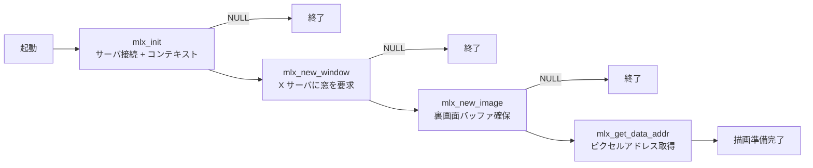
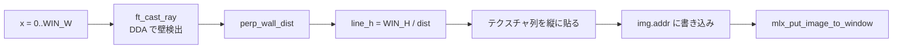
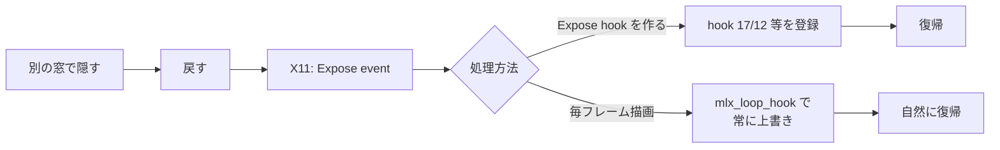

# Technical elements of the display — 評価詳細

cub3D 評価シートの **「Technical elements of the display」セクション** を「評価原文 + 日本語訳 + コード + 原理原則 + 模範回答」で 1 項目ずつ解説します。

→ 概要は **[評価対策トップ](eval.md)** を参照。
→ 本文の流れは **[06 レンダリング](06-rendering.md)** を参照。

---

## 🌱 3 秒でわかる

| 観点 | 一言で |
|---|---|
| **🎯 評価形式** | 3 テスト中 **1 つでも失敗** したら **このセクション 0 点** |
| **📦 関連コード** | `srcs/init.c` の `mlx_init`/`mlx_new_window`/`mlx_new_image` + `srcs/main.c` の `mlx_loop_hook` + `srcs/render/render.c` |
| **⚠️ ハマりどころ** | 1 度だけ描画して `mlx_loop` に入る実装 → ウィンドウを隠して戻すと **再描画されず黒く** なる |
| **🔗 本文ページ** | [06 レンダリング](06-rendering.md) |

---

## 📋 セクション全体の原文

!!! note "原文（評価シート Technical elements of the display）"
    > We're going to evaluate the technical elements of the display. Run the program and execute the following tests. If at least one fails, no points will be awarded for this section. Move to the next one. A window must open at the launch of the program. An image representing the inside of a maze must be displayed inside the window. Hide all or part of the window either by using another window or by using the screen's borders, then minimize the windows and maximize it back. In all cases, the content of the window must remain consistent.

!!! info "日本語訳"
    表示の技術要素を評価する。プログラムを起動し以下のテストを実行する。**1 つでも失敗したらこのセクションは 0 点**、次のセクションへ進む。プログラム起動時に **ウィンドウが開く** こと。ウィンドウ内に **迷路の内側を表す画像** が表示されること。別ウィンドウや画面端を使って **ウィンドウの一部または全部を隠し**、その後 **最小化して再度最大化** する。どのケースでも、ウィンドウの内容が **一貫している** こと。

---

## Test 1: 起動時にウィンドウが開く

### ① 評価シート原文

> A window must open at the launch of the program.

### ② 日本語訳

> プログラム起動時に、**ウィンドウが開く** こと。

### ③ 評価者が確認すること

| 確認 | 期待される挙動 |
|:---|:---|
| **ウィンドウ生成** | `./cub3D maps/valid.cub` でウィンドウが画面に現れる |
| **タイトルバー** | "cub3D" などのタイトルが表示される |
| **サイズ** | subject や設計通りのサイズ（例: 1024x768） |
| **クラッシュなし** | mlx 初期化失敗で segfault しない |

### ④ 評価者が見るコード箇所

| ファイル | 関数 | 何を見るか |
|:---|:---|:---|
| `srcs/init.c` | `ft_init_mlx` | `mlx_init` → `mlx_new_window` → `mlx_new_image` の **3 段順番** |
| `srcs/init.c` | エラー処理 | `mlx_init` が NULL のとき即エラー終了 |
| `includes/cub3d.h` | `WIN_W` / `WIN_H` | ウィンドウサイズの定義 |

```c title="srcs/init.c (mlx 初期化)"
int	ft_init_mlx(t_game *game)
{
	game->mlx = mlx_init();
	if (!game->mlx)
		return (ft_perr_game(game, "mlx_init failed"));
	game->win = mlx_new_window(game->mlx, WIN_W, WIN_H, "cub3D");
	if (!game->win)
		return (ft_perr_game(game, "mlx_new_window failed"));
	game->img.ptr = mlx_new_image(game->mlx, WIN_W, WIN_H);
	if (!game->img.ptr)
		return (ft_perr_game(game, "mlx_new_image failed"));
	game->img.addr = mlx_get_data_addr(game->img.ptr,
		&game->img.bpp, &game->img.line_len, &game->img.endian);
	return (0);
}
```

### ⑤ 原理原則 — `mlx_init` から `mlx_new_image` までの順番

miniLibX は **段階的にリソースを確保** していくライブラリです。各段の戻り値を NULL チェックしないと、後段で NULL を渡して segfault します。



`mlx_new_image` で **裏画面バッファ** を作っておくと、毎フレームの描画で `mlx_pixel_put`（X サーバ往復）を避けられ、**100 倍以上の高速化** が得られます。

### ⑥ よくある罠

- ❌ `mlx_init` の戻り値 NULL を見ない → 評価者環境（X11 forwarding 失敗等）で segfault
- ❌ `mlx_new_window` のサイズに `int` オーバーフロー値を渡す
- ❌ `mlx_get_data_addr` の戻り値を `void *` のまま使う → bpp/line_len/endian を見ずに描画してずれる
- ❌ Linux と macOS で `mlx_init` の戻り型が違うことを意識せずポインタ演算

### ⑦ 想定質問と模範回答

| 質問 | 模範回答 |
|---|---|
| 「`mlx_init` は何を返しますか？」 | mlx の **コンテキストへのポインタ** を返します。X11 サーバとの接続情報やリソース管理状態を持つ不透明型で、NULL ならディスプレイ取得失敗です |
| 「`mlx_new_image` を作る理由は？」 | 描画を **裏画面バッファ** に蓄積し、1 フレーム分を組み立ててから `mlx_put_image_to_window` で一括転送するためです。`mlx_pixel_put` を 1 ピクセルずつ呼ぶより圧倒的に高速です |
| 「`mlx_get_data_addr` の 3 つの引数の意味は？」 | `bpp`（bits per pixel）、`line_len`（1 行のバイト数、パディング含む）、`endian`（バイト順）を取り出すための out 引数です。これらを使ってピクセル位置 `y * line_len + x * (bpp/8)` を計算します |

---

## Test 2: 迷路の内側が画像として描画される

### ① 評価シート原文

> An image representing the inside of a maze must be displayed inside the window.

### ② 日本語訳

> ウィンドウ内に **迷路の内側を表す画像**（壁・床・天井）が表示されること。

### ③ 評価者が確認すること

| 確認 | 期待される挙動 |
|:---|:---|
| **壁が見える** | プレイヤー位置から前方の壁がテクスチャ付きで描画 |
| **床・天井** | `F`/`C` で指定した色で塗られる |
| **遠近感** | 近い壁は大きく、遠い壁は小さく描画される |
| **テクスチャの向き** | N/S/E/W 各方向で正しいテクスチャが貼られる |

### ④ 評価者が見るコード箇所

| ファイル | 関数 | 何を見るか |
|:---|:---|:---|
| `srcs/main.c` | `main` | `mlx_loop_hook(mlx, ft_render, &game)` の登録 |
| `srcs/render/render.c` | `ft_render` | x 軸 0〜WIN_W で `ft_cast_ray` → `ft_draw_column` のループ |
| `srcs/render/draw_column.c` | `ft_draw_column` | 1 列の天井・壁・床を描画 |

```c title="srcs/render/render.c (描画ループ全体)"
int	ft_render(t_game *game)
{
	int	x;

	x = 0;
	while (x < WIN_W)
	{
		ft_cast_ray(game, x);
		ft_draw_column(game, x);
		x++;
	}
	mlx_put_image_to_window(game->mlx, game->win, game->img.ptr, 0, 0);
	return (0);
}
```

```c title="srcs/render/draw_column.c (1 列描画)"
void	ft_draw_column(t_game *game, int x)
{
	int	y;

	y = 0;
	while (y < game->ray.draw_start)
		ft_put_pixel(&game->img, x, y++, game->cfg.ceiling_color);
	while (y <= game->ray.draw_end)
		ft_put_pixel(&game->img, x, y++, ft_sample_texture(game, y));
	while (y < WIN_H)
		ft_put_pixel(&game->img, x, y++, game->cfg.floor_color);
}
```

### ⑤ 原理原則 — レイキャスティングで「迷路の内側」を描く

画面の **横幅分（1024 本）** の光線を飛ばし、各光線について:

1. プレイヤーから飛ばし、DDA で 1 マスずつ前進
2. 壁 (`1`) にぶつかったら **垂直壁距離** を計算
3. `WIN_H / dist` で **壁の高さ** を求める
4. その高さで縦 1 列のテクスチャを貼る



これで「**3D っぽい遠近感** + 壁の方向ごとに異なるテクスチャ + 床/天井の塗りつぶし」が 1 フレームで完成します。

### ⑥ よくある罠

- ❌ `mlx_pixel_put` を毎ピクセルで呼ぶ → 重すぎて 1 fps、評価で "no points"
- ❌ `draw_start` が負数になるのを丸めずに `ft_put_pixel` でセグフォ
- ❌ テクスチャ列のサンプリングで `tex_y` を整数化し忘れ → 縞模様が崩れる
- ❌ 床と天井を描かない → 黒画面で「迷路の内側」と認められない

### ⑦ 想定質問と模範回答

| 質問 | 模範回答 |
|---|---|
| 「壁の高さはどう決めますか？」 | `WIN_H / perp_wall_dist`。距離に反比例するので、近い壁は大きく、遠い壁は小さく描かれ、自然な遠近感になります |
| 「`mlx_pixel_put` を使わない理由は？」 | 1 ピクセル毎に X11 サーバへ通信するので極端に遅いです。`mlx_new_image` で確保した裏画面の `img.addr` に直接書き、`mlx_put_image_to_window` で 1 度に転送します |
| 「壁の方向（N/S/E/W）はどう判別？」 | DDA で最後に渡った格子が x 方向か y 方向か（`side`）、進む符号 `step.x` / `step.y` の組み合わせで 4 方向を一意に決め、対応するテクスチャを選びます |

---

## Test 3: 隠す/最小化しても表示が崩れない

### ① 評価シート原文

> Hide all or part of the window either by using another window or by using the screen's borders, then minimize the windows and maximize it back. In all cases, the content of the window must remain consistent.

### ② 日本語訳

> 別ウィンドウや画面端を使って **ウィンドウの一部または全部を隠し**、その後 **最小化して再度最大化** する。どのケースでも、ウィンドウの内容が **一貫している** こと。

### ③ 評価者が確認すること

| 確認 | 期待される挙動 |
|:---|:---|
| **別ウィンドウで隠す** | 重ねた後で戻すと描画が復帰している |
| **画面端で隠す** | ウィンドウを画面外に出して戻しても描画維持 |
| **最小化 → 戻す** | ドックから戻したときに黒画面にならない |
| **背景描画あり** | 何もしないと黒くなるところで `Expose` イベントに自動応答 |

### ④ 評価者が見るコード箇所

| ファイル | 関数 | 何を見るか |
|:---|:---|:---|
| `srcs/main.c` | `main` | `mlx_loop_hook(mlx, ft_render, &game)` で **毎フレーム再描画** |
| `srcs/render/render.c` | `ft_render` | フレーム末で `mlx_put_image_to_window` を呼ぶ |
| `srcs/init.c` | `ft_init_mlx` | 裏画面 image を毎フレーム使い回す（再生成しない） |

```c title="srcs/main.c (mlx_loop_hook 登録)"
int	main(int argc, char **argv)
{
	t_game	game;

	if (ft_check_args(argc, argv))
		return (1);
	if (ft_init_game(&game, argv[1]))
		return (1);
	mlx_hook(game.win, 17, 0, ft_close_window, &game);
	mlx_hook(game.win, 2, 0, ft_key_press, &game);
	mlx_hook(game.win, 3, 0, ft_key_release, &game);
	mlx_loop_hook(game.mlx, ft_render, &game);
	mlx_loop(game.mlx);
	return (0);
}
```

```c title="srcs/render/render.c (フレーム末の転送)"
int	ft_render(t_game *game)
{
	ft_move(game);
	ft_draw_frame(game);
	mlx_put_image_to_window(game->mlx, game->win, game->img.ptr, 0, 0);
	return (0);
}
```

### ⑤ 原理原則 — なぜ毎フレーム再描画で表示が維持されるか？

X11 / miniLibX は、ウィンドウが隠されてから戻されると **`Expose` イベント** を送ります。これを処理しないと、隠された部分は **黒（または前の残像）** のまま残ります。



`mlx_loop_hook` で **毎フレーム `mlx_put_image_to_window` する設計** なら、`Expose` イベントを明示的に拾わなくても、次のフレームで自動的に上書きされて表示が維持されます。これが **最もシンプルで安全な解** です。

### ⑥ よくある罠

- ❌ 起動時に 1 度だけ `mlx_put_image_to_window` を呼んで `mlx_loop` に入る → 隠して戻すと黒
- ❌ `mlx_loop_hook` を登録し忘れる → 同様にフレーム更新が無い
- ❌ FPS が極端に低い設計 → 復帰の応答が遅く「崩れて見える」と判定されかねない
- ❌ プレイヤー移動なしの時に `ft_render` をスキップして CPU 節約してしまう（CPU は使ってよい、表示を切らさない方が大事）

### ⑦ 想定質問と模範回答

| 質問 | 模範回答 |
|---|---|
| 「ウィンドウを隠して戻したときの再描画は？」 | `mlx_loop_hook` に登録した `ft_render` が毎フレーム呼ばれ、`mlx_put_image_to_window` で裏画面を転送し続けているので、復帰後の次フレームで自動的に復活します |
| 「Expose イベントを明示的に拾っていますか？」 | いいえ、`mlx_loop_hook` の毎フレーム転送に任せています。Expose に対する個別のフックを書くより、毎フレーム描画の方が実装が単純でバグが少ないためです |
| 「描画コストは高くないですか？」 | 1024x768 の image を一度に転送するコストは現代マシンでは無視できるレベルで、FPS は 60〜100 を維持できます。スマートにスキップするより、確実に毎フレーム転送する方が評価では安全です |

---

## 🎯 ディフェンス当日の動き方

1. **`./cub3D maps/valid.cub`** で起動 → ウィンドウが開くことを見せる
2. **ウィンドウ内の描画** を指差し、壁・床・天井・遠近感を説明
3. **別ウィンドウ（ターミナル等）を重ねて** 戻す → 描画が消えていないことを実演
4. **ウィンドウを最小化** → ドックから戻す → 描画維持を実演
5. **画面端にウィンドウを移動** → 戻す → 描画維持を実演
6. コード説明: `main.c` の `mlx_loop_hook` 行 → `render.c` の `ft_render` → `draw_column.c` の縦 1 列描画 の順で指す

!!! tip "30 秒で説明できるストーリー"
    「`mlx_init`、`mlx_new_window`、`mlx_new_image` の 3 段で初期化し、`mlx_loop_hook` で `ft_render` を毎フレーム呼びます。`ft_render` は画面横幅 1024 本のレイキャスティングで裏画面に描画し、最後に `mlx_put_image_to_window` で転送します。ウィンドウを隠して戻しても次フレームで上書きされるので、Expose を明示処理しなくても表示が維持されます。」

---

## 📋 提出前最終チェック

- [ ] `mlx_init` / `mlx_new_window` / `mlx_new_image` の戻り値を NULL チェック
- [ ] `mlx_loop_hook` で `ft_render` を毎フレーム登録
- [ ] `ft_render` 末尾で `mlx_put_image_to_window` を呼ぶ
- [ ] 起動時にウィンドウが開く
- [ ] 壁・床・天井が描画される
- [ ] 別ウィンドウで隠して戻す → 描画維持
- [ ] 最小化して戻す → 描画維持
- [ ] 画面端で隠す → 描画維持
- [ ] N/S/E/W 各方向で正しいテクスチャが貼られる

---

## 関連ページ

- 本文: [03 レイキャスティング](03-raycasting.md)
- 本文: [04 DDA](04-dda.md)
- 本文: [05 カメラ](05-camera.md)
- 本文: [06 レンダリング](06-rendering.md)
- 評価: [Executable name の評価詳細](eval-execution.md)
- 評価: [Configuration file の評価詳細](eval-config.md)
- 評価: [User basic events の評価詳細](eval-events.md)
- 評価: **[評価対策トップへ戻る](eval.md)**
