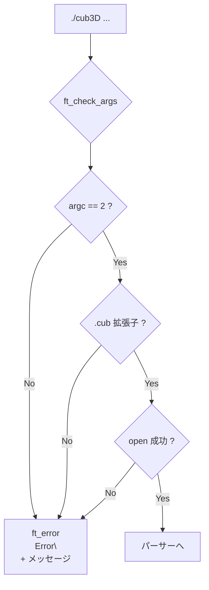
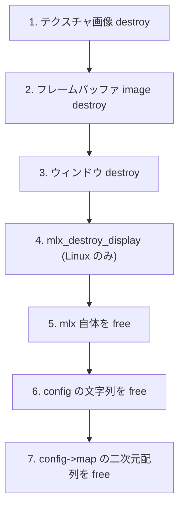
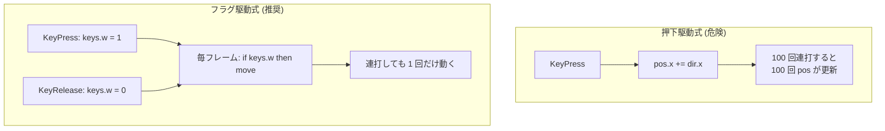
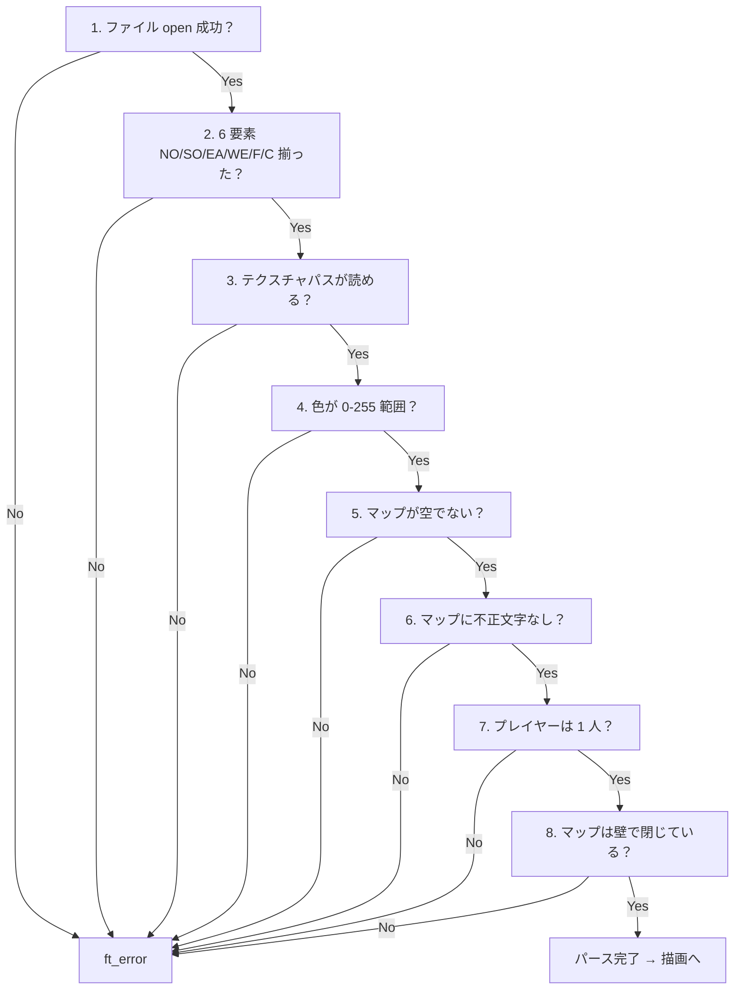

# Error management — 評価詳細

cub3D 評価シートの **「Error management」セクション** を「評価原文 + 日本語訳 + コード + 原理原則 + 模範回答」で 1 テストずつ解説します。

→ 概要は **[評価対策トップ](eval.md)** を参照。
→ 本文の流れは **[02 パーサー](02-parser.md)** と **[08 メモリ管理](08-memory.md)** を参照。

---

## 🌱 3 秒でわかる

| 観点 | 一言で |
|---|---|
| **🎯 評価形式** | 4 テスト中 **1 つでも失敗** したら **このセクション 0 点** |
| **📦 関連コード** | `main.c` の `ft_check_args` + `cleanup.c` の `ft_cleanup` + `error.c` の `ft_error` + `validate_map.c` のマップ検証 + `input.c` のフラグ方式キー入力 |
| **⚠️ ハマりどころ** | 引数 0 個や 3 個以上でクラッシュ / **キーボード乱打** で `keys.*` のフラグが正しく管理されず暴走 / マップを壊しても `Error\n` を出さず segfault |
| **🔗 本文ページ** | [02 パーサー](02-parser.md) / [07 入力処理](07-input.md) / [08 メモリ管理](08-memory.md) / [09 デバッグ](09-debugging.md) |

---

## 📋 セクション全体の原文

!!! note "原文（評価シート Error management）"
    > In this section, we'll evaluate the program's error management and reliability. Execute the 4 following tests. If at least one fails, this means that no points will be awarded for this section. Run the program using numerous arguments and random values. Even if the program doesn't require any arguments, it is critical that those arguments don't alternate or create unhandled errors. Check that there are no memory leaks. You can use the top or leaks command in another shell to monitor that the memory use is stable. The memory used must not increase each time an action is made. Roll either your arm or your face on the keyboard. The program must not show any strange behaviors and it must stay functional. Modify the map. The program must not show any strange behaviors and it must stay functional if the map is well configured, if not it must raise an error.

!!! info "日本語訳"
    本セクションではプログラムのエラー管理と信頼性を評価する。以下 4 テストを実行する。**1 つでも失敗したら、このセクションは 0 点**。**様々な数・値の引数** をつけて起動する。プログラムが引数を必要としなくても、それらが**未処理のエラー** を起こさないことが重要。**メモリリーク** がないことを確認する（`top` や `leaks` を別シェルで使って監視可）。各操作のたびにメモリ使用量が増えないこと。**腕や顔でキーボードを乱打** する。プログラムは奇妙な挙動を示さず、機能し続けること。**マップを変更** する。**正しいマップなら動作し、不正なマップなら `Error\n`** を出すこと。

---

## Test 1: 様々な引数でクラッシュしない

### ① 評価シート原文

> Run the program using numerous arguments and random values. Even if the program doesn't require any arguments, it is critical that those arguments don't alternate or create unhandled errors.

### ② 日本語訳

> プログラムを**様々な数・ランダム値の引数** で実行する。プログラムが引数を必要としなくても、それらの引数が**動作を狂わせたり、未処理のエラーを生じさせたりしないこと** が重要。

### ③ 評価者が確認すること

| 確認 | 期待される挙動 |
|:---|:---|
| **引数 0 個** | `./cub3D` → "Error\n" + 使用法 |
| **引数 1 個 `.cub`** | 正常動作 |
| **引数 1 個 `.txt` など** | "Error\n" + "Wrong extension" |
| **引数 2 個以上** | "Error\n" + "Too many arguments" |
| **引数 1 個 存在しないファイル** | "Error\n" + "Cannot open file" |
| **空文字や `--help`** | 未定義動作にならず "Error\n" 終了 |

### ④ 評価者が見るコード箇所

| ファイル | 関数 | 何を見るか |
|:---|:---|:---|
| `srcs/main.c` | `ft_check_args` | `argc == 2` かつ `.cub` 拡張子かを検証 |
| `srcs/main.c` | `main` | `ft_check_args` を**最初** に呼ぶ |
| `srcs/utils/error.c` | `ft_error` | `Error\n` を stderr に出して `EXIT_FAILURE` で終了 |

```c title="srcs/main.c (ft_check_args)"
static void ft_check_args(int argc, char **argv)
{
    if (argc != 2)
        ft_error("Usage: ./cub3D <path/to/map.cub>");
    int len = ft_strlen(argv[1]);
    if (len < 4 || ft_strncmp(argv[1] + len - 4, ".cub", 4) != 0)
        ft_error("File must have .cub extension");
    int fd = open(argv[1], O_RDONLY);
    if (fd < 0)
        ft_error("Cannot open .cub file");
    close(fd);
}
```

```c title="srcs/main.c (main 冒頭)"
int main(int argc, char **argv)
{
    t_game game;
    ft_check_args(argc, argv);          // ★最初に呼ぶ
    ft_bzero(&game, sizeof(t_game));    // 0 埋めしておく
    ft_parse(&game, argv[1]);
    // ... 続行 ...
}
```

### ⑤ 原理原則 — 入力検証は**最初のゲート**

「悪意のない誤入力」も「悪意のある攻撃」も、すべて `main` の入口で弾くのが鉄則です。



「動作テストで弾く」ではなく「**コードに到達する前** に弾く」のが安全。`main` の最初の 1 関数で全条件をクリアしたものだけが後段に進める設計にします。

### ⑥ よくある罠

- ❌ `argc` チェックなしで `argv[1]` を参照 → 引数 0 個で **NULL ポインタ参照** segfault
- ❌ 拡張子チェックなし → `./cub3D maps/broken.png` で先に進んでパースエラー（行き当たりばったり）
- ❌ `open` で確認せず `read` だけ → 存在しないファイルでも先に進む
- ❌ 拡張子チェックを `strstr(argv[1], ".cub")` で → `mymap.cub.bak` のような名前を通してしまう。**末尾比較** が正しい
- ❌ エラーメッセージなしで `exit(1)` のみ → 評価者が「何のエラーか分からない」

### ⑦ 想定質問と模範回答

| 質問 | 模範回答 |
|---|---|
| 「引数の数チェックはどこで？」 | `main` の最初に呼ぶ `ft_check_args` 関数で `argc != 2` を判定し、外れたら `ft_error` で即終了します |
| 「拡張子チェックの方法は？」 | `argv[1]` の末尾 4 文字を `ft_strncmp(... + len - 4, ".cub", 4)` で比較します。`strstr` だと `foo.cub.bak` が通ってしまうので避けます |
| 「ファイルの存在確認は？」 | `open(argv[1], O_RDONLY)` の戻り値が `< 0` ならエラーとします。`close` してパーサーで改めて `open` するので、ここでは存在確認だけです |

---

## Test 2: メモリリークなし

### ① 評価シート原文

> Check that there are no memory leaks. You can use the top or leaks command in another shell to monitor that the memory use is stable. The memory used must not increase each time an action is made.

### ② 日本語訳

> **メモリリーク** がないことを確認する。別のシェルで `top` や `leaks` コマンドを使ってメモリ使用量が安定していることを監視できる。各**操作** のたびにメモリ使用量が**増えてはいけない**。

### ③ 評価者が確認すること

| 確認 | 期待される挙動 |
|:---|:---|
| **起動直後** | `leaks ./cub3D` でリーク 0 |
| **操作中** | `top` で RSS が**増え続けない**（一定値） |
| **ESC 終了** | `leaks` でリーク 0 |
| **× ボタン終了** | `leaks` でリーク 0 |
| **エラー終了** | 不正マップ等でエラー終了しても `leaks` でリーク 0 |

### ④ 評価者が見るコード箇所

| ファイル | 関数 | 何を見るか |
|:---|:---|:---|
| `srcs/utils/cleanup.c` | `ft_cleanup` | mlx 関連・テクスチャ・マップ配列・config パスを**漏らさず** 解放 |
| `srcs/main.c` | `ft_close_window` | `ft_cleanup` → `exit(0)` の順 |
| `srcs/main.c` | `ft_loop` | **毎フレーム** で `mlx_new_image` を作り直していないこと（メモリ膨張の典型バグ） |
| `srcs/render/texture.c` | `ft_load_textures` | テクスチャ image を `t_game` に保持し、cleanup で `mlx_destroy_image` |

```c title="srcs/utils/cleanup.c (ft_cleanup)"
void ft_cleanup(t_game *game)
{
    int i;
    i = 0;
    while (i < 4) {
        if (game->textures[i].img)
            mlx_destroy_image(game->mlx, game->textures[i].img);
        i++;
    }
    if (game->img.ptr)
        mlx_destroy_image(game->mlx, game->img.ptr);
    if (game->win)
        mlx_destroy_window(game->mlx, game->win);
    if (game->mlx) {
#ifdef __linux__
        mlx_destroy_display(game->mlx);
#endif
        free(game->mlx);
    }
    ft_free_config(&game->config);
}
```

```c title="srcs/utils/cleanup.c (ft_free_config)"
void ft_free_config(t_config *cfg)
{
    free(cfg->no_path);
    free(cfg->so_path);
    free(cfg->ea_path);
    free(cfg->we_path);
    if (cfg->map) {
        int i = 0;
        while (cfg->map[i])
            free(cfg->map[i++]);
        free(cfg->map);
    }
}
```

### ⑤ 原理原則 — 「**確保した順番の逆**」で解放

二次元配列は内側 → 外側、リソースは依存関係の浅い順から解放するのが原則。



**初期化時に `t_game` 全体を `ft_bzero` で 0 埋め** しておくと、cleanup での `if (game->win)` のような NULL チェックが安全になります（途中エラー時の中途半端な状態にも対応）。

### ⑥ よくある罠

- ❌ 毎フレームで `mlx_new_image` を作り直して `destroy` 忘れ → 起動 10 秒で**メモリ数百 MB**
- ❌ `config->map` の **行ごとの `free` 漏れ** → 1 マップあたり数 KB のリーク
- ❌ `mlx_destroy_display` を Linux で呼んでいない → mlx ポインタ自体は解放されない
- ❌ `mlx_destroy_display` を macOS（`mlx_mms`）でも呼ぶ → シンボル未定義でリンクエラー
- ❌ 既に `NULL` のポインタに対して destroy / free → ライブラリによっては crash
- ❌ ESC では cleanup するが × ボタンでは cleanup しない → 経路統一で対処

### ⑦ 想定質問と模範回答

| 質問 | 模範回答 |
|---|---|
| 「リーク対策の基本方針は？」 | `t_game` 構造体に全リソースを集約し、`ft_cleanup` 1 関数で全解放。`exit` の前と `ft_close_window` 内で必ず呼びます。初期化時に `ft_bzero` で 0 埋めし、cleanup の NULL チェックで安全に |
| 「`mlx_destroy_display` を `#ifdef __linux__` で囲む理由は？」 | macOS の `mlx_mms` には `mlx_destroy_display` シンボルがなく、書くとリンクエラーになるためです |
| 「`leaks` と `valgrind` どちらで確認？」 | macOS では `leaks ./cub3D`、Linux では `valgrind --leak-check=full ./cub3D`。両方の環境でリーク 0 を確認しています |
| 「メモリが操作のたびに増える典型原因は？」 | フレーム毎の `mlx_new_image` をdestroyせず作り直す、テクスチャを毎回読み込む、`getline` などのバッファを解放しない、などです |

---

## Test 3: キーボード乱打で壊れない

### ① 評価シート原文

> Roll either your arm or your face on the keyboard. The program must not show any strange behaviors and it must stay functional.

### ② 日本語訳

> **腕や顔でキーボードを乱打** する。プログラムは**奇妙な挙動を示さず**、**機能し続けること**。

### ③ 評価者が確認すること

| 確認 | 期待される挙動 |
|:---|:---|
| **無関係なキー** | 何も起きない（クラッシュしない） |
| **複数キー同時押し** | 各キーが正しく独立に動く（W+A で斜め前進） |
| **連打** | 押下/離しのフラグが正しく切り替わる |
| **顔押し** | キーが大量に押される状況でも正常 |
| **押したまま ESC** | ESC で正常終了（移動キーフラグが残らない） |

### ④ 評価者が見るコード箇所

| ファイル | 関数 | 何を見るか |
|:---|:---|:---|
| `srcs/input/input.c` | `ft_key_press` | 各キーごとに `keys.*` フラグを立てる（**直接 `pos` を動かさない**） |
| `srcs/input/input.c` | `ft_key_release` | 同じキーで `keys.*` フラグを倒す |
| `srcs/input/move.c` | `ft_move` | 毎フレームでフラグを見て動く。フラグ方式なので「無関係なキー = フラグなし = 何もしない」 |

```c title="srcs/input/input.c (ft_key_press)"
int ft_key_press(int keycode, t_game *game)
{
    if (keycode == KEY_ESC) {
        ft_close_window(game);
    } else if (keycode == KEY_W || keycode == KEY_Z) {
        game->keys.w = 1;
    } else if (keycode == KEY_S) {
        game->keys.s = 1;
    } else if (keycode == KEY_A || keycode == KEY_Q) {
        game->keys.a = 1;
    } else if (keycode == KEY_D) {
        game->keys.d = 1;
    } else if (keycode == KEY_LEFT) {
        game->keys.left = 1;
    } else if (keycode == KEY_RIGHT) {
        game->keys.right = 1;
    }
    return (0);
}
```

```c title="srcs/input/input.c (ft_key_release)"
int ft_key_release(int keycode, t_game *game)
{
    if (keycode == KEY_W || keycode == KEY_Z)
        game->keys.w = 0;
    else if (keycode == KEY_S)
        game->keys.s = 0;
    else if (keycode == KEY_A || keycode == KEY_Q)
        game->keys.a = 0;
    else if (keycode == KEY_D)
        game->keys.d = 0;
    else if (keycode == KEY_LEFT)
        game->keys.left = 0;
    else if (keycode == KEY_RIGHT)
        game->keys.right = 0;
    return (0);
}
```

### ⑤ 原理原則 — **フラグ方式** が乱打耐性を生む

「押下イベントで即 `pos` を更新」式（押下駆動式）と、「押下/離しでフラグを on/off → 毎フレームでフラグを見て動く」式（フラグ駆動式）の違い:



フラグ方式の利点:

- 押下回数に依存しない（連打しても 1 フレーム 1 移動）
- 無関係なキーは flag が増えないだけで影響なし
- 複数キー同時押し（W+A）が自然に「W のフラグも A のフラグも立つ → 両方処理」で動く

### ⑥ よくある罠

- ❌ `ft_key_press` 内で**直接 `pos.x += ...`** → 連打すると壁を貫通
- ❌ `t_keys` 構造体を初期化していない → 起動時にゴミ値で勝手に移動
- ❌ `mlx_hook` のイベント 3 (KeyRelease) を登録忘れ → キーを離してもフラグが立ち続け、暴走
- ❌ `if (keycode == KEY_W)` の後に `else` を付け忘れ、複数 if 文が連続実行 → コンパイラ警告は出ないがロジック狂う
- ❌ `keys.*` を `int` 以外（例: `bool` で stdbool 未 include）→ C99 でビルドして norminette が嫌う構文を使う

### ⑦ 想定質問と模範回答

| 質問 | 模範回答 |
|---|---|
| 「キー入力をどう処理する？」 | `mlx_hook` の **KeyPress (2)** と **KeyRelease (3)** を登録し、各キーで `keys.*` フラグを 0/1 にトグルします。実際の移動は毎フレーム呼ばれる `ft_move` がフラグを見て行います |
| 「フラグ方式の利点は？」 | 押下回数に依存せず、OS のキーリピート間隔の影響を受けない。複数キー同時押しも自然に対応。乱打しても各フレーム 1 回しか動かないので壁貫通も防げます |
| 「無関係なキー（例 Caps Lock）が押されたら？」 | `if-else if` の連鎖の最後に `else` がないので**何もしません**。フラグが増えないので無害です |
| 「押したまま ESC を押したら？」 | `ESC` 押下で `ft_close_window` を呼び、その中で `ft_cleanup → exit` するため、フラグが残っていても問題ありません |

---

## Test 4: マップ変更で正常 or エラー終了

### ① 評価シート原文

> Modify the map. The program must not show any strange behaviors and it must stay functional if the map is well configured, if not it must raise an error.

### ② 日本語訳

> **マップを変更** する。プログラムは奇妙な挙動を示さず、**正しいマップなら機能し続け** 、**そうでなければエラーを発生** させること。

### ③ 評価者が確認すること

| 確認 | 期待される挙動 |
|:---|:---|
| **正常なマップ** | 普通に起動・動作 |
| **壁で囲まれていない** | "Error\n" + "Map is not closed" |
| **プレイヤーなし** | "Error\n" + "No player" |
| **プレイヤー複数** | "Error\n" + "Multiple players" |
| **不正文字** | "Error\n" + "Invalid character" |
| **空ファイル** | "Error\n" + "Empty file" |
| **要素欠落（NO/SO/EA/WE/F/C）** | "Error\n" + "Missing element" |

### ④ 評価者が見るコード箇所

| ファイル | 関数 | 何を見るか |
|:---|:---|:---|
| `srcs/parser/validate_map.c` | `ft_validate_map` | 文字種・プレイヤー数・壁閉鎖を順に検証 |
| `srcs/parser/validate_map.c` | `ft_check_walls` | 通行可能マスの上下左右が壁か空白か |
| `srcs/parser/parse.c` | `ft_parse` | NO/SO/EA/WE/F/C 全要素が揃ったか `flags` で管理 |
| `srcs/utils/error.c` | `ft_error` | `Error\n` + メッセージ |

```c title="srcs/parser/validate_map.c (文字種チェック)"
static int ft_check_chars(t_config *cfg)
{
    int y = 0;
    while (cfg->map[y]) {
        int x = 0;
        while (cfg->map[y][x]) {
            char c = cfg->map[y][x];
            if (!ft_strchr(" 01NSEW", c))
                return (0);
            if (ft_strchr("NSEW", c))
                cfg->player_count++;
            x++;
        }
        y++;
    }
    return (cfg->player_count == 1);
}
```

```c title="srcs/parser/validate_map.c (壁閉鎖チェック: 4 近傍)"
static int ft_neighbor_ok(char **map, int y, int x)
{
    int h = ft_strarr_len(map);
    if (y == 0 || x == 0 || y == h - 1)
        return (0);
    if (x >= (int)ft_strlen(map[y]) - 1)
        return (0);
    char neighbors[4] = { map[y-1][x], map[y+1][x], map[y][x-1], map[y][x+1] };
    int i = 0;
    while (i < 4) {
        if (neighbors[i] != '1' && neighbors[i] != '0'
            && neighbors[i] != 'N' && neighbors[i] != 'S'
            && neighbors[i] != 'E' && neighbors[i] != 'W')
            return (0);
        i++;
    }
    return (1);
}
```

```c title="srcs/parser/parse.c (要素フラグ管理)"
// 6 要素 (NO/SO/EA/WE/F/C) すべてが揃ったかを bit で管理
#define ALL_ELEMENTS 0x3F
if (cfg->flags != ALL_ELEMENTS)
    ft_error("Missing element in config");
```

### ⑤ 原理原則 — 「**正しい順序で**」検証する

検証は**安いものから順** に行うのが基本。NULL ポインタ参照を起こす前に上流チェックを通すこと。



検証はすべて**`ft_error` で `Error\n` + 終了**。サイレントに「デフォルト値で埋める」のは subject 違反です。

### ⑥ よくある罠

- ❌ 壁閉鎖チェックを「最外周が `1` か」だけで判定 → 内部の凹みで `0` が空白に隣接していても見逃す
- ❌ プレイヤー数のチェック忘れ → 複数いるとどちらをスポーンに使うか不定で UB
- ❌ 空ファイルや、マップ部分が空のファイルで segfault → `cfg->map[0]` が NULL のまま走る
- ❌ マップ行末の改行 `\n` を取り除き忘れ → `\n` が「不正文字」として弾かれてしまう（valid map が拒否される）
- ❌ Tab 文字をマップに許容する/しないでズレる（subject では空白は 32 のみ）
- ❌ 要素重複（NO 行が 2 つ）をエラーにしない → 後勝ち / 前勝ちが不定

### ⑦ 想定質問と模範回答

| 質問 | 模範回答 |
|---|---|
| 「マップ検証の優先順位は？」 | (1) 6 要素揃った？ (2) 色・パスが有効？ (3) マップ非空？ (4) 不正文字なし？ (5) プレイヤー 1 人？ (6) 壁閉鎖？ の順に検証。安いチェックから先に行います |
| 「壁閉鎖はどう判定？」 | 通行可能マス（`0/N/S/E/W`）について、上下左右の 4 近傍が `1` または有効な通行可能マスかをチェックします。空白や範囲外に接していたら開いていると判断 |
| 「6 要素揃ったかどう管理？」 | `config->flags` の 6 ビットを各要素受信時に立て、最後に `0x3F` と比較します。重複検出にも使えます |
| 「不正なマップでもメモリリークしない？」 | はい。`ft_error` 経路でも `ft_cleanup` を呼ぶ実装にしており、ここまでに確保した文字列・配列を全解放してから `exit(1)` します |

---

## 🎯 ディフェンス当日の動き方

1. **引数なし起動** `./cub3D` → "Error\n" + 使用法
2. **拡張子 NG** `./cub3D maps/bad.txt` → "Error\n" + "Wrong extension"
3. **引数 3 個** `./cub3D a b` → "Error\n" + "Too many arguments"
4. 正常マップで起動 → **`leaks -atExit -- ./cub3D maps/valid.cub`** を別端末で監視
5. 移動・回転を 1 分ほど操作 → `top` の RSS が**横ばい** を見せる
6. **キーボードを腕で乱打** → ウィンドウが落ちないことを確認
7. **複数キー同時押し（W+A）** → 斜め前進が滑らかに動く
8. ESC で終了 → `leaks` でリーク 0
9. **壁が閉じていないマップ**（例 `maps/open_wall.cub`）→ `Error\n` + "Map not closed" 終了
10. **プレイヤーなしマップ** → `Error\n` + "No player" 終了
11. **不正文字（例 `X`）を含むマップ** → `Error\n` + "Invalid character" 終了
12. コード説明: `main.c` の `ft_check_args` → `validate_map.c` の `ft_check_chars` / `ft_neighbor_ok` → `cleanup.c` の `ft_cleanup` の順で指す

!!! tip "30 秒で説明できるストーリー"
    「`main` の最初に `ft_check_args` で引数を全弾き、その後 `ft_parse` で 6 要素を flag 管理し、`ft_validate_map` で文字種・プレイヤー数・壁閉鎖を順に検証します。どこで失敗しても `ft_cleanup` を呼んでから `Error\n` を出して `exit(1)` するのでリークしません。キー入力はフラグ方式なので乱打しても暴走せず、毎フレームの `ft_move` で 1 フレーム 1 移動の安定動作になります。」

---

## 📋 提出前最終チェック

- [ ] `argc == 2` チェックを `main` の最初で行う
- [ ] 拡張子チェックは末尾 4 文字比較（`strstr` ではなく）
- [ ] ファイル `open` の戻り値チェック
- [ ] **すべての** エラー終了経路で `ft_cleanup` → `Error\n` + メッセージ → `exit(1)` の順
- [ ] `leaks ./cub3D maps/valid.cub` でリーク 0（起動 → 操作 → ESC）
- [ ] `leaks ./cub3D maps/bad.cub` でもリーク 0（エラー終了経路）
- [ ] 操作中の `top` で RSS が**横ばい**（毎フレーム mlx_new_image していない）
- [ ] **フラグ方式** で入力処理（押下で `pos` を直接書き換えない）
- [ ] 無関係なキーは何もしない（`if-else if` の最後に何もない）
- [ ] 壁閉鎖 / プレイヤー数 / 不正文字 / 要素欠落 / 空ファイル のすべてに対応
- [ ] マップ行末の `\n` を `ft_strdup` 後に取り除く処理あり

---

## 関連ページ

- 本文: [02 パーサー](02-parser.md)
- 本文: [07 入力処理](07-input.md)
- 本文: [08 メモリ管理](08-memory.md)
- 本文: [09 デバッグとリークチェック](09-debugging.md)
- 評価: [User basic events の評価詳細](eval-events.md)
- 評価: [Walls の評価詳細](eval-walls.md)
- 評価: [Movements の評価詳細](eval-movement.md)
- 評価: **[評価対策トップへ戻る](eval.md)**
