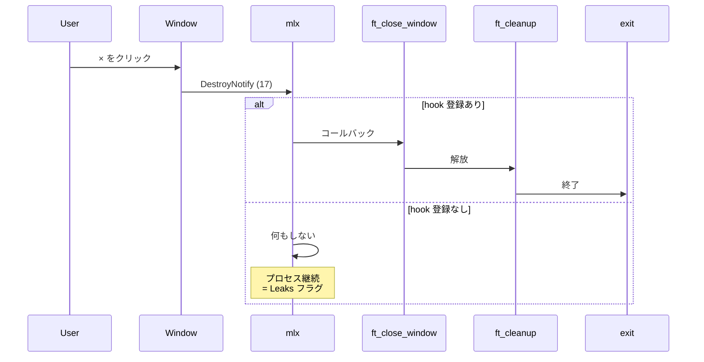
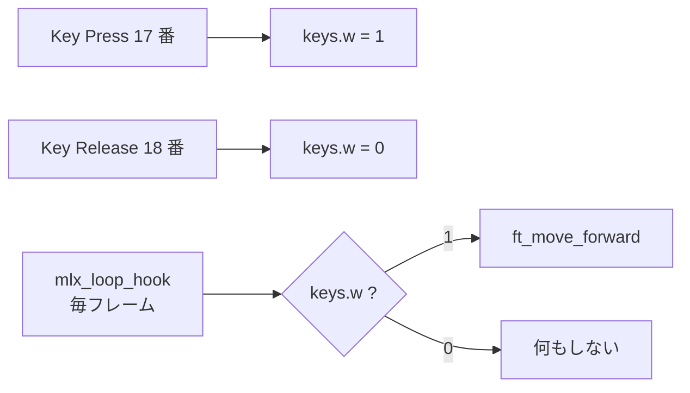

# User basic events — 評価詳細

cub3D 評価シートの **「User basic events」セクション** を「評価原文 + 日本語訳 + コード + 原理原則 + 模範回答」で 1 項目ずつ解説します。

→ 概要は **[評価対策トップ](eval.md)** を参照。
→ 本文の流れは **[00 プログラム全体の流れ](00-main-flow.md)** を参照。

---

## 🌱 3 秒でわかる

| 観点 | 一言で |
|---|---|
| **🎯 評価形式** | 3 テスト中 **1 つでも失敗** したら **このセクション 0 点** |
| **📦 関連コード** | `main.c` の `mlx_hook` 3 行 + `ft_key_press` + `ft_close_window` |
| **⚠️ ハマりどころ** | × ボタンを `mlx_hook(win, 17, ...)` で拾い忘れ → リークで **Leaks フラグ** |
| **🔗 本文ページ** | [00 メインフロー §2 main 関数](00-main-flow.md#2-main-mainc) |

---

## 📋 セクション全体の原文

!!! note "原文（評価シート User basic events）"
    > In this section, we're going to evaluate the program's user generated events. Execute the 3 following tests. If at least one fails, this means that no points will be awarded for this section. Move to the next one.

!!! info "日本語訳"
    このセクションではユーザーが発生させるイベントを評価する。以下 3 テストを実行する。**1 つでも失敗したら、このセクションは 0 点**となり、次のセクションへ進む。

---

## Test 1: × ボタン（赤いバツ）でクリーン終了

### ① 評価シート原文

> Click the red cross at the top left of the window. The window must close and the program must exit cleanly.

### ② 日本語訳

> ウィンドウ左上の赤い × ボタンをクリックする。**ウィンドウが閉じ、プログラムがクリーンに終了** すること。

### ③ 評価者が確認すること

| 確認 | 期待される挙動 |
|:---|:---|
| **ウィンドウが消える** | ×クリック後すぐに画面から消える |
| **プロセスが終了** | `ps` や `top` でプロセスが残らない |
| **メモリリークなし** | `leaks`（macOS）/ `valgrind`（Linux）で増えていない |

### ④ 評価者が見るコード箇所

| ファイル | 関数 | 何を見るか |
|:---|:---|:---|
| `srcs/main.c` | `main` | `mlx_hook(win, 17, 0, ft_close_window, &game);` が **登録されているか** |
| `srcs/main.c` | `ft_close_window` | `ft_cleanup(game);` → `exit(0);` の **順番** |

```c title="srcs/main.c (× ボタン関連)"
// main 関数内: 17 = DestroyNotify
mlx_hook(game.win, 17, 0, ft_close_window, &game);
```

```c title="srcs/main.c (ft_close_window)"
static int ft_close_window(t_game *game)
{
    ft_cleanup(game);   // ← 先に解放
    exit(0);            // ← その後で終了
    return (0);
}
```

### ⑤ 原理原則 — なぜ `17` が必要？

miniLibX は X11 の薄いラッパーで、`17 = DestroyNotify` は **「ウィンドウ破棄イベント」** のコード。これを `mlx_hook` で拾わないと:

- × クリック → ウィンドウは消える（X サーバーが破棄）
- しかし **プロセスは生き続ける**（`mlx_loop` が回り続ける）
- → cleanup が走らずメモリリーク



### ⑥ よくある罠

- ❌ `mlx_hook(win, 17, ...)` を忘れる → × で閉じても **プロセス残存 = Leaks**
- ❌ `exit(0)` の前に `ft_cleanup` を呼ばない → 解放されず Leaks
- ❌ `ft_close_window` の戻り値を書かない → コンパイル警告 → `Invalid compilation`

### ⑦ 想定質問と模範回答

| 質問 | 模範回答 |
|---|---|
| 「× ボタンを処理するには？」 | `mlx_hook` のイベント番号 **17 (DestroyNotify)** を登録し、コールバック内で `cleanup → exit` する |
| 「`exit(0)` の前に `ft_cleanup` を呼ぶ理由は？」 | `exit` 後に通常コードは走らないため。リソース解放は **必ず `exit` の前** に置く |
| 「`mlx_destroy_display` は呼んでる？」 | Linux 版 miniLibX のみ呼ぶ（macOS の `mlx_mms` には無い）。`#ifdef __linux__` で分岐 |

---

## Test 2: ESC キーでクリーン終了

### ① 評価シート原文

> Press the ESC key. The window must close and the program must exit cleanly. In the case of this test, we will accept that another key exits the program, for example, Q.

### ② 日本語訳

> ESC キーを押す。**ウィンドウが閉じ、プログラムがクリーンに終了** すること。本テストでは ESC 以外のキー（例: Q）で終了する実装でも許容される。

### ③ 評価者が確認すること

| 確認 | 期待される挙動 |
|:---|:---|
| **ESC で終了** | ESC 押下でウィンドウが消えてプロセス終了 |
| **クリーン終了** | リークなし |

### ④ 評価者が見るコード箇所

| ファイル | 関数 | 何を見るか |
|:---|:---|:---|
| `srcs/main.c` | `main` | `mlx_hook(win, 2, ..., ft_key_press, &game);` の登録 |
| `srcs/input/input.c` | `ft_key_press` | `keycode == KEY_ESC` 分岐で `ft_close_window` 経由 |
| `includes/cub3d.h` | — | `KEY_ESC` マクロの定義（macOS: 53, Linux: 65307） |

```c title="srcs/input/input.c (ESC 処理抜粋)"
int ft_key_press(int keycode, t_game *game)
{
    if (keycode == KEY_ESC)
        ft_close_window(game);   // Test 1 と同じ経路
    // ... 移動キー処理 ...
    return (0);
}
```

### ⑤ 原理原則 — × ボタンと終了経路を統一する理由

ESC 終了と × 終了が **別経路** だと、片方だけリーク修正を忘れる事故が起きます。`ft_close_window` を共通呼び出し点にすると:

- 解放処理が **1 箇所** に集中（DRY 原則）
- 「× だとリークしないが ESC だとリークする」というバグが起きない

### ⑥ よくある罠

- ❌ `keycode == 53` のように **マジックナンバー直書き** → 規範エラーになりうる。`KEY_ESC` マクロ化を
- ❌ ESC で `exit(0)` だけ呼んで `ft_cleanup` を忘れる → Leaks
- ❌ macOS と Linux で keycode が違うことを知らない → 片方の環境で動かない

### ⑦ 想定質問と模範回答

| 質問 | 模範回答 |
|---|---|
| 「ESC のキーコードは？」 | macOS (`mlx_mms`) は **53**、Linux (X11) は **65307**。`#ifdef` でマクロを切り替える |
| 「終了経路を × と統一した理由は？」 | 解放処理を 1 箇所にまとめ、片方修正漏れのリスクを排除するため |
| 「Q キーでも終了する実装は OK？」 | 評価シート明文許容（"for example, Q"）。ただし ESC は **基本キー** なので両方対応する方が無難 |

---

## Test 3: 移動キーで画面に変化が出る

### ① 評価シート原文

> Press the four movement keys (we'll accept WASD or ZQSD keys) in the order of your liking. Each key press must render a visible result on the window, such as a player's movement/rotation.

### ② 日本語訳

> 4 つの移動キー（**WASD または ZQSD** を許容）を任意の順で押す。**各キー押下ごとに、画面にプレイヤーの移動/回転など視覚的な変化** が出ること。

### ③ 評価者が確認すること

| 確認 | 期待される挙動 |
|:---|:---|
| **W / Z**（前進） | プレイヤー視点が前に動く |
| **A / Q**（左ストレイフ） | 視点が真左に並行移動 |
| **S**（後退） | 視点が後ろに動く |
| **D**（右ストレイフ） | 視点が真右に並行移動 |
| **反応速度** | 押下後 すぐに画面に変化 |

!!! info "回転（← →）は本テスト範囲外"
    ← → の回転は **Movements セクション** で評価される。本テストは「4 つの移動キー（W/A/S/D または Z/Q/S/D）で何か起きる」だけ確認。

### ④ 評価者が見るコード箇所

| ファイル | 関数 | 何を見るか |
|:---|:---|:---|
| `srcs/main.c` | `main` | `mlx_hook(..., 2, ..., ft_key_press, ...)` と `mlx_hook(..., 3, ..., ft_key_release, ...)` の **両方** |
| `srcs/input/input.c` | `ft_key_press` / `ft_key_release` | キーごとに `game->keys.<flag>` を 1/0 にする |
| `srcs/input/move.c` | `ft_move` | `game->keys.<flag>` を見て位置を更新 |

```c title="srcs/input/input.c (移動キー抜粋)"
int ft_key_press(int keycode, t_game *game)
{
    if (keycode == KEY_W) game->keys.w = 1;
    if (keycode == KEY_A) game->keys.a = 1;
    if (keycode == KEY_S) game->keys.s = 1;
    if (keycode == KEY_D) game->keys.d = 1;
    return (0);
}

int ft_key_release(int keycode, t_game *game)
{
    if (keycode == KEY_W) game->keys.w = 0;
    // ... 他のキーも同様 ...
    return (0);
}
```

```c title="srcs/input/move.c (毎フレーム呼ばれる)"
void ft_move(t_game *game)
{
    if (game->keys.w) ft_move_forward(game);
    if (game->keys.s) ft_move_backward(game);
    if (game->keys.a) ft_strafe_left(game);
    if (game->keys.d) ft_strafe_right(game);
}
```

### ⑤ 原理原則 — なぜ press / release を分けるか？

「押した瞬間に 1 回だけ動く」より「**押している間ずっと動く**」方が FPS ゲームらしい操作感になります。これを実現するには:



押下イベントだけで動かすと **キーリピート間隔（OS 依存、ガタつく）** に支配されますが、フラグ + 毎フレーム判定なら **常に滑らかな移動**（後の Movements セクション評価にも直結）になります。

### ⑥ よくある罠

- ❌ `mlx_hook` のイベント 3 (KeyRelease) を登録忘れ → キーを離しても動き続ける
- ❌ `ft_key_press` 内で直接 `pos.x += ...` する → リピート間隔依存でガタつく
- ❌ WASD と ZQSD のどちらか **片方しか効かない** → AZERTY/QWERTY 両配列に対応すべき
- ❌ 押下時に何の変化も出ない → 評価即 0 点

### ⑦ 想定質問と模範回答

| 質問 | 模範回答 |
|---|---|
| 「なぜ press と release を分ける？」 | フラグ方式で「押している間動き続ける」を実現するため。OS のキーリピート間隔に依存せず滑らか |
| 「移動量はどう決めた？」 | `ft_move_forward` 内で `pos += dir * MOVE_SPEED;` のように、フレーム時間に比例しない固定量。FPS が一定（60）前提 |
| 「WASD と ZQSD の両方に対応した？」 | はい。両方のキーコードを `KEY_W` / `KEY_Z` などで定義し、`ft_key_press` 内で `||` で OR をとる |

---

## 🎯 ディフェンス当日の動き方

1. **× ボタンクリック** → 起動 → × → クリーン終了を見せる
2. **`leaks ./cub3D maps/valid.cub`** をもう一つのターミナルで動かしつつ、ESC で終了 → リーク 0
3. **WASD（または ZQSD）を順番に押下** → 画面に変化が出ることを実演
4. コード説明: `main.c` の `mlx_hook` 4 行 → `ft_close_window` → `ft_key_press` の順で指す

!!! tip "30 秒で説明できるストーリー"
    「`mlx_hook` でキー押下・離す・× ボタンの 3 つを登録しています。× は内部で `ft_cleanup` を呼んでから `exit` するのでリークしません。移動キーは `press` でフラグを立て `release` でフラグを下ろし、`mlx_loop_hook` 内の `ft_move` が毎フレームフラグを見て移動します。」

---

## 📋 提出前最終チェック

- [ ] `mlx_hook(win, 17, 0, ft_close_window, &game)` が登録されている
- [ ] `ft_close_window` 内で `ft_cleanup → exit(0)` の順
- [ ] ESC で終了 → `leaks` / `valgrind` でリーク 0
- [ ] × で終了 → リーク 0
- [ ] W/A/S/D（または Z/Q/S/D）の各キーで画面に変化が出る
- [ ] キーを離すと止まる（フラグ方式が機能している）
- [ ] キーボードを乱打しても落ちない（Error management にも関連）

---

## 関連ページ

- 本文: [00 メインフロー — main 関数](00-main-flow.md#2-main-mainc)
- 本文: [07 入力処理](07-input.md)
- 評価: [Movements の評価詳細](eval-movement.md)（仮）
- 評価: [Error management の評価詳細](eval-errors.md)（仮）
- 評価: **[評価対策トップへ戻る](eval.md)**
