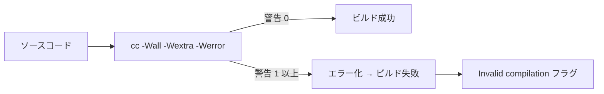
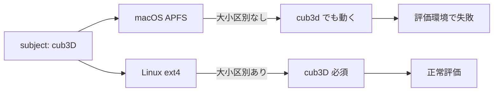

# Executable name — 評価詳細

cub3D 評価シートの **「Executable name」セクション** を「評価原文 + 日本語訳 + コード + 原理原則 + 模範回答」で 1 項目ずつ解説します。

→ 概要は **[評価対策トップ](eval.md)** を参照。
→ 本文の流れは **[00 プログラム全体の流れ](00-main-flow.md)** を参照。

---

## 🌱 3 秒でわかる

| 観点 | 一言で |
|---|---|
| **🎯 評価形式** | 3 テスト中 **1 つでも失敗** したら **`Invalid compilation` フラグ** で defense 終了 |
| **📦 関連コード** | `Makefile` の `NAME = cub3D` / `CFLAGS = -Wall -Wextra -Werror` / `.PHONY` / `$(NAME):` ターゲット |
| **⚠️ ハマりどころ** | 実行ファイル名を `cub3d`（小文字 d）にしてしまう、`make` 2 回目で **再リンク** が走る、`-Werror` を抜かす |
| **🔗 本文ページ** | [00 メインフロー §1 ビルド](00-main-flow.md) |

---

## 📋 セクション全体の原文

!!! note "原文（評価シート Executable name）"
    > Check that the project compiles correctly (without relinking) when running the make command and that the executable name is cub3D. If not, use the invalid compilation flag at the end of the scale.

!!! info "日本語訳"
    `make` コマンドを実行した際にプロジェクトが **再リンクなしで正しくコンパイル** され、実行ファイル名が **`cub3D`** であることを確認する。そうでない場合は、評価シート末尾の **`Invalid compilation` フラグ** を使う。

---

## Test 1: `make` でエラーも警告もなくビルドできる

### ① 評価シート原文

> Check that the project compiles correctly when running the make command.

### ② 日本語訳

> `make` コマンドでプロジェクトが **エラーも警告もなくコンパイル** されること。

### ③ 評価者が確認すること

| 確認 | 期待される挙動 |
|:---|:---|
| **エラーゼロ** | `make` の出力にコンパイルエラーが 1 つも無い |
| **警告ゼロ** | `warning:` の文字が 1 行も出ない |
| **必須フラグ** | `-Wall -Wextra -Werror` が `CFLAGS` に並んでいる |
| **実行ファイル生成** | ビルド後にカレントに `cub3D` が出来ている |

### ④ 評価者が見るコード箇所

| ファイル | 関数/変数 | 何を見るか |
|:---|:---|:---|
| `Makefile` | `CFLAGS` | `-Wall -Wextra -Werror` の **3 つすべてが揃っているか** |
| `Makefile` | `$(NAME):` ターゲット | `.o` を集めて `$(CC) $(CFLAGS) ... -o $(NAME)` でリンクしているか |
| ターミナル | `make` の出力 | `warning:` が 1 行も出ないか |

```makefile title="Makefile (フラグ宣言)"
CC      = cc
CFLAGS  = -Wall -Wextra -Werror
NAME    = cub3D
```

```makefile title="Makefile ($(NAME) ターゲット)"
$(NAME): $(OBJS)
	$(CC) $(CFLAGS) $(OBJS) $(MLX_FLAGS) -o $(NAME)
```

### ⑤ 原理原則 — なぜ 3 つのフラグが必須か？

42 では C プログラムを「**警告ゼロでビルドできる**」状態に保つことが必須です。

- **`-Wall`** — よく使う警告群（未使用変数・暗黙変換など）を有効化
- **`-Wextra`** — `-Wall` で拾えない警告（符号比較・空構造体など）も有効化
- **`-Werror`** — 警告を **コンパイルエラーに格上げ**。1 つでも警告が出れば即ビルド失敗



警告は **未定義動作の前兆** であることが多いので、本番に持ち込ませない強制力として `-Werror` が機能します。

### ⑥ よくある罠

- ❌ `CFLAGS` に `-Wall` だけしか書いていない → 評価者がフラグを `grep` して気付く → `Invalid compilation`
- ❌ `mlx_init` 系の暗黙宣言警告が出ているのに気付かない → `-Werror` でビルド不可
- ❌ 環境変数で `CFLAGS` が上書きされる構造（`CFLAGS = ...` ではなく `CFLAGS += ...`）→ ローカルでは通るが評価者環境で警告
- ❌ Linux と macOS でフラグが分岐していないため、片方の環境で警告

### ⑦ 想定質問と模範回答

| 質問 | 模範回答 |
|---|---|
| 「`-Werror` を入れている理由は？」 | 警告を読み飛ばさず、コードに残さないため。警告は未定義動作の前兆なので、本番に行かせない開発文化を強制する目的です |
| 「`-Wall` と `-Wextra` の違いは？」 | `-Wall` は「全て」と読みますが実は一部の警告のみ有効化、`-Wextra` で残りの警告（符号比較・初期化漏れなど）まで広げます。両方セットで使うのが定石です |
| 「miniLibX のヘッダに警告が出たら？」 | システムヘッダ扱いにする `-isystem` を使うか、自分のラッパー関数で受けて自前コードに警告を出さない設計にします |

---

## Test 2: `make` 2 回目で再リンクなし

### ① 評価シート原文

> Check that the project compiles correctly (without relinking) when running the make command.

### ② 日本語訳

> `make` を 2 回目に実行したとき、**再リンクが走らない**（`Nothing to be done for 'all'` などが出る）こと。

### ③ 評価者が確認すること

| 確認 | 期待される挙動 |
|:---|:---|
| **1 回目 `make`** | 全 `.o` をコンパイルし `cub3D` を生成 |
| **2 回目 `make`** | `make: Nothing to be done for 'all'.` などが出て、コンパイルもリンクも走らない |
| **`.PHONY` 宣言** | `all clean fclean re` が `.PHONY` に並んでいる |

### ④ 評価者が見るコード箇所

| ファイル | 場所 | 何を見るか |
|:---|:---|:---|
| `Makefile` | `all:` ターゲット | `$(NAME)` を依存に持つだけで、空ターゲットになっているか |
| `Makefile` | `.PHONY` 行 | `all clean fclean re` が宣言されているか |
| `Makefile` | パターンルール | `%.o: %.c` の依存関係で `.c` が変わったときだけ `.o` を作り直すか |

```makefile title="Makefile (.PHONY と all)"
.PHONY: all clean fclean re

all: $(NAME)
```

```makefile title="Makefile (パターンルール)"
$(OBJS_DIR)/%.o: $(SRCS_DIR)/%.c
	@mkdir -p $(dir $@)
	$(CC) $(CFLAGS) $(INCLUDES) -c $< -o $@
```

### ⑤ 原理原則 — なぜ再リンクが起きるか？

`make` はターゲットと依存ファイルの **タイムスタンプ** を見て、依存の方が新しければ再ビルドします。再リンクが毎回走る典型原因は:

```mermaid
flowchart TD
    A[make 2 回目] --> B{$(NAME) は<br/>OBJS より新しい？}
    B -->|Yes| OK[Nothing to be done.]
    B -->|No| Re[リンクが走る]
    Re --> Cause1[原因 1: .PHONY 漏れで<br/>$(NAME) という<br/>ファイル名のディレクトリ等が衝突]
    Re --> Cause2[原因 2: OBJS が<br/>毎回 touch されている]
    Re --> Cause3[原因 3: 依存に存在しないファイル<br/>を書いている]
```

`.PHONY` に `all` を入れずに `all:` を書くと、たまたま `all` というファイルが存在した時に動作が変わります。`$(NAME)` の依存解決を安定させるためにも `.PHONY` 宣言は必須です。

### ⑥ よくある罠

- ❌ `.PHONY: all clean fclean re` を書いていない → 同名のファイル/ディレクトリが出来た瞬間に動作不安定
- ❌ `$(OBJS)` を `wildcard` で取り直して毎回タイムスタンプが変わる
- ❌ ヘッダ依存を書かず、`includes/cub3d.h` を更新しても再コンパイルされない（評価とは別の問題だがハマりやすい）
- ❌ `all: re` と書いている → 毎回 `re` が走る

### ⑦ 想定質問と模範回答

| 質問 | 模範回答 |
|---|---|
| 「2 回目の `make` で何も起きない理由は？」 | `$(NAME)` のタイムスタンプが `$(OBJS)` より新しいため、Make は再ビルド不要と判断します |
| 「`.PHONY` の役割は？」 | `all` `clean` 等は **ファイルではない仮想ターゲット** であると Make に伝えるためです。これが無いと同名ファイルが存在したときに動作が壊れます |
| 「ヘッダ依存はどう書いていますか？」 | `OBJS` ルールに `$(HEADERS)` を依存として並べるか、`-MMD` で自動生成した `.d` ファイルを `-include` しています |

---

## Test 3: 実行ファイル名が `cub3D`

### ① 評価シート原文

> Check that the executable name is cub3D.

### ② 日本語訳

> 実行ファイル名が **`cub3D`**（大文字 D）であること。

### ③ 評価者が確認すること

| 確認 | 期待される挙動 |
|:---|:---|
| **ファイル名** | `make` 完了後、カレントに **`cub3D`**（小文字 cub3 + 大文字 D）が存在 |
| **`./cub3D`** で起動 | 小文字 d の `./cub3d` ではなく、大文字 D で起動できる |
| **`Makefile` の `NAME`** | `NAME = cub3D` と **大文字 D** で宣言されている |

### ④ 評価者が見るコード箇所

| ファイル | 変数 | 何を見るか |
|:---|:---|:---|
| `Makefile` | `NAME` | `NAME = cub3D` の **大文字 D** |
| `Makefile` | `$(NAME):` | リンク時の `-o $(NAME)` で `$(NAME)` を使っているか |
| シェル | `ls cub3D` | 大小区別のあるファイルシステム（Linux）でも存在するか |

```makefile title="Makefile (NAME 宣言)"
NAME = cub3D
```

```makefile title="Makefile (リンク行)"
$(NAME): $(OBJS)
	$(CC) $(CFLAGS) $(OBJS) $(MLX_FLAGS) -o $(NAME)
```

### ⑤ 原理原則 — なぜ大文字 D に強くこだわるか？

- **subject 厳守** — 42 課題は subject の表記を 1 文字単位で守ることが評価対象
- **大小区別** — Linux / `ext4` などは **大小区別** あり。`cub3d` と `cub3D` は **別ファイル** として扱われる
- **macOS の罠** — macOS の `APFS` はデフォルトで **大小区別なし**。ローカルで `cub3d` でも動くが、評価者の Linux で名前不一致になり Defense 失敗



### ⑥ よくある罠

- ❌ `NAME = cub3d`（小文字 d） → macOS では気付かず、Linux 評価で `command not found`
- ❌ `NAME = Cub3D` のような独自表記 → subject 違反
- ❌ ハードコードで `gcc ... -o cub3d` と書いている（`$(NAME)` を使っていない）
- ❌ サブディレクトリに実行ファイルを置く → カレントに `cub3D` が無いと評価者が見つけられない

### ⑦ 想定質問と模範回答

| 質問 | 模範回答 |
|---|---|
| 「ファイル名はなぜ大文字の D ですか？」 | subject 指定に従っているからです。Linux の評価環境は大小区別があるため、`cub3D` でないと評価で見つけてもらえません |
| 「macOS で動くから OK では？」 | macOS は APFS で大小区別が無いので、`cub3d` でも動いてしまいます。評価環境は Linux 想定なので、`Makefile` の `NAME` を必ず `cub3D` に揃えます |
| 「実行ファイル名を変えたい場合は？」 | `Makefile` の `NAME` 変数を変更するだけで、リンク行は `-o $(NAME)` を参照しているので全箇所に反映されます |

---

## 🎯 ディフェンス当日の動き方

1. **`make fclean && make`** を最初に実行 → 警告 0、エラー 0 を見せる
2. **`make`** をすぐもう 1 回実行 → `Nothing to be done for 'all'.` が出ることを見せる
3. **`ls -l cub3D`** で大文字 D のファイルが存在することを示す
4. **`cat Makefile | head -20`** で `CFLAGS` と `NAME` を見せ、`-Wall -Wextra -Werror` と `cub3D` を指差す
5. **`grep .PHONY Makefile`** で `.PHONY` 宣言を見せる

!!! tip "30 秒で説明できるストーリー"
    「`Makefile` で `CFLAGS = -Wall -Wextra -Werror`、`NAME = cub3D` と宣言しています。`.PHONY: all clean fclean re` を付けているので `make` 2 回目はリンクが走らず、`Nothing to be done for 'all'` になります。」

---

## 📋 提出前最終チェック

- [ ] `Makefile` に `CFLAGS = -Wall -Wextra -Werror` がある
- [ ] `Makefile` に `NAME = cub3D`（**大文字 D**）がある
- [ ] `.PHONY: all clean fclean re` が宣言されている
- [ ] `make fclean && make` で警告 0、エラー 0
- [ ] `make` 2 回目で `Nothing to be done for 'all'.` が出る
- [ ] `ls cub3D` で **大文字 D** の実行ファイルが存在する
- [ ] Linux 環境（評価者環境）で名前一致を確認した

---

## 関連ページ

- 本文: [00 メインフロー](00-main-flow.md)
- 評価: [Configuration file の評価詳細](eval-config.md)
- 評価: [Technical elements of the display の評価詳細](eval-display.md)
- 評価: [User basic events の評価詳細](eval-events.md)
- 評価: **[評価対策トップへ戻る](eval.md)**
