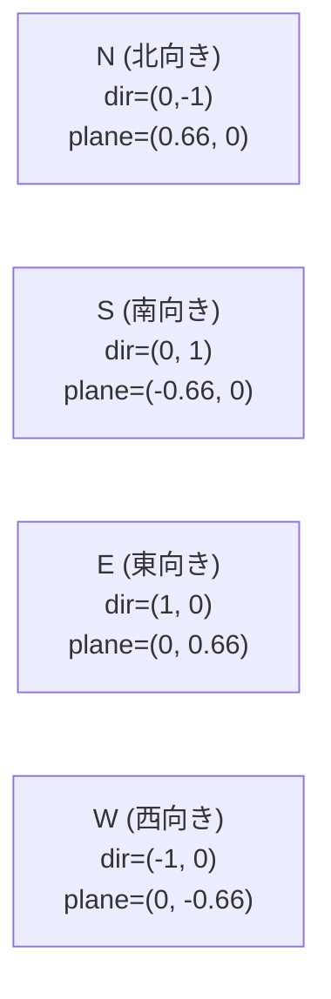
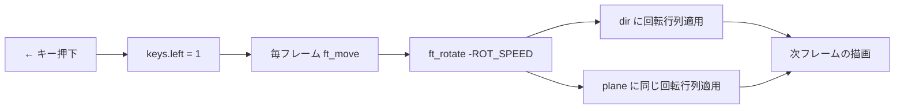
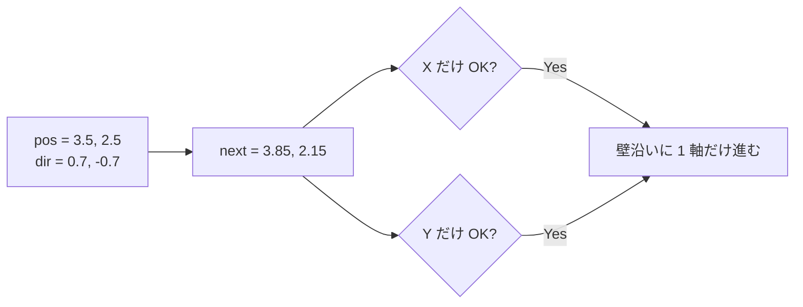
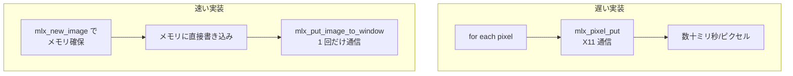

# Movements — 評価詳細

cub3D 評価シートの **「Movements」セクション** を「評価原文 + 日本語訳 + コード + 原理原則 + 模範回答」で 1 テストずつ解説します。

→ 概要は **[評価対策トップ](eval.md)** を参照。
→ 本文の流れは **[07 入力処理とプレイヤー移動](07-input.md)** と **[05 カメラと魚眼補正](05-camera.md)** を参照。

---

## 🌱 3 秒でわかる

| 観点 | 一言で |
|---|---|
| **🎯 評価形式** | 5 テスト中 **1 つでも失敗** したら **このセクション 0 点** |
| **📦 関連コード** | `init.c` の `ft_init_dir_*` + `move.c` の `ft_rotate` / `ft_move_*` / `ft_strafe_*` |
| **⚠️ ハマりどころ** | spawn 向きが N/S/E/W で全部同じ → スポーン方向テストで 0 点 / sin・cos 引数の単位（ラジアン）取り違え |
| **🔗 本文ページ** | [07 入力処理](07-input.md) / [05 カメラ](05-camera.md) |

---

## 📋 セクション全体の原文

!!! note "原文（評価シート Movements）"
    > In this section, we'll evaluate the implementation of the player's movement/orientation inside the maze. Execute the 5 following tests. If at least one fails, this means that no points will be awarded for this section. The player's spawning orientation on the first image must be in accordance with the configuration file, test for each cardinal orientation (N, S, E, W). Press the left arrow then the right arrow. The player's view must rotate to the left then to the right as if the player's head was moving. Press W (or Z) then S. The player's view must go forward and then backward in a straight line. Press A (or Q) then D. The player's view must go to the left and then to the right in a straight line. During those four movements, was the display smooth? By smooth we mean is the game 'playable' or is it slow.

!!! info "日本語訳"
    本セクションでは迷路内のプレイヤーの移動/向きの実装を評価する。以下 5 テストを実行する。**1 つでも失敗したら、このセクションは 0 点**。最初の画像でのプレイヤーのスポーン向きはコンフィグファイルに従うこと（N, S, E, W の **4 方向それぞれをテスト**）。← → を押すと、頭を左右に振るようにビューが左右回転すること。W (または Z) と S を押すと、ビューが**直進的に前進・後退**すること。A (または Q) と D を押すと、ビューが**直進的に左右ストレイフ**すること。これら 4 つの移動中、**表示は滑らか**か？（プレイ可能な速度か、それとも遅いか）

---

## Test 1: スポーン向きが N/S/E/W で正しい

### ① 評価シート原文

> The player's spawning orientation on the first image must be in accordance with the configuration file, test for each cardinal orientation (N, S, E, W).

### ② 日本語訳

> 最初の画像でのプレイヤーのスポーン向きは、**コンフィグファイル（.cub）に書かれた N/S/E/W** に一致すること。**4 方向すべて** をテストする。

### ③ 評価者が確認すること

| 確認 | 期待される挙動 |
|:---|:---|
| **N で起動** | プレイヤーが**北（マップ上方向）**を向いている初期画面 |
| **S で起動** | プレイヤーが**南（マップ下方向）**を向いている初期画面 |
| **E で起動** | プレイヤーが**東（マップ右方向）**を向いている初期画面 |
| **W で起動** | プレイヤーが**西（マップ左方向）**を向いている初期画面 |
| **コンフィグ変更で反映** | `.cub` のスポーン文字を書き換えると、起動時のビューが変わる |

!!! tip "4 つのマップを用意しておく"
    `maps/spawn_n.cub` / `maps/spawn_s.cub` / `maps/spawn_e.cub` / `maps/spawn_w.cub` の **4 つを準備しておく** とテストがスムーズ。中身は同じマップで、プレイヤー位置の文字だけ N/S/E/W を入れ替えます。

### ④ 評価者が見るコード箇所

| ファイル | 関数 | 何を見るか |
|:---|:---|:---|
| `srcs/init.c` | `ft_init_player` | マップ走査で N/S/E/W の文字を発見し、対応する `ft_init_dir_*` を呼ぶ |
| `srcs/init.c` | `ft_init_dir_ns` | N と S で `dir`・`plane` の符号がきちんと逆になっているか |
| `srcs/init.c` | `ft_init_dir_ew` | E と W で `dir`・`plane` の符号がきちんと逆になっているか |

```c title="srcs/init.c (ft_init_player 抜粋)"
// マップを 1 マスずつ走査して N/S/E/W を見つける
if (ch == 'N' || ch == 'S')
    ft_init_dir_ns(game, ch);
else if (ch == 'E' || ch == 'W')
    ft_init_dir_ew(game, ch);
game->player.pos_x = x + 0.5;
game->player.pos_y = y + 0.5;
```

```c title="srcs/init.c (ft_init_dir_ns)"
void ft_init_dir_ns(t_game *game, char ch)
{
    if (ch == 'N') { game->player.dir_x = 0;  game->player.dir_y = -1; }
    else           { game->player.dir_x = 0;  game->player.dir_y =  1; }
    if (ch == 'N') { game->player.plane_x = 0.66; game->player.plane_y = 0; }
    else           { game->player.plane_x = -0.66; game->player.plane_y = 0; }
}
```

```c title="srcs/init.c (ft_init_dir_ew)"
void ft_init_dir_ew(t_game *game, char ch)
{
    if (ch == 'E') { game->player.dir_x =  1; game->player.dir_y = 0; }
    else           { game->player.dir_x = -1; game->player.dir_y = 0; }
    if (ch == 'E') { game->player.plane_x = 0; game->player.plane_y =  0.66; }
    else           { game->player.plane_x = 0; game->player.plane_y = -0.66; }
}
```

### ⑤ 原理原則 — `dir` と `plane` が必ず直交する理由

レイキャスティングでは「**プレイヤーの向き `dir`**」と「**視野の幅を決める `plane`**」が**直交する 2 つの 2D ベクトル**で表されます。



- `dir` を 90 度時計回りに回した方向が `plane` の向きになる
- `|plane| / |dir|` で **視野角（FOV）** が決まる（`0.66` で約 66°）
- N→S や E→W で `dir` を反転するときは **`plane` も同時に反転** しないと「左右が鏡像」になる

→ 詳細は [05 カメラと魚眼補正](05-camera.md) を参照。

### ⑥ よくある罠

- ❌ `dir` だけ反転して `plane` を反転し忘れる → 北では正常だが南だけ**左右逆**
- ❌ `plane` の大きさが `dir` と等しい（`1.0`）→ FOV が 90° で広角すぎて魚眼っぽい
- ❌ Y 軸の向きを数学（上が +Y）で書く → 画面座標は **下が +Y** なので N の `dir_y` は `-1`
- ❌ `.cub` で `N` が見つかったあとも走査を続けない → スポーン文字が複数あったらエラーにする必要がある（Error management 側のテストにも関連）

### ⑦ 想定質問と模範回答

| 質問 | 模範回答 |
|---|---|
| 「`dir` と `plane` の関係は？」 | **直交する 2 つの 2D ベクトル**。`dir` がプレイヤーの向き、`plane` がカメラ平面で、両者の比で FOV が決まります。`|plane|/|dir|` を `0.66` にすると約 66° の自然な視野になります |
| 「N の `dir_y` が `-1` なのは？」 | miniLibX の画面座標は **Y が下向き** にプラス。マップでも上が `y=0`、下に行くほど y が増えるので、北 = 上向きは `dir_y = -1` です |
| 「`plane` の大きさ `0.66` の根拠は？」 | `FOV = 2 * atan(|plane|/|dir|)`。`0.66` を入れると約 66°。広すぎず狭すぎず、Wolfenstein 3D 等と同じ慣例値です |

---

## Test 2: ← → で左右回転

### ① 評価シート原文

> Press the left arrow then the right arrow. The player's view must rotate to the left then to the right as if the player's head was moving.

### ② 日本語訳

> ← → を順に押す。**頭を左右に振るようにビューが左→右に回転** すること。

### ③ 評価者が確認すること

| 確認 | 期待される挙動 |
|:---|:---|
| **← で左回転** | 画面の景色が**右方向に流れる**（=視点は左へ回る） |
| **→ で右回転** | 画面の景色が**左方向に流れる**（=視点は右へ回る） |
| **滑らかさ** | 押下中ずっと回転し続け、離すと止まる |
| **方向の整合性** | ← で右回転してしまう、などの符号ミスがない |

### ④ 評価者が見るコード箇所

| ファイル | 関数 | 何を見るか |
|:---|:---|:---|
| `srcs/input/input.c` | `ft_key_press` / `ft_key_release` | `KEY_LEFT` / `KEY_RIGHT` で `keys.left` / `keys.right` フラグを 1/0 にする |
| `srcs/input/move.c` | `ft_rotate` | **2D 回転行列** を `dir` と `plane` の両方に適用 |
| `includes/cub3d.h` | — | `ROT_SPEED`（1 フレームあたりの回転角ラジアン） |

```c title="srcs/input/move.c (ft_rotate)"
void ft_rotate(t_game *game, double angle)
{
    double old_dx = game->player.dir_x;
    double old_px = game->player.plane_x;
    game->player.dir_x = old_dx * cos(angle) - game->player.dir_y * sin(angle);
    game->player.dir_y = old_dx * sin(angle) + game->player.dir_y * cos(angle);
    game->player.plane_x = old_px * cos(angle) - game->player.plane_y * sin(angle);
    game->player.plane_y = old_px * sin(angle) + game->player.plane_y * cos(angle);
}
```

```c title="srcs/input/move.c (毎フレームの回転呼び出し)"
if (game->keys.left)
    ft_rotate(game, -ROT_SPEED);
if (game->keys.right)
    ft_rotate(game, ROT_SPEED);
```

### ⑤ 原理原則 — なぜ `dir` と `plane` を**両方**回すのか？

`dir` だけを回して `plane` を放置すると、**視野範囲（カメラ平面）が回転に追従しない** ため、回転すると画面が歪んでいきます。



2D 回転行列の公式:

```
[ x' ]   [ cos θ  -sin θ ] [ x ]
[ y' ] = [ sin θ   cos θ ] [ y ]
```

これを **`dir`・`plane` の両方** に同じ角度 `θ` で適用すれば、両者の直交関係が保たれたまま回転します。

### ⑥ よくある罠

- ❌ `dir` だけ回して `plane` を回し忘れる → 回転するほど画面が歪む
- ❌ 回転後の `dir_x` を計算してから、その**書き換え後の値**を使って `dir_y` を計算 → `old_dx` を退避し忘れている
- ❌ `cos`/`sin` に**度数（degree）**を渡す → C の `<math.h>` はラジアンが前提
- ❌ ← で `+ROT_SPEED` 、→ で `-ROT_SPEED` → 符号が逆で操作感が変
- ❌ ← → に反応させる `mlx_hook` のイベント 2 / 3 を登録忘れ → キーが効かない

### ⑦ 想定質問と模範回答

| 質問 | 模範回答 |
|---|---|
| 「なぜ `plane` も一緒に回す？」 | `dir` と `plane` は**直交関係**で FOV を作っているため。片方だけ回すと視野が歪み、camera_x の計算が破綻します |
| 「`cos(angle)` の `angle` の単位は？」 | **ラジアン**。`<math.h>` の三角関数は全てラジアン前提なので、`M_PI/180` を掛けて度から変換する必要があります |
| 「`old_dx` を別変数に退避する理由は？」 | `dir_x` を先に更新してしまうと、`dir_y` の計算で**新しい `dir_x`** を使ってしまい結果が壊れるため。回転行列は元の値で計算する必要があります |
| 「← で `-ROT_SPEED` の理由は？」 | 2D 回転行列の正回転は反時計回り（数学慣例）ですが、画面の Y が下向きなので**符号が反転** します。左回転 = 角度マイナス、で実機の見え方と一致します |

---

## Test 3: W (Z) / S で前進・後退（直進）

### ① 評価シート原文

> Press W (or Z) then S. The player's view must go forward and then backward in a straight line.

### ② 日本語訳

> W （または Z）を押してから S を押す。**ビューが直線的に前進し、その後直線的に後退** すること。

### ③ 評価者が確認すること

| 確認 | 期待される挙動 |
|:---|:---|
| **W / Z で前進** | プレイヤーの向きに沿って前に進む |
| **S で後退** | プレイヤーの向きの真後ろに下がる |
| **直進性** | 横にズレずに**真っ直ぐ**進む |
| **壁との衝突** | 壁にぶつかると止まる（ただし斜めなら**壁沿いに滑る**） |

### ④ 評価者が見るコード箇所

| ファイル | 関数 | 何を見るか |
|:---|:---|:---|
| `srcs/input/move.c` | `ft_move_forward` | `pos += dir * MOVE_SPEED` の式と、X/Y を**別々に衝突判定** |
| `srcs/input/move.c` | `ft_move_backward` | `pos -= dir * MOVE_SPEED`（符号を反転） |
| `srcs/input/move.c` | `ft_can_move` | 移動先のマス（int 切り捨て）が `'1'` でないか |

```c title="srcs/input/move.c (ft_move_forward)"
void ft_move_forward(t_game *game)
{
    double nx = game->player.pos_x + game->player.dir_x * MOVE_SPEED;
    double ny = game->player.pos_y + game->player.dir_y * MOVE_SPEED;
    if (ft_can_move(game, nx, game->player.pos_y))
        game->player.pos_x = nx;
    if (ft_can_move(game, game->player.pos_x, ny))
        game->player.pos_y = ny;
}
```

```c title="srcs/input/move.c (ft_move_backward)"
void ft_move_backward(t_game *game)
{
    double nx = game->player.pos_x - game->player.dir_x * MOVE_SPEED;
    double ny = game->player.pos_y - game->player.dir_y * MOVE_SPEED;
    if (ft_can_move(game, nx, game->player.pos_y))
        game->player.pos_x = nx;
    if (ft_can_move(game, game->player.pos_x, ny))
        game->player.pos_y = ny;
}
```

### ⑤ 原理原則 — 「直進」とは `dir` ベクトル方向への移動

「プレイヤーの向きに進む」を数式にすると:

```
new_pos = pos + dir * speed   (前進)
new_pos = pos - dir * speed   (後退)
```

`dir` は単位ベクトル（長さ 1）なので、`speed` がそのまま 1 フレームあたりの移動距離になります。

X と Y を別々に判定する理由は **壁沿いスライド** のため:



両方一緒に判定すると、斜め移動で壁にぶつかった瞬間にぴたっと止まり「**壁に貼り付いて動けない**」感触になります。

### ⑥ よくある罠

- ❌ `MOVE_SPEED` が大きすぎる（例 `0.5`）→ 壁を貫通する
- ❌ X と Y を **同時に** 判定 → 壁沿いをスライドできない
- ❌ 移動先の `int` 変換を忘れる → `map[3.5][2.5]` のようなインデックスはコンパイルが通っても**配列範囲外** で UB
- ❌ `S` のキーコードを `KEY_W` と同じに書いてしまう → S を押しても前進する
- ❌ 横移動と前後で同じ関数を流用してしまい、`dir` ではなく `plane` で計算 → 「前 W で右に流れる」ような変なバグ

### ⑦ 想定質問と模範回答

| 質問 | 模範回答 |
|---|---|
| 「衝突判定の仕組みは？」 | 移動後の座標を `int` に切り捨ててマップインデックスに変換し、`map[y][x] == '1'` なら壁とみなして移動をキャンセルします |
| 「X と Y を別々に判定する理由は？」 | 壁沿いに斜め入力するとき、X 方向だけ・Y 方向だけ進めるようにするため。両軸を同時判定すると壁に貼り付いて動けなくなります |
| 「`MOVE_SPEED` の決め方は？」 | 1 マス（1.0）の **数十分の一** を目安に。60fps 想定で `0.05` 程度。これより大きいと衝突判定をすり抜けるリスクがあります |
| 「前進と後退でコードが似ているのは？」 | 符号を反転しただけ。共通化する場合は `ft_move_in_dir(game, sign)` のように `+1 / -1` を引数で渡せば 1 関数にできます |

---

## Test 4: A (Q) / D で左右ストレイフ

### ① 評価シート原文

> Press A (or Q) then D. The player's view must go to the left and then to the right in a straight line.

### ② 日本語訳

> A （または Q）を押してから D を押す。**ビューが直線的に左へ、その後直線的に右へストレイフ（平行移動）** すること。

### ③ 評価者が確認すること

| 確認 | 期待される挙動 |
|:---|:---|
| **A / Q で左ストレイフ** | プレイヤーの**真左** に平行移動（向きは変わらない） |
| **D で右ストレイフ** | プレイヤーの**真右** に平行移動 |
| **直進性** | 前後にズレずに横方向だけに動く |
| **回転と区別** | 視点が回転していない（あくまで平行移動） |

### ④ 評価者が見るコード箇所

| ファイル | 関数 | 何を見るか |
|:---|:---|:---|
| `srcs/input/move.c` | `ft_strafe_left` | `pos -= plane * MOVE_SPEED`（`plane` ベクトル方向の負） |
| `srcs/input/move.c` | `ft_strafe_right` | `pos += plane * MOVE_SPEED` |
| `srcs/input/move.c` | `ft_can_move` | 前進と同じ衝突判定を共用 |

```c title="srcs/input/move.c (ft_strafe_left)"
void ft_strafe_left(t_game *game)
{
    double nx = game->player.pos_x - game->player.plane_x * MOVE_SPEED;
    double ny = game->player.pos_y - game->player.plane_y * MOVE_SPEED;
    if (ft_can_move(game, nx, game->player.pos_y))
        game->player.pos_x = nx;
    if (ft_can_move(game, game->player.pos_x, ny))
        game->player.pos_y = ny;
}
```

```c title="srcs/input/move.c (ft_strafe_right)"
void ft_strafe_right(t_game *game)
{
    double nx = game->player.pos_x + game->player.plane_x * MOVE_SPEED;
    double ny = game->player.pos_y + game->player.plane_y * MOVE_SPEED;
    if (ft_can_move(game, nx, game->player.pos_y))
        game->player.pos_x = nx;
    if (ft_can_move(game, game->player.pos_x, ny))
        game->player.pos_y = ny;
}
```

### ⑤ 原理原則 — 「真横」 = `plane` ベクトル方向

`plane` は `dir` に**垂直** な単位（厳密には 0.66 倍）ベクトル。これを移動方向に使えば、向きを変えずに横方向に平行移動できます。

| キー | 方向 | 式 |
|---|---|---|
| **W / Z**（前） | `dir` | `pos += dir * SPEED` |
| **S**（後） | `-dir` | `pos -= dir * SPEED` |
| **D**（右） | `plane` | `pos += plane * SPEED` |
| **A / Q**（左） | `-plane` | `pos -= plane * SPEED` |

!!! note "`plane` の長さは `0.66` だが移動量に問題ない？"
    厳密には左右の移動量が前後より少し小さくなる（`0.66` 倍）。気になる場合は `plane / |plane|` で**単位ベクトル化**してから使う。多くの 42 提出例ではそのまま使っており、評価でも問題視されない。

### ⑥ よくある罠

- ❌ A / D で `dir` を使って動かす → 真横ではなく**真ん前 / 真後ろ** に動いてしまう
- ❌ `plane` の符号を取り違える → 左キーで右に動く
- ❌ ストレイフ中に視点も回ってしまう → 回転処理を誤って呼んでいる
- ❌ 移動量が `plane * SPEED` で、`plane = 0.66` 倍なので**前後より遅く感じる** → 評価者に「カクッ」と見えることはまずないが気になるなら正規化

### ⑦ 想定質問と模範回答

| 質問 | 模範回答 |
|---|---|
| 「なぜ `plane` を使う？」 | `plane` は `dir` に直交するベクトルで、「プレイヤーの真横」の向きを表しているため。これに沿って動けば、向きを変えずに真横へ平行移動できます |
| 「ストレイフと回転の違いは？」 | ストレイフは**位置だけ** が動く（`pos` を更新）、回転は**向きだけ** が動く（`dir`・`plane` を更新）。混同するとバグります |
| 「`plane` が `0.66` 倍の単位だと、左右が前後より遅くなる？」 | 厳密にはそうですが、約 34% の差で実機ではほぼ違和感ない速度。気になる場合は `plane` を正規化（`plane / |plane|`）して使えば均一になります |

---

## Test 5: 表示は滑らか（smooth）か

### ① 評価シート原文

> During those four movements, was the display smooth? By smooth we mean is the game 'playable' or is it slow.

### ② 日本語訳

> 上記 4 つの移動中、**表示は滑らか** か？　ここで言う "smooth" は「ゲームとして**プレイ可能** か、それとも**遅い** か」という意味。

### ③ 評価者が確認すること

| 確認 | 期待される挙動 |
|:---|:---|
| **フレームが詰まらない** | 移動中に画面がカクカクしない |
| **入力遅延が小さい** | キー押下後、即座にビューが動き始める |
| **解像度を上げても破綻しない** | 1024×768 程度で実用速度 |
| **キーリピート間隔に依存しない** | 押しっぱなしでスムーズに連続移動 |

### ④ 評価者が見るコード箇所

| ファイル | 関数 | 何を見るか |
|:---|:---|:---|
| `srcs/main.c` | `main` | `mlx_loop_hook(mlx, ft_loop, &game)` で**毎フレーム** 描画を回している |
| `srcs/render/raycaster.c` | `ft_raycast` | **フレームバッファ**（`mlx_new_image` で確保した image）に書き込む |
| `srcs/render/raycaster.c` | — | `mlx_put_image_to_window` で**完成画像を 1 回だけ** 転送 |
| `srcs/input/input.c` | `ft_key_press` / `ft_key_release` | **フラグ方式** でキー状態を保持（直接 `pos` を書き換えない） |

```c title="srcs/main.c (メインループ抜粋)"
mlx_hook(game.win, 2, 1L<<0, ft_key_press, &game);
mlx_hook(game.win, 3, 1L<<1, ft_key_release, &game);
mlx_hook(game.win, 17, 0, ft_close_window, &game);
mlx_loop_hook(game.mlx, ft_loop, &game);
mlx_loop(game.mlx);
```

```c title="srcs/main.c (ft_loop: 毎フレームの処理)"
int ft_loop(t_game *game)
{
    ft_move(game);                  // フラグを見て位置・向きを更新
    ft_raycast(game);               // フレームバッファに 1 列ずつ描画
    mlx_put_image_to_window(game->mlx, game->win, game->img.ptr, 0, 0);
    return (0);
}
```

### ⑤ 原理原則 — `mlx_pixel_put` を使わない理由

`mlx_pixel_put` は 1 ピクセルごとに **X サーバーへ通信** する API。これを `WIN_W × WIN_H = 786,432` 回呼ぶと 1 フレーム描くだけで何秒もかかります。



正しい実装:

1. `mlx_new_image` で **画面サイズ分のメモリバッファ** を確保
2. `mlx_get_data_addr` でそのアドレスを取得
3. レイキャスティング結果を **直接メモリに書き込む**（`addr[y * line + x * bpp] = color`）
4. `mlx_put_image_to_window` で **1 回だけ** ウィンドウに転送

これで 60fps 以上を実現できます。

### ⑥ よくある罠

- ❌ `mlx_pixel_put` でピクセル単位に書く → **1fps 以下** で評価即 0 点
- ❌ 毎フレームで `mlx_new_image` を**作り直し**、`mlx_destroy_image` を忘れる → 起動 10 秒でメモリ数百 MB
- ❌ `mlx_put_image_to_window` を**列ごとに** 呼ぶ → 1 回にまとめないと遅い
- ❌ `ft_key_press` 内で **直接 `pos` を更新** → キーリピート間隔に依存してガタつく
- ❌ 解像度を `1920x1080` のような高すぎる値にする → 描画が間に合わずカクつく

### ⑦ 想定質問と模範回答

| 質問 | 模範回答 |
|---|---|
| 「滑らかに描画するためのキモは？」 | **フレームバッファ方式**。`mlx_new_image` でメモリ画像を作り、レイキャスト結果を直接メモリに書き、最後に `mlx_put_image_to_window` で 1 回だけ転送します |
| 「`mlx_pixel_put` を使わない理由は？」 | 1 ピクセルごとに X サーバーへ通信が発生し、画面全体で**百万回近い通信** になるため。フレームバッファなら 1 回の通信で済みます |
| 「フレーム間で `image` を作り直していない？」 | いいえ、`mlx_new_image` は**起動時に 1 回だけ** 呼び、毎フレームは**同じ image にデータを上書き** するだけです。これで `mlx_destroy_image` の手間もリークもありません |
| 「FPS が出ない場合の対処は？」 | (1) 解像度を下げる (2) `mlx_pixel_put` 使用箇所を image バッファに置き換える (3) `printf` などのデバッグ出力を削除 — の順に確認します |

---

## 🎯 ディフェンス当日の動き方

1. **`maps/spawn_n.cub`** から起動 → 北向きの初期画面を見せる
2. ESC で終了 → `maps/spawn_s.cub` → 南向き → ESC
3. 同様に `maps/spawn_e.cub` / `maps/spawn_w.cub` も実演
4. 通常マップを起動して **← → を押して左右回転** → 「景色が逆方向に流れる」を見せる
5. **W / Z で前進** → **S で後退** → 真っ直ぐ進むことを実演
6. **A / Q で左ストレイフ** → **D で右ストレイフ** → 視点が回らず横移動するのを確認
7. 全 4 移動を組み合わせて壁沿いを歩く → 滑らかなフレームレートを見せる
8. コード説明: `init.c` の `ft_init_dir_ns` / `ft_init_dir_ew` で N/S/E/W 別の `dir`・`plane` 初期化 → `move.c` の `ft_rotate` / `ft_move_*` / `ft_strafe_*` の順で指す

!!! tip "30 秒で説明できるストーリー"
    「プレイヤーの状態は `dir`（向き）と `plane`（カメラ平面）の 2 つの直交するベクトルで表現しています。N/S/E/W のスポーンはこの 2 つの初期値を切り替えるだけです。回転は両方に同じ 2D 回転行列を適用、前進・後退は `dir` 方向、左右ストレイフは `plane` 方向に `pos` を動かします。描画は `mlx_new_image` のフレームバッファに書き込んで `mlx_put_image_to_window` で 1 回転送するので 60fps が出ます。」

---

## 📋 提出前最終チェック

- [ ] `maps/spawn_n.cub` / `maps/spawn_s.cub` / `maps/spawn_e.cub` / `maps/spawn_w.cub` の **4 マップ** を用意した
- [ ] N / S / E / W それぞれの起動で**期待した初期向き** が出る
- [ ] ← で左回転、→ で右回転（符号ミスなし）
- [ ] W / Z で前進、S で後退、A / Q で左ストレイフ、D で右ストレイフ
- [ ] 押しっぱなしで連続移動、離すと停止（フラグ方式）
- [ ] 壁にぶつかると止まる、斜めなら壁沿いに滑る（X / Y 別判定）
- [ ] 描画が**滑らか**（`mlx_pixel_put` ではなく `mlx_new_image` ＋ `mlx_put_image_to_window`）
- [ ] `cos`/`sin` の引数は**ラジアン**
- [ ] `dir` と `plane` を**両方** 回転している

---

## 関連ページ

- 本文: [05 カメラと魚眼補正](05-camera.md)
- 本文: [07 入力処理とプレイヤー移動](07-input.md)
- 評価: [User basic events の評価詳細](eval-events.md)
- 評価: [Walls の評価詳細](eval-walls.md)
- 評価: [Error management の評価詳細](eval-errors.md)
- 評価: **[評価対策トップへ戻る](eval.md)**
