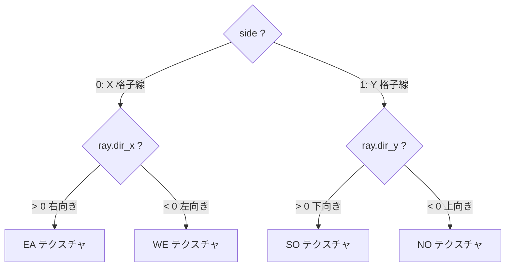
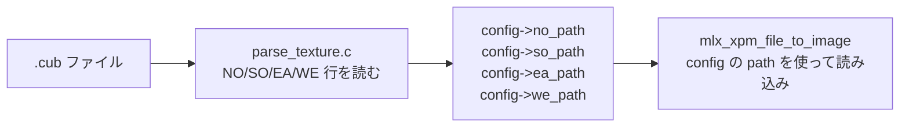
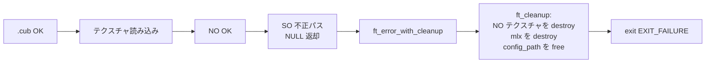
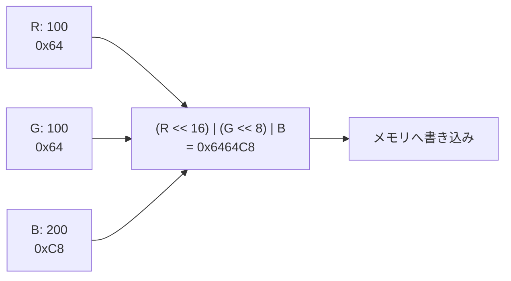

# Walls — 評価詳細

cub3D 評価シートの **「Walls」セクション** を「評価原文 + 日本語訳 + コード + 原理原則 + 模範回答」で 1 テストずつ解説します。

→ 概要は **[評価対策トップ](eval.md)** を参照。
→ 本文の流れは **[03 レイキャスティング](03-raycasting.md)** と **[06 レンダリング](06-rendering.md)** を参照。

---

## 🌱 3 秒でわかる

| 観点 | 一言で |
|---|---|
| **🎯 評価形式** | 4 テスト中 **1 つでも失敗** したら **このセクション 0 点** |
| **📦 関連コード** | `raycaster.c` の side 判定 + `draw_column.c` の N/S/E/W テクスチャ選択 + `texture.c` の `mlx_xpm_file_to_image` + `parse_color.c` の RGB 抽出 |
| **⚠️ ハマりどころ** | side 判定だけで N と S を分けず両方同じテクスチャ → Test 1 失敗 / 不正パスを `mlx_xpm_file_to_image` の戻り値 NULL で検知し忘れ |
| **🔗 本文ページ** | [03 レイキャスティング](03-raycasting.md) / [06 レンダリング](06-rendering.md) / [02 パーサー](02-parser.md) |

---

## 📋 セクション全体の原文

!!! note "原文（評価シート Walls）"
    > In this section, we'll evaluate the walls in the maze. Execute the 4 following tests. If at least one fails, this means that no points will be awarded for this section. The wall's texture vary depending on which compass point the wall is facing (north, south, east, west). Check that the textures on the walls and perspective are visible and correct. Check that if you modify the path of a wall texture in the configuration file, it modifies the rendered texture when the program is re-executed. Also check that if you set a non-existent path it raises an error. Check that the floor and ceiling colors are well handled when you modify them in the configuration file.

!!! info "日本語訳"
    本セクションでは迷路の壁を評価する。以下 4 テストを実行する。**1 つでも失敗したら、このセクションは 0 点**。壁のテクスチャは**コンパス方位（N, S, E, W）に応じて変わる** こと。壁テクスチャと**遠近感（perspective）** が見えていて正しいことを確認する。**コンフィグファイル中のテクスチャパスを変更** すると、再実行で**描画されるテクスチャが変わる** こと。また、**存在しないパス** を設定すると**エラーが発生** すること。コンフィグの**床/天井の色** を変更すると、それが**反映** されること。

---

## Test 1: 4 方向のテクスチャが見分けられる

### ① 評価シート原文

> The wall's texture vary depending on which compass point the wall is facing (north, south, east, west). Check that the textures on the walls and perspective are visible and correct.

### ② 日本語訳

> 壁のテクスチャは**それぞれの方位（N/S/E/W）に応じて異なる** こと。壁のテクスチャと**遠近感（perspective）** が見えていて正しいことを確認する。

### ③ 評価者が確認すること

| 確認 | 期待される挙動 |
|:---|:---|
| **北向きの壁** | NO テクスチャが貼られている |
| **南向きの壁** | SO テクスチャが貼られている |
| **東向きの壁** | EA テクスチャが貼られている |
| **西向きの壁** | WE テクスチャが貼られている |
| **遠近感** | 近い壁は大きく、遠い壁は小さく描画される |
| **4 方向を歩いて確認** | 評価者は部屋を 1 周してテクスチャの違いを目視確認 |

!!! tip "テスト用に 4 種の派手なテクスチャを"
    NO=赤、SO=青、EA=緑、WE=黄色のような **見分けやすいテクスチャ** を `assets/test/` に用意しておくと、評価者に一発で違いを示せる。

### ④ 評価者が見るコード箇所

| ファイル | 関数 | 何を見るか |
|:---|:---|:---|
| `srcs/render/raycaster.c` | `ft_dda` 内の side 判定 | `side = 0`（X 格子線交差）/ `side = 1`（Y 格子線交差） |
| `srcs/render/draw_column.c` | `ft_pick_texture` | side と光線の向き符号で N/S/E/W のどのテクスチャを使うか分岐 |
| `includes/cub3d.h` | `t_texture textures[4]` | 4 つのテクスチャを配列やインデックス NO/SO/EA/WE で管理 |

```c title="srcs/render/raycaster.c (side 判定の核)"
// DDA ループ内
if (side_dist_x < side_dist_y) {
    side_dist_x += delta_x;
    map_x += step_x;
    side = 0;            // ← X 格子線を跨いだ = 東西方向の壁面
} else {
    side_dist_y += delta_y;
    map_y += step_y;
    side = 1;            // ← Y 格子線を跨いだ = 南北方向の壁面
}
```

```c title="srcs/render/draw_column.c (ft_pick_texture)"
t_texture *ft_pick_texture(t_game *game, t_ray *ray)
{
    if (ray->side == 0 && ray->dir_x > 0)
        return (&game->textures[EA]);
    if (ray->side == 0 && ray->dir_x < 0)
        return (&game->textures[WE]);
    if (ray->side == 1 && ray->dir_y > 0)
        return (&game->textures[SO]);
    return (&game->textures[NO]);
}
```

### ⑤ 原理原則 — side と光線符号で 4 方向を一意に決める

DDA は格子状マップを進むときに「**今回どちらの軸方向の格子線を跨いだか**」が分かります。



- 「X 格子線を跨ぐ」=「壁が東西どちらかを向いている」
- そのうち「光線が右向き」=「壁の **西側** にぶつかった」=「壁面が **東を向いている**」=「EA テクスチャ」

逆に考える人が多いので注意:「光線方向 ≠ 壁の方位」。**壁面の法線方向** がコンパス方位になります。

### ⑥ よくある罠

- ❌ side だけで判定して N/S（または E/W）を**まとめて 1 つのテクスチャ** にする → 「壁のテクスチャが 2 種類しかない」で 0 点
- ❌ 光線方向と壁面方位を逆に取る → N と S、E と W が**入れ替わる**
- ❌ Y 軸の向きを数学（上が +Y）で書く → 南北が逆になる
- ❌ `ray->dir_x` の符号を見ずに `step_x` を見てしまう → 同じ符号だが概念がずれるとデバッグが地獄
- ❌ 遠近感が出ない（`line_h` を距離反比例で計算していない）→ Test 1 の "perspective" でも減点

### ⑦ 想定質問と模範回答

| 質問 | 模範回答 |
|---|---|
| 「壁の方向（N/S/E/W）はどう判定する？」 | DDA で**最後にどちらの格子線を跨いだか**（`side = 0`/`1`）と、**光線の向きの符号**（`ray.dir_x`/`ray.dir_y`）の組み合わせで 4 通りに分岐します |
| 「side=0 で `dir_x>0` がなぜ EA？」 | side=0 は X 格子線を跨いだ = 東西向きの壁面。光線が右へ進んで当たった = 壁の西側にヒット = 壁面の法線は東向き → EA テクスチャです |
| 「遠近感はどう出している？」 | `line_h = WIN_H / perp_wall_dist` で、距離に**反比例** した高さで縦線を描画します。近い壁ほど大きく、遠い壁ほど小さく見えます |
| 「魚眼補正は？」 | DDA で得た**通常距離** ではなく、`(map - pos + (1-step)/2) / dir` の式で**垂直距離 perp_wall_dist** を使うため魚眼が出ません |

---

## Test 2: テクスチャパス変更で描画も変わる

### ① 評価シート原文

> Check that if you modify the path of a wall texture in the configuration file, it modifies the rendered texture when the program is re-executed.

### ② 日本語訳

> コンフィグファイル（.cub）中の**壁テクスチャのパス** を書き換えたら、再実行時に**描画されるテクスチャが変わる** ことを確認する。

### ③ 評価者が確認すること

| 確認 | 期待される挙動 |
|:---|:---|
| **パスを書き換える** | 例: `NO ./textures/wood.xpm` を `NO ./textures/brick.xpm` に変更 |
| **再ビルドなしで再実行** | プログラム再起動だけで反映 |
| **新しいテクスチャが見える** | 該当方向の壁が新パスのテクスチャで描画される |

### ④ 評価者が見るコード箇所

| ファイル | 関数 | 何を見るか |
|:---|:---|:---|
| `srcs/parser/parse_texture.c` | `ft_parse_no` 等 | `NO` 行のパスを `config->no_path` に**ハードコードせずに格納** |
| `srcs/render/texture.c` | `ft_load_textures` | `mlx_xpm_file_to_image(mlx, config->no_path, ...)` で**実行時に読み込み** |

```c title="srcs/parser/parse_texture.c (NO のパースのみ抜粋)"
// 行頭が "NO " で始まったら 3 文字目以降をテクスチャパスとして取得
if (ft_strncmp(line, "NO ", 3) == 0) {
    config->no_path = ft_strdup(line + 3);
    if (!config->no_path)
        return (ft_error("strdup failed"));
    config->flags |= NO_FLAG;
}
```

```c title="srcs/render/texture.c (ft_load_textures)"
void ft_load_textures(t_game *game)
{
    int w, h;
    game->textures[NO].img = mlx_xpm_file_to_image(
        game->mlx, game->config.no_path, &w, &h);
    if (!game->textures[NO].img)
        ft_error("Failed to load NO texture");
    game->textures[NO].addr = mlx_get_data_addr(
        game->textures[NO].img,
        &game->textures[NO].bpp,
        &game->textures[NO].line,
        &game->textures[NO].endian);
    // SO / EA / WE も同様に...
}
```

### ⑤ 原理原則 — パスを**ハードコードしない**設計

評価者は「`.cub` を変えれば再実行だけで反映」を期待します。よくあるダメ実装は:

```c
// ❌ こうしてはいけない
game->textures[NO].img = mlx_xpm_file_to_image(mlx, "./textures/wall.xpm", ...);
```

これでは `.cub` を書き換えてもテクスチャが変わらず Test 2 が即失敗します。

正しい設計:



パーサーは**文字列をそのまま保持** するだけ。実際の画像読み込みは **`mlx_xpm_file_to_image`** に config の文字列を渡すだけ、というシンプルなデータフローにします。

### ⑥ よくある罠

- ❌ テクスチャパスをコード内に**ハードコード** → `.cub` 変更で動かない、Test 2 即失敗
- ❌ パスを `char *` で保持しているが `free` 漏れ → Leaks
- ❌ パスを `strdup` し忘れて `getline` のバッファ参照のまま → 解放後の dangling pointer
- ❌ 4 方向のうち 1 つだけ `mlx_xpm_file_to_image` を呼び忘れ → NULL ポインタ参照で segfault
- ❌ パスから改行 `\n` を取り除いていない → `./textures/wall.xpm\n` で open 失敗

### ⑦ 想定質問と模範回答

| 質問 | 模範回答 |
|---|---|
| 「テクスチャパスはどう保持する？」 | `t_config` 構造体の `no_path`/`so_path`/`ea_path`/`we_path` フィールドに**文字列として**保存します。`strdup` で複製して持ち、終了時に `free` します |
| 「`.cub` を書き換えただけで反映される仕組みは？」 | 実行時にパーサーが `.cub` を読んで `config->*_path` に格納し、`mlx_xpm_file_to_image` がそれを使って読み込むため。コードにパスは一切書きません |
| 「`mlx_xpm_file_to_image` の戻り値 NULL チェックは？」 | はい、必ず NULL チェックして NULL なら `ft_error` で終了します。これが Test 3（不正パスエラー）の挙動にも直結します |

---

## Test 3: 不正なテクスチャパスでエラー終了

### ① 評価シート原文

> Also check that if you set a non-existent path it raises an error.

### ② 日本語訳

> **存在しないパス** をテクスチャに設定すると、**エラーが発生** することを確認する。

### ③ 評価者が確認すること

| 確認 | 期待される挙動 |
|:---|:---|
| **存在しないパス** | `NO ./does_not_exist.xpm` などを指定 |
| **エラーメッセージ** | `Error\n` の後に内容（例: "Failed to load NO texture"）を **stderr** に出力 |
| **クラッシュではない** | segfault せず、`exit(EXIT_FAILURE)` で正常終了 |
| **メモリリークなし** | 部分的に確保していたリソースも解放して終了 |

### ④ 評価者が見るコード箇所

| ファイル | 関数 | 何を見るか |
|:---|:---|:---|
| `srcs/render/texture.c` | `ft_load_textures` | `mlx_xpm_file_to_image` の戻り値 NULL チェック |
| `srcs/utils/error.c` | `ft_error` | `Error\n` を stderr に書き、`ft_cleanup` 後に `exit` |
| `srcs/utils/cleanup.c` | `ft_cleanup` | 途中まで確保したリソースも全て解放 |

```c title="srcs/render/texture.c (NULL チェック付き)"
game->textures[NO].img = mlx_xpm_file_to_image(
    game->mlx, game->config.no_path, &w, &h);
if (!game->textures[NO].img)
    ft_error_with_cleanup(game, "Failed to load NO texture");
```

```c title="srcs/utils/error.c (ft_error)"
void ft_error(const char *msg)
{
    ft_putstr_fd("Error\n", 2);
    ft_putstr_fd((char *)msg, 2);
    ft_putstr_fd("\n", 2);
    exit(EXIT_FAILURE);
}
```

```c title="srcs/utils/error.c (cleanup を伴うエラー)"
void ft_error_with_cleanup(t_game *game, const char *msg)
{
    ft_putstr_fd("Error\n", 2);
    ft_putstr_fd((char *)msg, 2);
    ft_putstr_fd("\n", 2);
    ft_cleanup(game);
    exit(EXIT_FAILURE);
}
```

### ⑤ 原理原則 — エラーは「**早く・きれいに**」終わる

42 では `Error\n` 出力後に `EXIT_FAILURE`（通常 1）で終了するのが慣例です。重要なのは:

1. **stderr** に出力（`fd = 2`）、stdout には出さない
2. `Error\n` を**最初の 1 行**として出す（評価者は grep でこの行を探すこともある）
3. `exit` の**前** に `ft_cleanup` を呼んでリソースを全解放
4. 途中で確保したリソース（mlx ポインタ・window・既に読めたテクスチャ）も**全部** 解放



### ⑥ よくある罠

- ❌ `mlx_xpm_file_to_image` の戻り値を**チェックしない** → NULL を後段で参照して segfault
- ❌ エラーメッセージを stdout に出す → 評価者から「stderr で出して」と言われる
- ❌ エラー前に確保したテクスチャ（例えば NO だけ成功して SO で失敗）を解放しない → Leaks
- ❌ `perror` だけで終わらせる → "Error\n" プレフィックスがない（42 慣例違反）
- ❌ `exit` を呼ばず `return` → main まで戻って描画に進み segfault

### ⑦ 想定質問と模範回答

| 質問 | 模範回答 |
|---|---|
| 「不正なテクスチャパスはどう検知する？」 | `mlx_xpm_file_to_image` が **NULL を返す** ことで検知します。これを呼ぶ全 4 か所で NULL チェックし、NULL なら `ft_error_with_cleanup` を呼びます |
| 「途中で確保したリソースはどう解放？」 | `t_game` 構造体内に確保済みリソースを保持しているので、`ft_cleanup` が `mlx`・`win`・`config_path`・既読みのテクスチャを順に解放します。初期化時に `NULL` で埋めておくのがコツです |
| 「`Error\n` の形式の理由は？」 | 42 の慣例で、評価者は `Error\n` の 1 行目を grep で探すことがあるためです。`stderr` に出すのも慣例 |

---

## Test 4: 床/天井色がコンフィグから反映される

### ① 評価シート原文

> Check that the floor and ceiling colors are well handled when you modify them in the configuration file.

### ② 日本語訳

> コンフィグファイルの**床（F）と天井（C）の色** を変更したとき、**正しく反映** されることを確認する。

### ③ 評価者が確認すること

| 確認 | 期待される挙動 |
|:---|:---|
| **`F R,G,B`** | 床が指定 RGB で塗られている（例 `F 100,100,200` で青みの床） |
| **`C R,G,B`** | 天井が指定 RGB で塗られている |
| **値の範囲** | 0〜255 の範囲外（負数、256 以上、非数字）はエラー |
| **再実行で反映** | パスと同様、`.cub` を書き換えるだけで色が変わる |

### ④ 評価者が見るコード箇所

| ファイル | 関数 | 何を見るか |
|:---|:---|:---|
| `srcs/parser/parse_color.c` | `ft_parse_color` | `R,G,B` をカンマ区切りで分解、`ft_atoi` で int に変換 |
| `srcs/parser/parse_color.c` | `ft_validate_rgb` | 0〜255 範囲、3 要素揃っているかチェック |
| `srcs/render/draw_column.c` | `ft_draw_floor_ceiling` | 縦 1 列描画時、`line_top` より上を天井色、`line_bottom` より下を床色で塗る |
| `includes/cub3d.h` | `t_config` | `floor_color` / `ceiling_color` を `int` (0xRRGGBB) で保持 |

```c title="srcs/parser/parse_color.c (ft_parse_color)"
int ft_parse_color(const char *str)
{
    char **rgb = ft_split(str, ',');
    if (!rgb || !rgb[0] || !rgb[1] || !rgb[2] || rgb[3])
        return (-1);
    int r = ft_atoi(rgb[0]);
    int g = ft_atoi(rgb[1]);
    int b = ft_atoi(rgb[2]);
    ft_free_split(rgb);
    if (r < 0 || r > 255 || g < 0 || g > 255 || b < 0 || b > 255)
        return (-1);
    return ((r << 16) | (g << 8) | b);
}
```

```c title="srcs/render/draw_column.c (床・天井描画)"
// 縦 1 列の描画で、壁の上下を塗る
int y;
y = 0;
while (y < line_top)
    ft_put_pixel(game, x, y++, game->config.ceiling_color);
y = line_bottom;
while (y < WIN_H)
    ft_put_pixel(game, x, y++, game->config.floor_color);
```

### ⑤ 原理原則 — RGB を 1 つの `int` にパック

3 つの 0〜255 の値を `0xRRGGBB` 形式の int 1 つにまとめると、`mlx_get_data_addr` で書き込むときの形式と一致して便利:



- `r << 16` で R をビット 16-23 に
- `g << 8` で G をビット 8-15 に
- `b` はそのままビット 0-7

`int` の負数は使わないので、`unsigned int` でも `int` でも実害なし。

### ⑥ よくある罠

- ❌ `0〜255` の範囲チェックなし → `F 999,0,0` でオーバーフロー、変な色になる
- ❌ カンマ区切りで 4 要素以上来た（`F 100,100,100,100`）をエラーにしない → subject 違反
- ❌ 床/天井色をコードに**ハードコード** → `.cub` 書き換えで反映されない（Test 2 と同じ罠）
- ❌ パース結果をエンディアン違いで詰める → BGR 順になり「青を指定したのに赤」
- ❌ `R,G,B` の前後に**空白** がある（`F 100, 100, 100`）をパースエラーにする → subject では空白許容なので柔軟に処理

### ⑦ 想定質問と模範回答

| 質問 | 模範回答 |
|---|---|
| 「色はどう保持する？」 | 3 つの int（0〜255）を `(R << 16) \| (G << 8) \| B` で 1 つの int にパックして `config->floor_color`/`ceiling_color` に保存します |
| 「範囲外の値はどう扱う？」 | `ft_atoi` で int に変換後、0〜255 の範囲チェックを行い、外れていたら `ft_error("Invalid color")` で終了します |
| 「床・天井の描画タイミングは？」 | レイキャストの縦 1 列描画時、`line_top` より上を天井色、`line_bottom` より下を床色で塗ります。壁を描く前後に分ける実装もありますが、結果は同じです |
| 「カンマ区切りのパースは？」 | `ft_split(str, ',')` で 3 要素に分解、各要素を `ft_atoi` で int に変換、要素数や前後空白を検証します |

---

## 🎯 ディフェンス当日の動き方

1. **4 種類の派手なテクスチャ**（例: NO=赤、SO=青、EA=緑、WE=黄）でビルド済みの `.cub` を起動
2. 部屋を 1 周しながら ← → で回転 → **4 方向で異なる色** が見えることを示す
3. 「遠近感」を見せるため、長い廊下を W で前進して**壁が小さく見える** ことを実演
4. ESC で終了 → `.cub` の `NO` 行のパスを別テクスチャに書き換え → 再実行 → 北の壁が変わる
5. ESC → `.cub` の `NO` 行を**存在しないパス**（例 `NO ./nope.xpm`）に書き換え → 起動 → **`Error\n` + メッセージ** で終了することを実演（同じターミナルで `leaks` 監視中だとなお良い）
6. ESC → `.cub` の `F` と `C` 行の RGB を変更 → 再起動 → 床/天井の色が変わるのを示す
7. コード説明: `raycaster.c` の side 判定 → `draw_column.c` の `ft_pick_texture` → `texture.c` の `mlx_xpm_file_to_image` + NULL チェック → `parse_color.c` の `ft_parse_color` の順で指す

!!! tip "30 秒で説明できるストーリー"
    「DDA で最後に跨いだ格子線の向き（side）と光線の符号で 4 方向のテクスチャを選んでいます。テクスチャパスと床/天井色は `.cub` パース時に config 構造体に文字列・int で保持し、描画時にそれを使うだけなのでコードにハードコードはありません。`mlx_xpm_file_to_image` が NULL を返したら `ft_cleanup` を呼んでから `Error\n` を出して `exit(1)` します。」

---

## 📋 提出前最終チェック

- [ ] 4 方向で**異なるテクスチャ** が描画される（同じテクスチャを 2 方向で使い回していない）
- [ ] 遠近感が出ている（`line_h = WIN_H / perp_wall_dist`）
- [ ] テクスチャパスがコードに**ハードコードされていない**
- [ ] `.cub` のパス変更で**再ビルド不要** で反映される
- [ ] `mlx_xpm_file_to_image` の戻り値 NULL チェックを 4 か所すべてに入れた
- [ ] 不正パスで `Error\n` + メッセージ → `EXIT_FAILURE` 終了
- [ ] 不正パスエラー時に **既に確保したリソースを解放** している（リークなし）
- [ ] `F R,G,B` / `C R,G,B` の RGB を 0〜255 で検証
- [ ] 床/天井色を `.cub` で変更 → 再実行で反映
- [ ] RGB を `(R << 16) | (G << 8) | B` 形式で保持

---

## 関連ページ

- 本文: [02 パーサー](02-parser.md)
- 本文: [03 レイキャスティング](03-raycasting.md)
- 本文: [04 DDA アルゴリズム](04-dda.md)
- 本文: [06 レンダリング](06-rendering.md)
- 評価: [Movements の評価詳細](eval-movement.md)
- 評価: [Error management の評価詳細](eval-errors.md)
- 評価: **[評価対策トップへ戻る](eval.md)**
