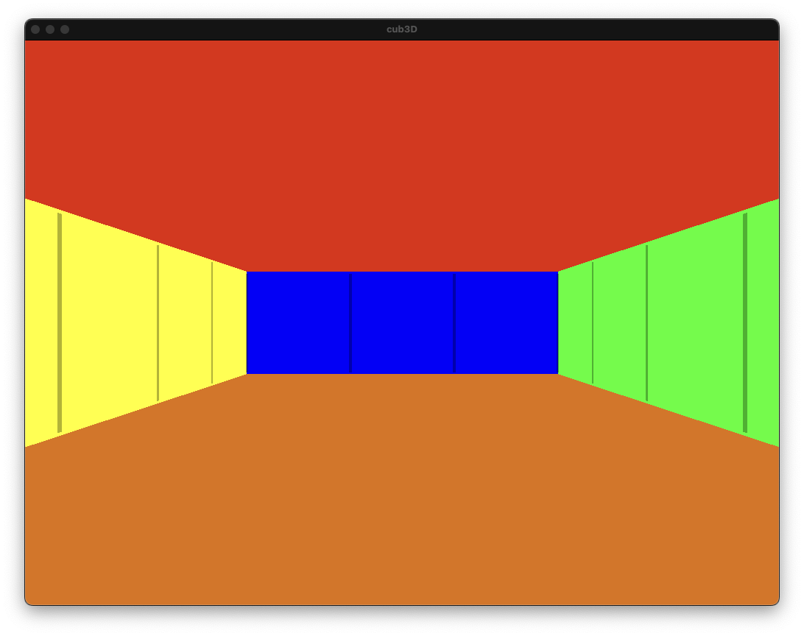
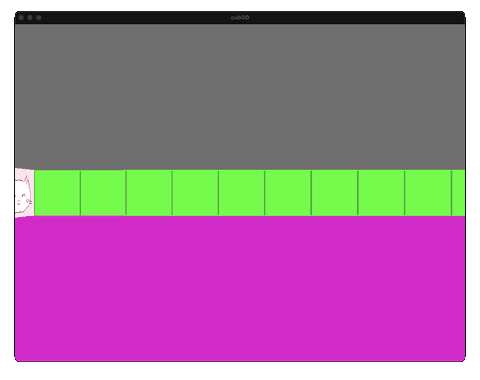

# cub3D ガイド

## 🎮 作るもの



**3D の迷路を歩き回れるゲーム** を C 言語で作るプロジェクトです。
プレイヤー視点で前進・回転ができ、4 方向の壁には別々のテクスチャが貼られます。

### 🎬 実際の動き

<video class="cub3d-video" autoplay loop muted playsinline preload="auto"
       onclick="this.paused ? this.play() : this.pause();">
  <source src="images/gameplay.mp4" type="video/mp4">
  
</video>

プレイヤーが回転・前進すると、画面の壁の位置や大きさがリアルタイムに変化します。
これが **レイキャスティング** の仕組みです。

*動画をクリックすると **その場で一時停止**（再クリックで再生再開）*

---

## 📖 全体目次（クリックで各ページへ）

| # | ページ | 何が分かる？ | 目安時間 |
|:---:|:---|:---|:---:|
| — | **[cub3D ってどんなプロジェクト？](#cub3d-)** | 全体像・遊び方・仕組みの触り | 3分 |
| 00 | [🗺️ プログラム全体の流れ](00-main-flow.md) | main.c, init.c, render の繋がり | 10分 |
| 01 | [📦 概要とビルド](01-overview.md) | ファイル構成、Makefile、操作方法 | 10分 |
| 02 | [📝 パーサー](02-parser.md) | `.cub` ファイルをどう読むか | 15分 |
| 03 | [🔦 レイキャスティングとは](03-raycasting.md) | 3D 描画の概念（懐中電灯の例え） | 10分 |
| 04 | [📐 DDA アルゴリズム](04-dda.md) | 格子を効率よく渡る方法 | 10分 |
| 05 | [📷 カメラと魚眼補正](05-camera.md) | 光線の向き・画面端の歪み補正 | 10分 |
| 06 | [🎨 レンダリング](06-rendering.md) | テクスチャを壁に貼る方法 | 15分 |
| 07 | [🎮 入力処理](07-input.md) | キー入力・移動・回転 | 15分 |
| 08 | [🧹 メモリ管理](08-memory.md) | リークを防ぐ方法 | 10分 |
| 09 | [🐛 実際のバグと修正](09-debugging.md) | 遭遇した 4 つのバグと直し方 | 15分 |
| 🎓 | [📋 評価対策](eval.md) | ディフェンスで聞かれること | 20分 |
| 📚 | [用語集](glossary.md) | `.cub`、構造体、DDA 等の用語解説 | 辞書代わり |

!!! tip "読み進める順番"
    **初めての方は 01 → 02 → 03 → ... と番号順** に読むのがおすすめ。
    特に **03 レイキャスティング** が最重要なので、ここに時間をかけてください。

---

## cub3D ってどんなプロジェクト？ { #cub3d- }

**3D の迷路を歩き回れる簡易ゲームを作るプロジェクト** です。

1992 年の名作 **Wolfenstein 3D** のような、
3D 迷路の中を一人称視点で歩き回れるプログラムを、
`.cub` という独自形式のマップファイルから読み込んで描画します。

```
+--- 画面イメージ ---+
|                    |
|   壁が見える 3D    |   ← プレイヤーから見た壁
|   (テクスチャ付き) |
|                    |
+--------------------+
|  天井色 / 床色     |
+--------------------+

W/A/S/D で移動、← / → で回転
```

**「魔法のような 3D 描画」** を、実は **2D の数学** だけで実現する、
という仕組みを学ぶのがこの課題の面白いところです。

---

## このガイドで学ぶこと

- 🔦 **レイキャスティング** — 3D っぽく見せるための描画アルゴリズム
- 📚 **miniLibX** — 42 が提供する最小限のグラフィックライブラリ
- 📝 **パーサー作り** — `.cub` ファイルを読んで構造体に変換
- 🎮 **イベントループ** — キー入力で画面を更新する仕組み
- 🎨 **テクスチャマッピング** — 壁に画像を貼る方法
- 🧹 **メモリ管理** — リークなく確実に解放

---

## どう動くの？（ざっくり）

```
[.cub ファイル]
  map:  1111
        1001
        10N1  ← N はプレイヤーの初期位置
        1111
  NO: textures/north.xpm
  SO: textures/south.xpm
  ...
       |
       v
[パーサー] → マップデータを読み込む
       |
       v
[メインループ]
  1. プレイヤーの位置と向きを取得
  2. 画面の横幅分、光線（ray）を飛ばす
  3. 光線が壁にぶつかった距離を計算
  4. 距離から壁の高さを決めて描画
  5. キー入力があれば位置/向きを更新
  6. 1 に戻る
```

これが **レイキャスティング** の仕組み。
「2D の数学」で「3D っぽい絵」を作る、というのがポイント。

---

## 課題仕様のポイント

| 項目 | 要件 |
|:---|:---|
| 入力 | `./cub3D <path_to_map.cub>` |
| 実行環境 | miniLibX (macOS / Linux) |
| 言語 | C |
| コンパイル | `-Wall -Wextra -Werror` |
| 禁止 | norminette NG、メモリリーク |
| 必須機能 | W/A/S/D 移動、矢印キー回転、ESC 終了、× ボタン |
| テクスチャ | NO / SO / WE / EA の 4 方向別 |
| 色指定 | 床 (F) と天井 (C) の RGB |

---

## 評価（ディフェンス）のポイント

以下が評価でチェックされます:

1. **マップファイルの異常系** — 開いたマップ、プレイヤー 2 人等でクラッシュしないか
2. **メモリリーク** — valgrind / leaks で確認
3. **操作性** — W/A/S/D と矢印キーが仕様通りに動くか
4. **テクスチャ方向** — 北の壁には NO テクスチャが貼られているか
5. **コードの説明** — レイキャスティングのアルゴリズムを説明できるか

!!! danger "ディフェンスで一番聞かれるのは？"
    **「レイキャスティングのアルゴリズムを説明してください」**

    DDA（Digital Differential Analyzer）という格子を渡るアルゴリズムを
    使って、光線がどの壁にぶつかるかを計算します。
    詳しくは [03. レイキャスティング](03-raycasting.md) を参照。

---

## 参考リソース

- [Lode's Computer Graphics Tutorial — Raycasting](https://lodev.org/cgtutor/raycasting.html) — 定番の参考資料
- [42 miniLibX documentation (harm-smits)](https://harm-smits.github.io/42docs/libs/minilibx) — miniLibX API リファレンス

---

## ▶️ 次に読むページ

次は [📦 01. 概要とビルド](01-overview.md) から始めましょう。
